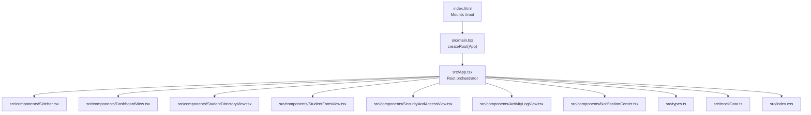
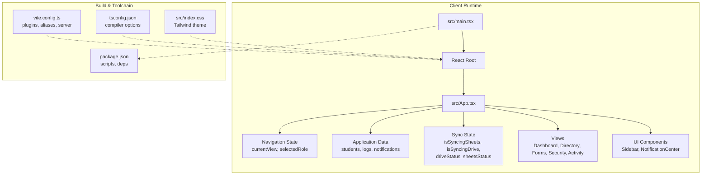
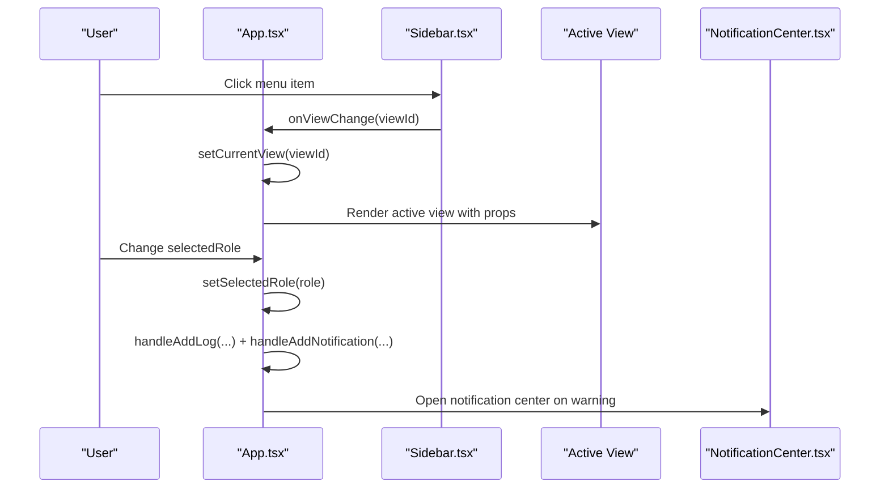
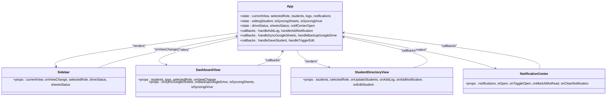
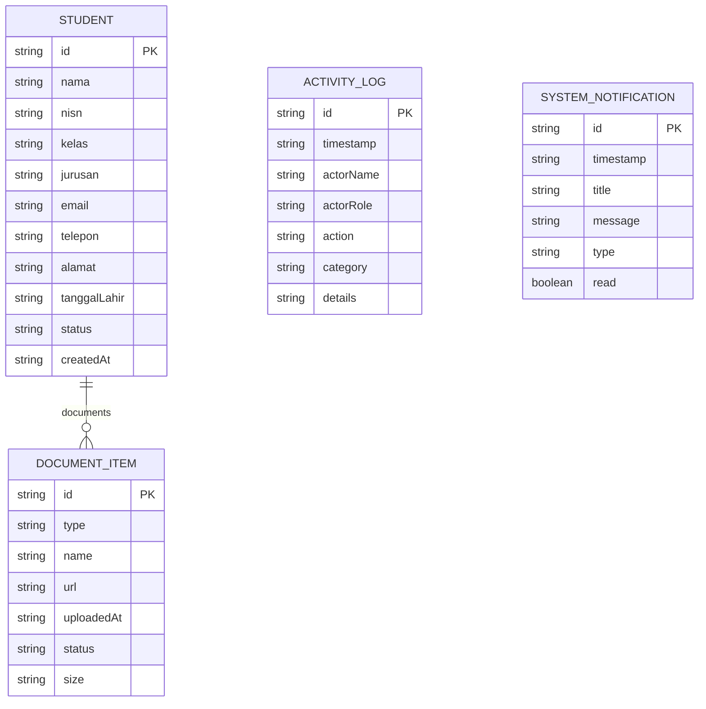
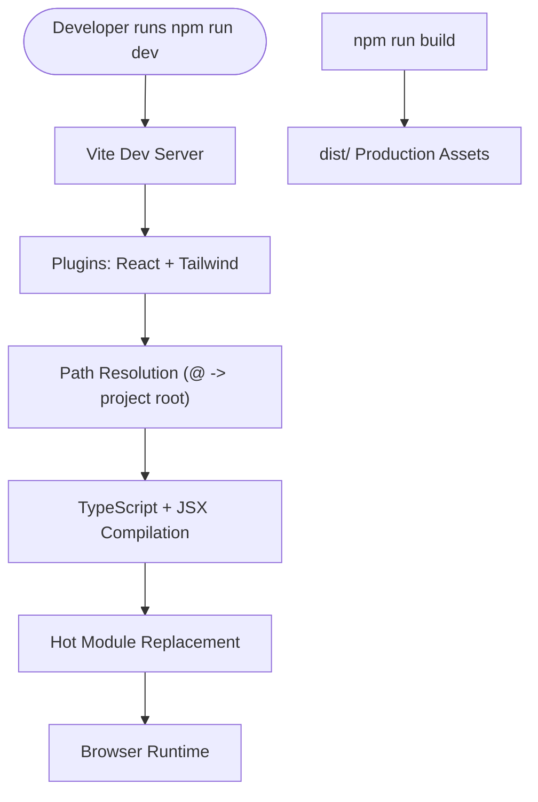
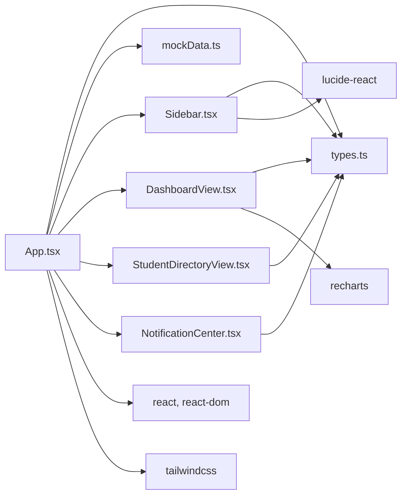

# Architecture Overview

<cite>
**Referenced Files in This Document**
- [main.tsx](file://src/main.tsx)
- [App.tsx](file://src/App.tsx)
- [Sidebar.tsx](file://src/components/Sidebar.tsx)
- [DashboardView.tsx](file://src/components/DashboardView.tsx)
- [StudentDirectoryView.tsx](file://src/components/StudentDirectoryView.tsx)
- [NotificationCenter.tsx](file://src/components/NotificationCenter.tsx)
- [types.ts](file://src/types.ts)
- [mockData.ts](file://src/mockData.ts)
- [index.css](file://src/index.css)
- [index.html](file://index.html)
- [package.json](file://package.json)
- [vite.config.ts](file://vite.config.ts)
- [tsconfig.json](file://tsconfig.json)
</cite>

## Table of Contents
1. [Introduction](#introduction)
2. [Project Structure](#project-structure)
3. [Core Components](#core-components)
4. [Architecture Overview](#architecture-overview)
5. [Detailed Component Analysis](#detailed-component-analysis)
6. [Dependency Analysis](#dependency-analysis)
7. [Performance Considerations](#performance-considerations)
8. [Troubleshooting Guide](#troubleshooting-guide)
9. [Conclusion](#conclusion)

## Introduction
This document describes the ARBAL application architecture, focusing on the React-based frontend design, component hierarchy, and modular structure. The application follows a component-based architecture with props-driven communication and local state management using React hooks. It separates concerns across presentation, data management, and styling layers, and integrates with Google Workspace services through simulated actions. The build system leverages Vite with TypeScript compilation and Tailwind CSS for styling.

## Project Structure
The project is organized around a single-page React application with a clear separation of concerns:
- Entry point initializes the React root and mounts the App component.
- App orchestrates global state, navigation, and view rendering.
- Modular components encapsulate views and UI elements.
- Shared types and mock data define domain models and initial datasets.
- Styling is centralized via Tailwind CSS and a shared stylesheet.

**Diagram sources**
- [index.html](file://index.html)
- [main.tsx](file://src/main.tsx)
- [App.tsx](file://src/App.tsx)
- [Sidebar.tsx](file://src/components/Sidebar.tsx)
- [DashboardView.tsx](file://src/components/DashboardView.tsx)
- [StudentDirectoryView.tsx](file://src/components/StudentDirectoryView.tsx)
- [NotificationCenter.tsx](file://src/components/NotificationCenter.tsx)
- [types.ts](file://src/types.ts)
- [mockData.ts](file://src/mockData.ts)
- [index.css](file://src/index.css)

**Section sources**
- [main.tsx:1-11](file://src/main.tsx#L1-L11)
- [index.html:1-14](file://index.html#L1-L14)

## Core Components
The core components and their responsibilities:
- App: Central orchestrator managing global state (navigation, roles, lists, sync statuses), coordinating child components, and handling cross-cutting operations (logging, notifications).
- Sidebar: Navigation and role-aware visibility of menu items; displays cloud connection status indicators.
- DashboardView: Analytics dashboard with statistics, charts, and quick actions for synchronization.
- StudentDirectoryView: CRUD operations for student records, document uploads, verification, and filtering.
- NotificationCenter: Notification center drawer with read/unread management and clearing actions.
- Supporting modules: types.ts defines domain models; mockData.ts provides initial datasets.

Design patterns:
- Component-based architecture: Each view is a self-contained component.
- Props-driven communication: Parent passes state and callbacks down to children; children invoke callbacks to update parent state.
- Local state management: React hooks manage component and application state locally without external state libraries.

**Section sources**
- [App.tsx:36-347](file://src/App.tsx#L36-L347)
- [Sidebar.tsx:20-181](file://src/components/Sidebar.tsx#L20-L181)
- [DashboardView.tsx:34-393](file://src/components/DashboardView.tsx#L34-L393)
- [StudentDirectoryView.tsx:33-755](file://src/components/StudentDirectoryView.tsx#L33-L755)
- [NotificationCenter.tsx:17-130](file://src/components/NotificationCenter.tsx#L17-L130)
- [types.ts:6-82](file://src/types.ts#L6-L82)
- [mockData.ts:6-451](file://src/mockData.ts#L6-L451)

## Architecture Overview
The system boundary encompasses the client-side React application, with data flows managed internally via React state and simulated integrations with Google Workspace services. The build system compiles TypeScript with Vite and applies Tailwind CSS for styling.

**Diagram sources**
- [main.tsx:1-11](file://src/main.tsx#L1-L11)
- [App.tsx:36-347](file://src/App.tsx#L36-L347)
- [package.json:6-11](file://package.json#L6-L11)
- [vite.config.ts:6-22](file://vite.config.ts#L6-L22)
- [tsconfig.json:2-26](file://tsconfig.json#L2-L26)
- [index.css:1-31](file://src/index.css#L1-L31)

## Detailed Component Analysis

### App Component Orchestration
App serves as the root container, maintaining:
- Navigation state: currentView selection.
- Role simulation: selectedRole with permission-aware UI.
- Core data: students, activity logs, system notifications.
- Editing context: editingStudent for forms.
- Cloud sync states: driveStatus, sheetsStatus, and flags for syncing.
- Cross-cutting helpers: addLog, addNotification, sync triggers, mark notifications, clear notification, save student, trigger edit.

Rendering strategy:
- Renders Sidebar with navigation and cloud status.
- Renders a single active view based on currentView.
- Provides header with branding, role switcher, and notification center.

**Diagram sources**
- [App.tsx:204-343](file://src/App.tsx#L204-L343)
- [Sidebar.tsx:98-111](file://src/components/Sidebar.tsx#L98-L111)
- [NotificationCenter.tsx:35-130](file://src/components/NotificationCenter.tsx#L35-L130)

**Section sources**
- [App.tsx:36-347](file://src/App.tsx#L36-L347)

### Component Hierarchy and Props Flow
The component hierarchy starts at App and branches into views and UI elements. Props are passed down to children, and callbacks are invoked upward to update state in App.

**Diagram sources**
- [App.tsx:204-343](file://src/App.tsx#L204-L343)
- [Sidebar.tsx:28-111](file://src/components/Sidebar.tsx#L28-L111)
- [DashboardView.tsx:45-54](file://src/components/DashboardView.tsx#L45-L54)
- [StudentDirectoryView.tsx:42-49](file://src/components/StudentDirectoryView.tsx#L42-L49)
- [NotificationCenter.tsx:25-31](file://src/components/NotificationCenter.tsx#L25-L31)

**Section sources**
- [App.tsx:204-343](file://src/App.tsx#L204-L343)
- [Sidebar.tsx:28-111](file://src/components/Sidebar.tsx#L28-L111)
- [DashboardView.tsx:45-54](file://src/components/DashboardView.tsx#L45-L54)
- [StudentDirectoryView.tsx:42-49](file://src/components/StudentDirectoryView.tsx#L42-L49)
- [NotificationCenter.tsx:25-31](file://src/components/NotificationCenter.tsx#L25-L31)

### Data Models and Mock Data
Domain models define the shape of application data:
- Student: personal info, family info, documents, status, timestamps.
- DocumentItem: document metadata and verification status.
- RoleType and AppRole: role definitions and permissions.
- ActivityLog and SystemNotification: audit and notification structures.

Mock data provides initial datasets for development and demonstration.

**Diagram sources**
- [types.ts:20-46](file://src/types.ts#L20-L46)
- [types.ts:8-16](file://src/types.ts#L8-L16)
- [types.ts:65-73](file://src/types.ts#L65-L73)
- [types.ts:75-82](file://src/types.ts#L75-L82)

**Section sources**
- [types.ts:6-82](file://src/types.ts#L6-L82)
- [mockData.ts:6-451](file://src/mockData.ts#L6-L451)

### Build System Architecture
The build system uses Vite with React and Tailwind CSS:
- Vite handles development server, HMR, and production builds.
- TypeScript configuration enables JSX with react-jsx and bundler module resolution.
- Tailwind plugin is configured via @tailwindcss/vite.
- Aliases and server options are defined in vite.config.ts.

**Diagram sources**
- [package.json:6-11](file://package.json#L6-L11)
- [vite.config.ts:6-22](file://vite.config.ts#L6-L22)
- [tsconfig.json:18-22](file://tsconfig.json#L18-L22)

**Section sources**
- [package.json:6-11](file://package.json#L6-L11)
- [vite.config.ts:6-22](file://vite.config.ts#L6-L22)
- [tsconfig.json:2-26](file://tsconfig.json#L2-L26)

## Dependency Analysis
Internal dependencies:
- App depends on all view components and UI components.
- Views depend on types and mock data for rendering and interactions.
- UI components depend on types for typing and on App for callbacks.

External dependencies (selected):
- React and React DOM for UI runtime.
- lucide-react for icons.
- recharts for analytics visualization.
- Tailwind CSS for styling.

**Diagram sources**
- [App.tsx:6-34](file://src/App.tsx#L6-L34)
- [Sidebar.tsx:6-17](file://src/components/Sidebar.tsx#L6-L17)
- [DashboardView.tsx:6-19](file://src/components/DashboardView.tsx#L6-L19)
- [StudentDirectoryView.tsx:6-31](file://src/components/StudentDirectoryView.tsx#L6-L31)
- [NotificationCenter.tsx:6-14](file://src/components/NotificationCenter.tsx#L6-L14)
- [types.ts:6-82](file://src/types.ts#L6-L82)
- [mockData.ts:6-7](file://src/mockData.ts#L6-L7)

**Section sources**
- [package.json:13-24](file://package.json#L13-L24)

## Performance Considerations
- Component-level state isolation reduces unnecessary re-renders; keep state close to where it is needed.
- Avoid deep prop drilling by grouping related callbacks and state in App and passing only what is necessary to each view.
- Memoization strategies (React.memo, useMemo, useCallback) can be applied to expensive computations or repeated renders in views.
- Lazy loading views is feasible if the routing grows; currently, a single active view is rendered based on currentView.
- Chart rendering: recharts components are efficient, but avoid excessive re-computation of chart data by deriving it once per render cycle.

## Troubleshooting Guide
Common issues and resolutions:
- Build errors due to TypeScript configuration: Verify jsx setting and module resolution in tsconfig.json.
- Missing Tailwind styles: Ensure @tailwind directives are present in index.css and Tailwind plugin is enabled in vite.config.ts.
- HMR behavior in AI Studio environments: HMR/watch toggles are controlled by DISABLE_HMR environment variable in vite.config.ts.
- Styling inconsistencies: Confirm font families and theme tokens are defined in index.css.

**Section sources**
- [tsconfig.json:17-24](file://tsconfig.json#L17-L24)
- [index.css:1-31](file://src/index.css#L1-L31)
- [vite.config.ts:14-20](file://vite.config.ts#L14-L20)

## Conclusion
ARBAL employs a clean, component-based React architecture with clear separation of concerns. App acts as the central orchestrator, delegating UI responsibilities to modular views while managing global state and cross-cutting features. The build system, powered by Vite and TypeScript, supports rapid iteration with Tailwind CSS for styling. The design emphasizes props-driven communication, local state management, and maintainable component boundaries suitable for extension and future enhancements.