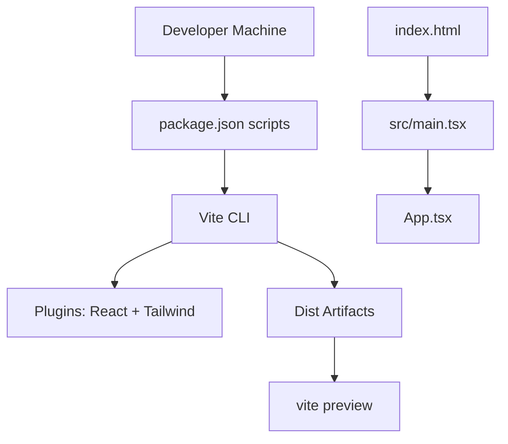
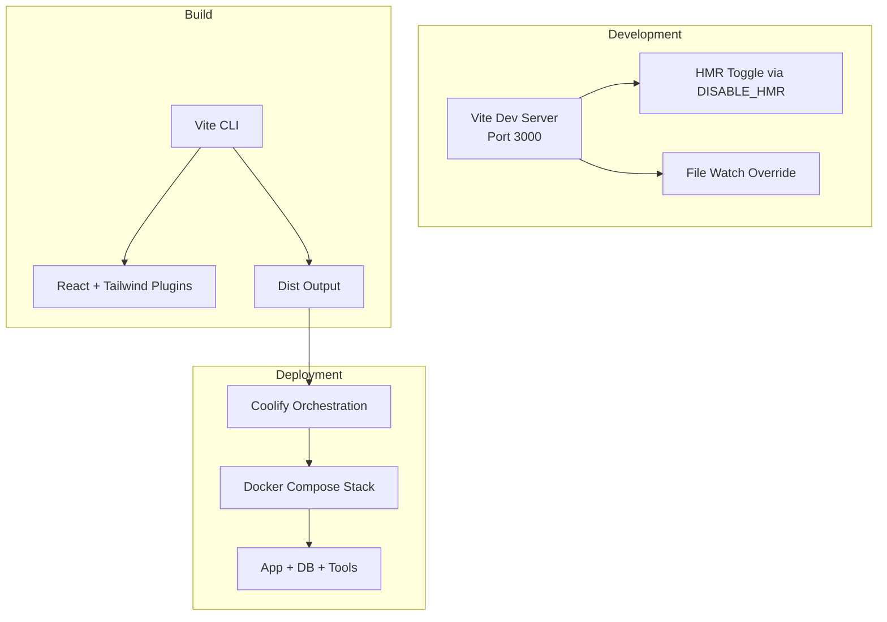
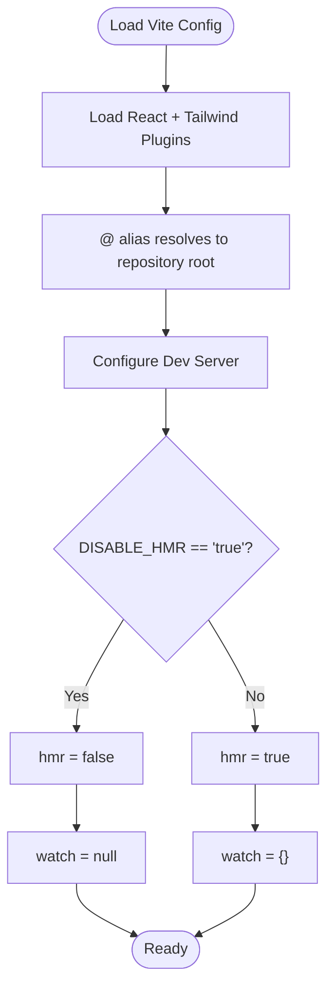
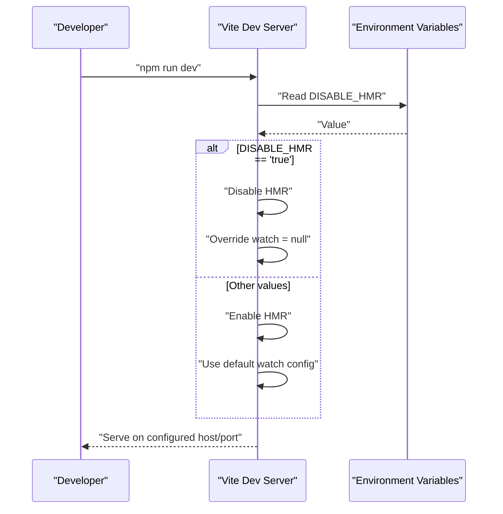
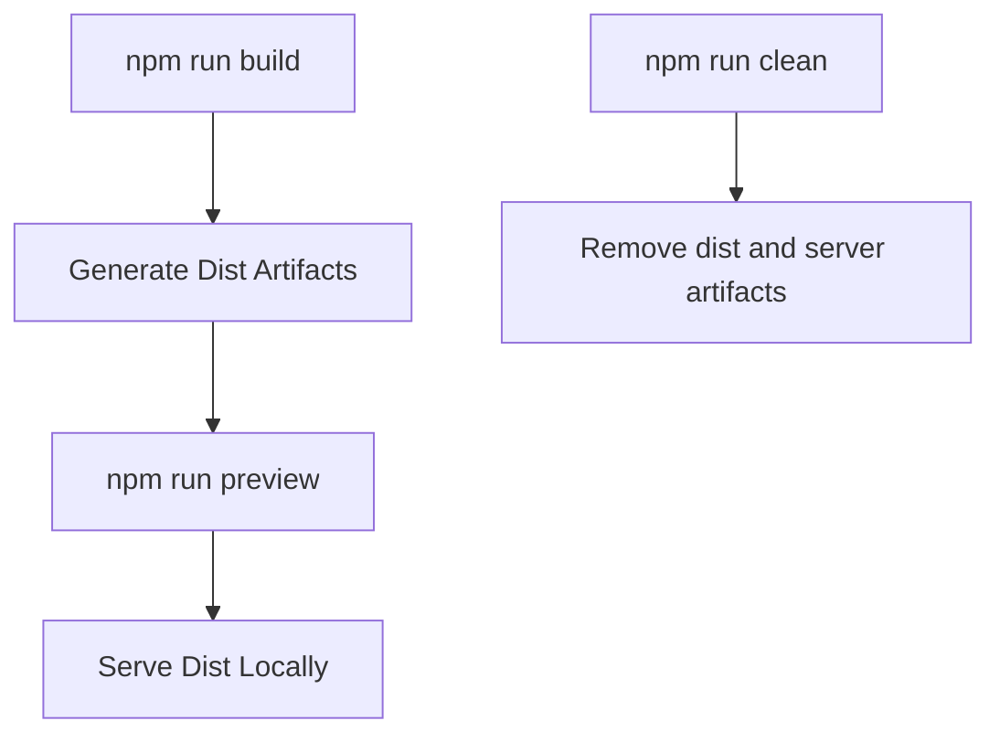
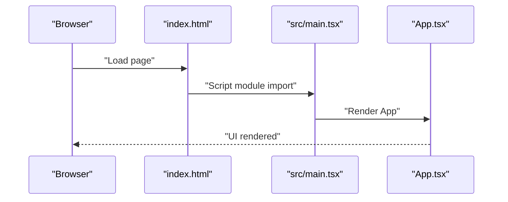
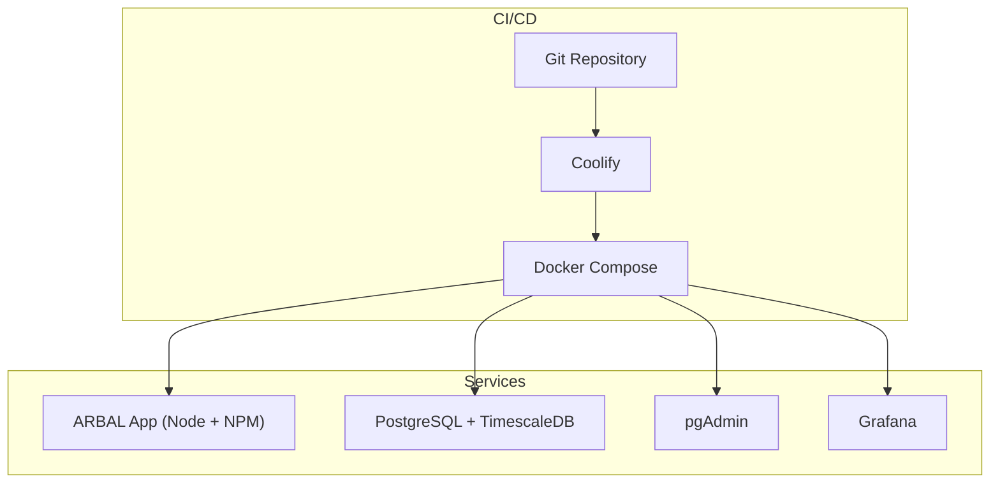
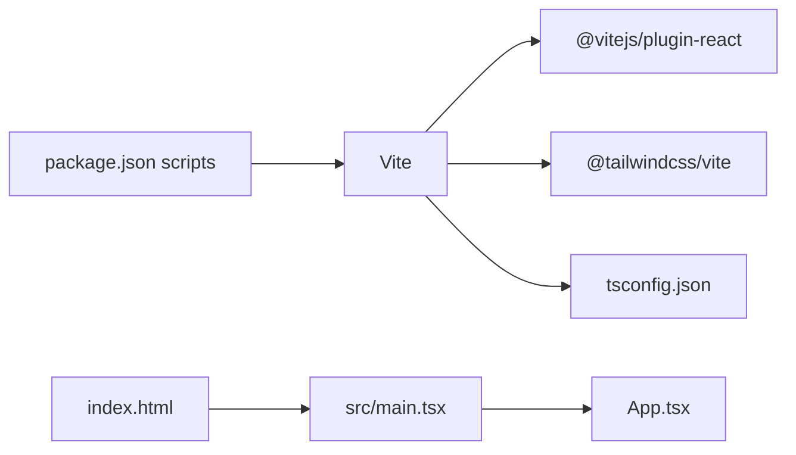

# Build and Deployment

<cite>
**Referenced Files in This Document**
- [vite.config.ts](file://vite.config.ts)
- [package.json](file://package.json)
- [README.md](file://README.md)
- [DEPLOYMENT_PLAN.md](file://DEPLOYMENT_PLAN.md)
- [PRD.md](file://PRD.md)
- [src/main.tsx](file://src/main.tsx)
- [index.html](file://index.html)
- [tsconfig.json](file://tsconfig.json)
- [.gitignore](file://.gitignore)
</cite>

## Table of Contents
1. [Introduction](#introduction)
2. [Project Structure](#project-structure)
3. [Core Components](#core-components)
4. [Architecture Overview](#architecture-overview)
5. [Detailed Component Analysis](#detailed-component-analysis)
6. [Dependency Analysis](#dependency-analysis)
7. [Performance Considerations](#performance-considerations)
8. [Troubleshooting Guide](#troubleshooting-guide)
9. [Conclusion](#conclusion)
10. [Appendices](#appendices)

## Introduction
This document explains the ARBAL build and deployment system with a focus on Vite configuration and deployment strategies. It covers the development server setup, hot module replacement (HMR), production builds, asset handling, and CI/CD integration patterns. It also provides troubleshooting guidance and best practices to maintain build performance and reliability.

## Project Structure
The repository is a React + TypeScript single-page application built with Vite. The build pipeline is driven by Vite with React and Tailwind plugins. Scripts are defined in the package manifest to run the dev server, produce production builds, and preview the build locally. The HTML entry point mounts the React root and loads the TypeScript entry module.

**Diagram sources**
- [package.json:6-12](file://package.json#L6-L12)
- [vite.config.ts:6-22](file://vite.config.ts#L6-L22)
- [index.html:8-11](file://index.html#L8-L11)
- [src/main.tsx:6-10](file://src/main.tsx#L6-L10)

**Section sources**
- [package.json:6-12](file://package.json#L6-L12)
- [index.html:1-14](file://index.html#L1-L14)
- [src/main.tsx:1-11](file://src/main.tsx#L1-L11)
- [tsconfig.json:1-27](file://tsconfig.json#L1-L27)

## Core Components
- Vite configuration defines plugins, path aliases, and development server behavior including HMR and file watching toggles controlled by environment variables.
- Package scripts orchestrate development, building, and previewing the application.
- TypeScript configuration enables bundler module resolution, JSX transform, and path mapping.
- HTML entry point initializes the React root and loads the TypeScript entry module.

Key build and runtime behaviors:
- Development server runs on port 3000 and binds to all interfaces for external access.
- Production build is generated via the Vite build script.
- Preview serves the production build locally for verification.
- Environment-driven HMR behavior allows disabling HMR and file watching to reduce CPU load during agent edits.

**Section sources**
- [vite.config.ts:6-22](file://vite.config.ts#L6-L22)
- [package.json:6-12](file://package.json#L6-L12)
- [tsconfig.json:18-22](file://tsconfig.json#L18-L22)
- [index.html:8-11](file://index.html#L8-L11)

## Architecture Overview
The build and deployment architecture centers on Vite’s development and production workflows, with the frontend served statically and integrated with backend services in self-hosted deployments.

**Diagram sources**
- [vite.config.ts:14-21](file://vite.config.ts#L14-L21)
- [package.json:6-12](file://package.json#L6-L12)
- [DEPLOYMENT_PLAN.md:130-214](file://DEPLOYMENT_PLAN.md#L130-L214)

**Section sources**
- [vite.config.ts:6-22](file://vite.config.ts#L6-L22)
- [package.json:6-12](file://package.json#L6-L12)
- [DEPLOYMENT_PLAN.md:130-214](file://DEPLOYMENT_PLAN.md#L130-L214)

## Detailed Component Analysis

### Vite Configuration
The Vite configuration sets up:
- Plugins: React and Tailwind CSS via the Vite plugin adapter.
- Path alias: An alias mapped to the repository root for ergonomic imports.
- Development server:
  - HMR controlled by the DISABLE_HMR environment variable.
  - File watching disabled when HMR is disabled to reduce CPU usage during agent edits.

**Diagram sources**
- [vite.config.ts:6-22](file://vite.config.ts#L6-L22)

**Section sources**
- [vite.config.ts:6-22](file://vite.config.ts#L6-L22)

### Development Server and Hot Reload
- The dev server is started with a fixed port and host binding suitable for local and hosted environments.
- HMR behavior is environment-controlled:
  - When DISABLE_HMR is set to true, HMR is disabled and file watching is overridden to null.
  - When DISABLE_HMR is not true, HMR remains enabled and file watching uses defaults.

**Diagram sources**
- [package.json:7](file://package.json#L7)
- [vite.config.ts:14-21](file://vite.config.ts#L14-L21)

**Section sources**
- [package.json:7](file://package.json#L7)
- [vite.config.ts:14-21](file://vite.config.ts#L14-L21)

### Production Build and Preview
- The production build is produced using the Vite build script.
- The preview script serves the production build locally for validation.
- Clean script removes distribution artifacts and server binaries.

**Diagram sources**
- [package.json:8-11](file://package.json#L8-L11)

**Section sources**
- [package.json:8-11](file://package.json#L8-L11)

### Asset Handling and Entry Point
- The HTML entry point defines the root element and loads the TypeScript entry module.
- The TypeScript entry module initializes the React root and renders the application component.

**Diagram sources**
- [index.html:8-11](file://index.html#L8-L11)
- [src/main.tsx:6-10](file://src/main.tsx#L6-L10)

**Section sources**
- [index.html:1-14](file://index.html#L1-L14)
- [src/main.tsx:1-11](file://src/main.tsx#L1-L11)

### TypeScript Configuration
- Bundler module resolution is enabled for compatibility with Vite’s build pipeline.
- Path mapping under the alias is configured for convenient imports.
- JSX transform is configured for React components.

**Section sources**
- [tsconfig.json:13-17](file://tsconfig.json#L13-L17)
- [tsconfig.json:18-22](file://tsconfig.json#L18-L22)

### Environment Configuration and CI/CD Integration
- The project supports environment-driven behavior for HMR and integrates with self-hosted deployment using Coolify and Docker Compose.
- The deployment plan outlines a multi-service stack including the application, database, administration, and monitoring services.

**Diagram sources**
- [DEPLOYMENT_PLAN.md:130-214](file://DEPLOYMENT_PLAN.md#L130-L214)

**Section sources**
- [DEPLOYMENT_PLAN.md:130-214](file://DEPLOYMENT_PLAN.md#L130-L214)

## Dependency Analysis
- Vite orchestrates the build and development workflows.
- React plugin powers JSX transforms and component rendering.
- Tailwind plugin integrates CSS utilities and purging.
- TypeScript configuration influences module resolution and path mapping.
- Package scripts define the lifecycle commands for development, build, preview, and cleanup.

**Diagram sources**
- [vite.config.ts:1-2](file://vite.config.ts#L1-L2)
- [package.json:6-12](file://package.json#L6-L12)
- [tsconfig.json:1-27](file://tsconfig.json#L1-L27)
- [index.html:8-11](file://index.html#L8-L11)
- [src/main.tsx:6-10](file://src/main.tsx#L6-L10)

**Section sources**
- [vite.config.ts:1-2](file://vite.config.ts#L1-L2)
- [package.json:6-12](file://package.json#L6-L12)
- [tsconfig.json:1-27](file://tsconfig.json#L1-L27)
- [index.html:8-11](file://index.html#L8-L11)
- [src/main.tsx:6-10](file://src/main.tsx#L6-L10)

## Performance Considerations
- HMR and file watching can consume CPU resources during frequent edits. Disabling HMR and watch reduces overhead when editing agents or scripts that trigger rapid file changes.
- Use the preview command to validate production builds locally before deploying.
- Keep dependencies aligned with the supported Node.js versions indicated by Vite to avoid unnecessary transpilation or polyfill costs.
- Leverage path aliases to reduce deep-relative imports and improve DX without affecting bundle size significantly.

[No sources needed since this section provides general guidance]

## Troubleshooting Guide
Common issues and resolutions:
- HMR does not update or flickers during agent edits:
  - Set the environment variable to disable HMR and file watching to reduce CPU load.
  - Verify the environment variable is correctly applied when starting the dev server.
- Build fails due to missing environment variables:
  - Ensure required environment variables are present in the environment where the build runs.
- Unexpected asset paths or missing styles:
  - Confirm Tailwind plugin is loaded and path aliases are correctly configured.
- Preview server not serving content:
  - Run the build script first, then use the preview script to serve the dist output.

**Section sources**
- [vite.config.ts:14-21](file://vite.config.ts#L14-L21)
- [package.json:6-12](file://package.json#L6-L12)
- [README.md:16-20](file://README.md#L16-L20)

## Conclusion
The ARBAL build and deployment system leverages Vite for fast development and efficient production builds. The configuration supports environment-driven HMR behavior, integrates Tailwind for styling, and aligns with a self-hosted deployment strategy using Coolify and Docker Compose. Following the scripts and environment controls outlined here ensures reliable builds and smooth development workflows.

[No sources needed since this section summarizes without analyzing specific files]

## Appendices
- Development quickstart and prerequisites are documented in the project’s README.
- Self-hosted deployment steps and service stack are documented in the deployment plan and PRD.

**Section sources**
- [README.md:16-20](file://README.md#L16-L20)
- [DEPLOYMENT_PLAN.md:130-214](file://DEPLOYMENT_PLAN.md#L130-L214)
- [PRD.md:171-250](file://PRD.md#L171-L250)