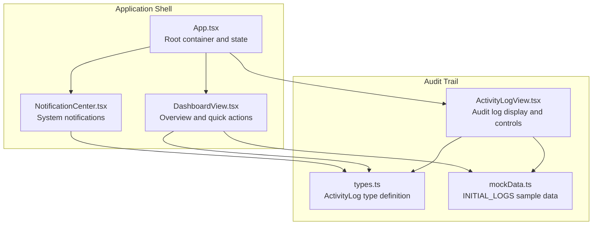
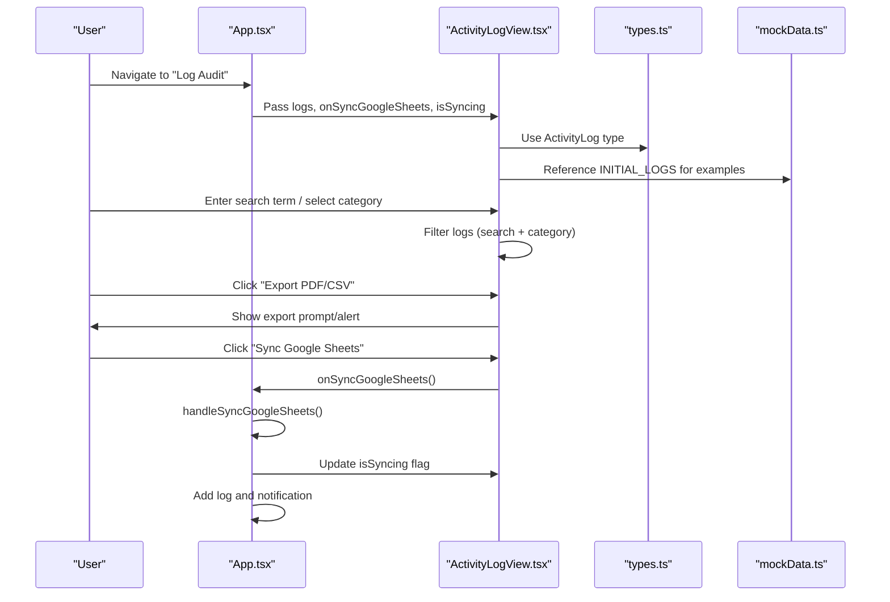
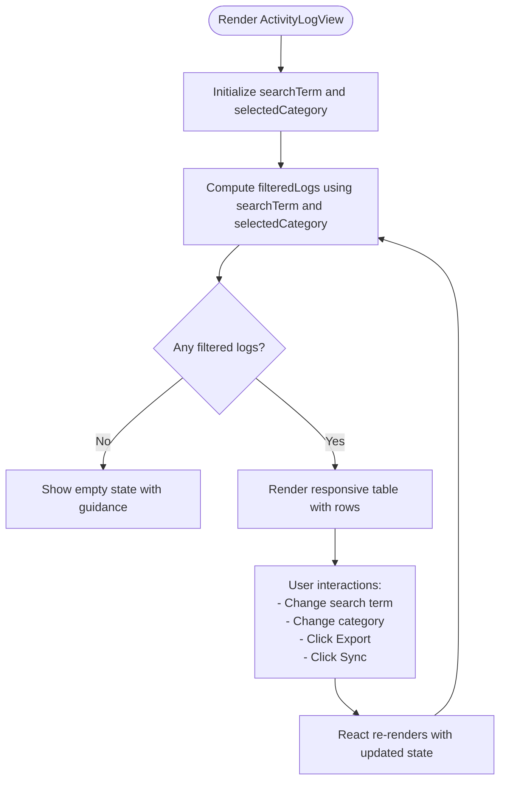
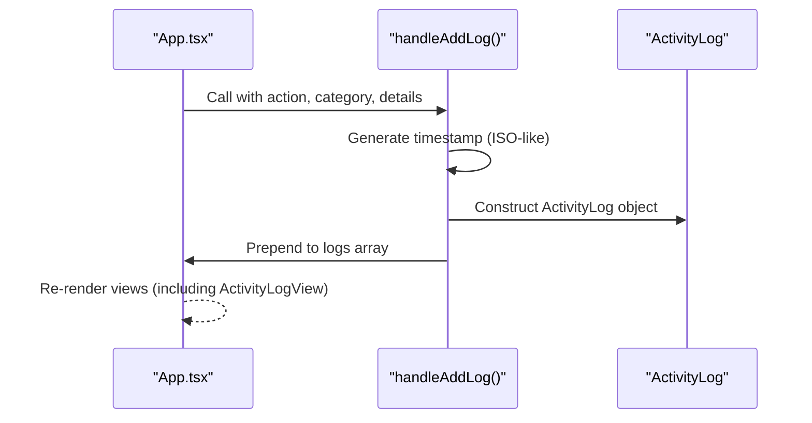
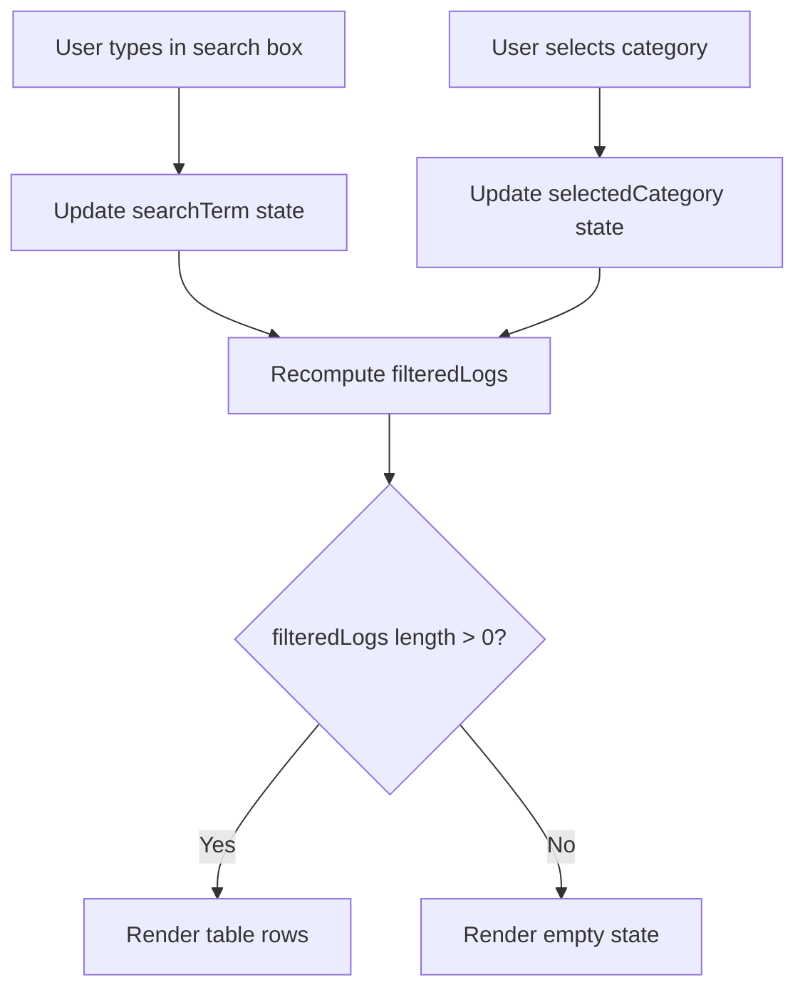
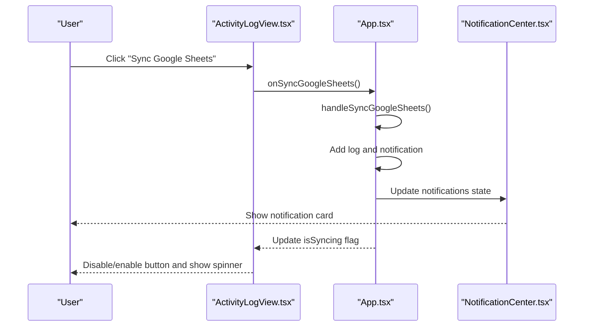
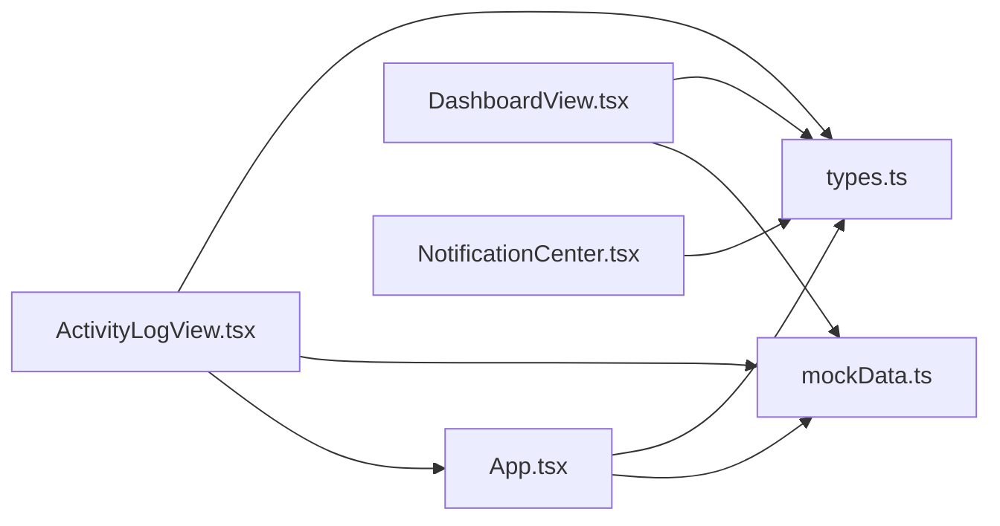

# Activity Log Component

<cite>
**Referenced Files in This Document**
- [ActivityLogView.tsx](file://src/components/ActivityLogView.tsx)
- [App.tsx](file://src/App.tsx)
- [types.ts](file://src/types.ts)
- [mockData.ts](file://src/mockData.ts)
- [DashboardView.tsx](file://src/components/DashboardView.tsx)
- [NotificationCenter.tsx](file://src/components/NotificationCenter.tsx)
- [package.json](file://package.json)
</cite>

## Table of Contents
1. [Introduction](#introduction)
2. [Project Structure](#project-structure)
3. [Core Components](#core-components)
4. [Architecture Overview](#architecture-overview)
5. [Detailed Component Analysis](#detailed-component-analysis)
6. [Dependency Analysis](#dependency-analysis)
7. [Performance Considerations](#performance-considerations)
8. [Troubleshooting Guide](#troubleshooting-guide)
9. [Conclusion](#conclusion)
10. [Appendices](#appendices)

## Introduction
This document provides comprehensive documentation for the ActivityLogView component, focusing on the audit trail and activity monitoring interface. It explains the log entry display, filtering mechanisms, timestamp handling, and user activity tracking. It also covers the log data structure, event categorization, search functionality, export capabilities, real-time activity updates, notification integration, and historical data management. Practical examples demonstrate log filtering, activity analysis, and compliance reporting, along with performance optimization strategies for large datasets and pagination approaches.

## Project Structure
The ActivityLogView component resides within the components directory and integrates with the main application state and shared types. It receives log data and synchronization callbacks from the parent application and renders a searchable, filterable audit trail.



**Diagram sources**
- [App.tsx:36-347](file://src/App.tsx#L36-L347)
- [ActivityLogView.tsx:19-29](file://src/components/ActivityLogView.tsx#L19-L29)
- [types.ts:65-73](file://src/types.ts#L65-L73)
- [mockData.ts:360-424](file://src/mockData.ts#L360-L424)
- [DashboardView.tsx:34-54](file://src/components/DashboardView.tsx#L34-L54)
- [NotificationCenter.tsx:17-31](file://src/components/NotificationCenter.tsx#L17-L31)

**Section sources**
- [ActivityLogView.tsx:19-29](file://src/components/ActivityLogView.tsx#L19-L29)
- [App.tsx:36-347](file://src/App.tsx#L36-L347)
- [types.ts:65-73](file://src/types.ts#L65-L73)
- [mockData.ts:360-424](file://src/mockData.ts#L360-L424)

## Core Components
- ActivityLogView: Renders the audit trail with search and category filters, export controls, and Google Sheets sync integration.
- ActivityLog type: Defines the shape of log entries, including identifiers, timestamps, actor details, action, category, and details.
- App state and helpers: Manage logs, notifications, and synchronization triggers; append new logs and notifications dynamically.
- DashboardView: Provides quick access to recent logs and navigation to the full audit trail.
- NotificationCenter: Displays system notifications triggered by log events and sync actions.

**Section sources**
- [ActivityLogView.tsx:25-172](file://src/components/ActivityLogView.tsx#L25-L172)
- [types.ts:65-73](file://src/types.ts#L65-L73)
- [App.tsx:60-102](file://src/App.tsx#L60-L102)
- [DashboardView.tsx:306-346](file://src/components/DashboardView.tsx#L306-L346)
- [NotificationCenter.tsx:25-131](file://src/components/NotificationCenter.tsx#L25-L131)

## Architecture Overview
The ActivityLogView is a presentational component that receives props from the root application. It maintains local UI state for search and category filters, computes a filtered subset of logs, and renders a responsive table. It exposes callbacks for exporting and syncing logs to external systems.



**Diagram sources**
- [App.tsx:336-342](file://src/App.tsx#L336-L342)
- [ActivityLogView.tsx:25-172](file://src/components/ActivityLogView.tsx#L25-L172)
- [types.ts:65-73](file://src/types.ts#L65-L73)
- [mockData.ts:360-424](file://src/mockData.ts#L360-L424)

## Detailed Component Analysis

### ActivityLogView Component
- Props:
  - logs: Array of ActivityLog entries.
  - onSyncGoogleSheets: Callback invoked when the user initiates a Google Sheets sync.
  - isSyncing: Boolean indicating whether a sync operation is currently in progress.
- Local state:
  - searchTerm: String used to filter logs by actor name, action, or details.
  - selectedCategory: String representing the chosen category filter.
- Filtering logic:
  - Combines keyword search across actorName, action, and details.
  - Applies category filter with a “All Categories” option.
- Rendering:
  - Displays a header with description and action buttons.
  - Provides a two-column filter panel: keyword search and category selector.
  - Renders a responsive table with columns for timestamp, category badge, action, details, and actor.
  - Shows a message when no logs match the filters.
- Export and sync:
  - Export button triggers a client-side alert describing encrypted CSV/PDF export.
  - Sync button invokes onSyncGoogleSheets and reflects isSyncing state with a spinner icon.



**Diagram sources**
- [ActivityLogView.tsx:31-43](file://src/components/ActivityLogView.tsx#L31-L43)
- [ActivityLogView.tsx:117-168](file://src/components/ActivityLogView.tsx#L117-L168)

**Section sources**
- [ActivityLogView.tsx:25-172](file://src/components/ActivityLogView.tsx#L25-L172)

### Log Data Structure and Event Categorization
- ActivityLog fields:
  - id: Unique identifier for the log entry.
  - timestamp: ISO-like string representing the date and time of the event.
  - actorName: Full name of the user who performed the action.
  - actorRole: Role of the actor (e.g., Super Admin, Staff TU, Guru / Wali Kelas).
  - action: Short description of the operation performed.
  - category: Categorical grouping of the event (e.g., Siswa, Dokumen, Hak Akses, Google Drive, Google Sheets).
  - details: Descriptive narrative of the change or operation.
- Categories:
  - Siswa: Profile and data changes.
  - Dokumen: Uploads, verifications, and document lifecycle events.
  - Hak Akses: Permission and role-related changes.
  - Google Drive: External storage operations.
  - Google Sheets: Spreadsheet synchronization events.

```mermaid
classDiagram
class ActivityLog {
+string id
+string timestamp
+string actorName
+RoleType actorRole
+string action
+Category category
+string details
}
class RoleType {
<<enumeration>>
"Super Admin"
"Staff TU"
"Guru / Wali Kelas"
}
class Category {
<<enumeration>>
"Siswa"
"Dokumen"
"Hak Akses"
"Google Drive"
"Google Sheets"
}
ActivityLog --> RoleType : "actorRole"
ActivityLog --> Category : "category"
```

**Diagram sources**
- [types.ts:65-73](file://src/types.ts#L65-L73)
- [types.ts:48-48](file://src/types.ts#L48-L48)

**Section sources**
- [types.ts:65-73](file://src/types.ts#L65-L73)

### Timestamp Handling
- Storage format: The timestamp field is stored as a human-readable string combining date and time.
- Presentation: The component displays the timestamp as-is, preserving the HH:mm:ss format.
- Generation: The App helper appends new logs with a timestamp derived from the current date/time.



**Diagram sources**
- [App.tsx:60-81](file://src/App.tsx#L60-L81)
- [ActivityLogView.tsx:139-140](file://src/components/ActivityLogView.tsx#L139-L140)

**Section sources**
- [App.tsx:60-81](file://src/App.tsx#L60-L81)
- [ActivityLogView.tsx:139-140](file://src/components/ActivityLogView.tsx#L139-L140)

### Search and Filtering Mechanisms
- Keyword search:
  - Case-insensitive substring matching against actorName, action, and details.
  - Real-time filtering as the user types.
- Category filter:
  - Dropdown with “All Categories” and specific categories.
  - Combines with keyword search to refine results.
- Empty state:
  - Displays a friendly message when no logs match the filters.



**Diagram sources**
- [ActivityLogView.tsx:31-43](file://src/components/ActivityLogView.tsx#L31-L43)
- [ActivityLogView.tsx:117-124](file://src/components/ActivityLogView.tsx#L117-L124)

**Section sources**
- [ActivityLogView.tsx:31-43](file://src/components/ActivityLogView.tsx#L31-L43)
- [ActivityLogView.tsx:117-124](file://src/components/ActivityLogView.tsx#L117-L124)

### Export Capabilities
- Export button:
  - Triggers a client-side alert describing encrypted CSV/PDF export to the user’s computer.
  - Intended as a placeholder for future backend integration.

**Section sources**
- [ActivityLogView.tsx:70-78](file://src/components/ActivityLogView.tsx#L70-L78)

### Real-Time Activity Updates and Notification Integration
- Real-time updates:
  - New logs are prepended to the logs array via a helper in the root application.
  - ActivityLogView automatically re-renders with the latest entries.
- Notification integration:
  - Sync actions trigger notifications that appear in the NotificationCenter.
  - The notification center displays unread counts and allows marking all as read or clearing individual notifications.



**Diagram sources**
- [App.tsx:104-130](file://src/App.tsx#L104-L130)
- [App.tsx:83-102](file://src/App.tsx#L83-L102)
- [ActivityLogView.tsx:58-68](file://src/components/ActivityLogView.tsx#L58-L68)
- [NotificationCenter.tsx:33-120](file://src/components/NotificationCenter.tsx#L33-L120)

**Section sources**
- [App.tsx:60-102](file://src/App.tsx#L60-L102)
- [App.tsx:104-130](file://src/App.tsx#L104-L130)
- [NotificationCenter.tsx:33-120](file://src/components/NotificationCenter.tsx#L33-L120)

### Historical Data Management
- Initial dataset:
  - The mock data provides a set of sample logs categorized by roles and actions.
- Dynamic growth:
  - New logs are appended to the beginning of the list, maintaining chronological order with newest at the top.
- Pagination:
  - The current implementation does not include pagination. For large datasets, consider virtualized lists or server-side pagination.

**Section sources**
- [mockData.ts:360-424](file://src/mockData.ts#L360-L424)
- [App.tsx:60-81](file://src/App.tsx#L60-L81)

### Examples: Log Filtering, Activity Analysis, Compliance Reporting
- Log filtering:
  - Example: Search for “verifikasi dokumen” to find verification-related entries across actors and details.
  - Example: Filter by category “Dokumen” to isolate document lifecycle events.
- Activity analysis:
  - Use the dashboard’s recent logs panel to quickly assess recent activity and navigate to the full audit trail.
- Compliance reporting:
  - Export placeholder can be extended to produce standardized reports for audits.
  - Sync to Google Sheets enables external archiving and cross-reference with administrative spreadsheets.

**Section sources**
- [ActivityLogView.tsx:36-43](file://src/components/ActivityLogView.tsx#L36-L43)
- [DashboardView.tsx:306-346](file://src/components/DashboardView.tsx#L306-L346)

## Dependency Analysis
- Internal dependencies:
  - ActivityLogView depends on the ActivityLog type and mock data for examples.
  - App manages logs and notifications and provides callbacks to ActivityLogView.
- External dependencies:
  - lucide-react icons for UI affordances.
  - recharts for dashboard visualizations (used indirectly via DashboardView).



**Diagram sources**
- [ActivityLogView.tsx:17-17](file://src/components/ActivityLogView.tsx#L17-L17)
- [types.ts:65-73](file://src/types.ts#L65-L73)
- [mockData.ts:360-424](file://src/mockData.ts#L360-L424)
- [App.tsx:336-342](file://src/App.tsx#L336-L342)
- [DashboardView.tsx:34-54](file://src/components/DashboardView.tsx#L34-L54)
- [NotificationCenter.tsx:15-15](file://src/components/NotificationCenter.tsx#L15-L15)

**Section sources**
- [ActivityLogView.tsx:17-17](file://src/components/ActivityLogView.tsx#L17-L17)
- [App.tsx:336-342](file://src/App.tsx#L336-L342)
- [DashboardView.tsx:34-54](file://src/components/DashboardView.tsx#L34-L54)
- [NotificationCenter.tsx:15-15](file://src/components/NotificationCenter.tsx#L15-L15)

## Performance Considerations
- Current state:
  - Filtering is performed in-memory on the entire logs array; this is efficient for moderate sizes but can degrade with very large datasets.
- Recommendations:
  - Virtualized lists: Use a library like react-window or react-virtualized to render only visible rows.
  - Debounced search: Throttle search input to reduce re-computation during rapid typing.
  - Server-side pagination: Paginate results and lazy-load older logs.
  - Memoization: Memoize computed filtered logs to prevent unnecessary re-renders.
  - Indexing: Maintain indices for frequently queried fields (e.g., actorName, category) to accelerate filtering.

[No sources needed since this section provides general guidance]

## Troubleshooting Guide
- No logs displayed:
  - Verify that the searchTerm and selectedCategory combination is not overly restrictive.
  - Confirm that logs are present in the application state.
- Export button appears disabled:
  - Ensure the export action is reachable and not blocked by role restrictions.
- Sync button disabled:
  - Check the selected role and isSyncing flag; some roles may not have permission to initiate sync.
- Notifications not appearing:
  - Confirm that notifications are being added to state and the notification center is open.

**Section sources**
- [ActivityLogView.tsx:36-43](file://src/components/ActivityLogView.tsx#L36-L43)
- [App.tsx:104-130](file://src/App.tsx#L104-L130)
- [NotificationCenter.tsx:33-120](file://src/components/NotificationCenter.tsx#L33-L120)

## Conclusion
The ActivityLogView component provides a robust, user-friendly interface for auditing system activity. It supports keyword search, categorical filtering, real-time updates, and integration with notifications and external sync workflows. While the current implementation focuses on simplicity and clarity, performance enhancements such as virtualization, debounced search, and pagination should be considered for production-scale deployments.

## Appendices

### Appendix A: External Dependencies
- Icons: lucide-react
- Charts: recharts (used in DashboardView)

**Section sources**
- [package.json:13-24](file://package.json#L13-L24)