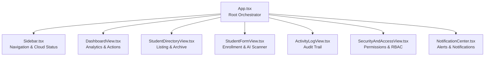
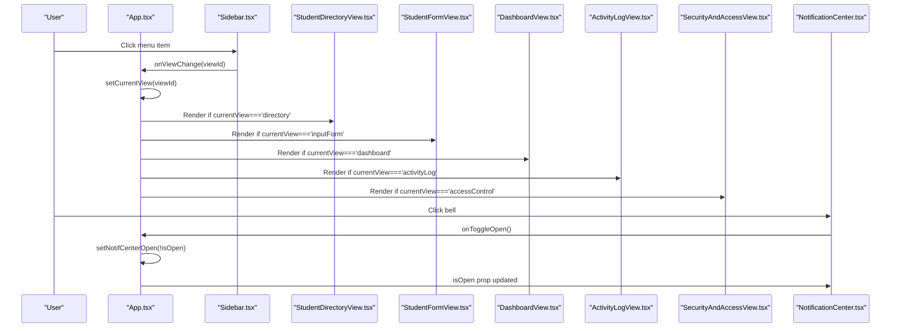
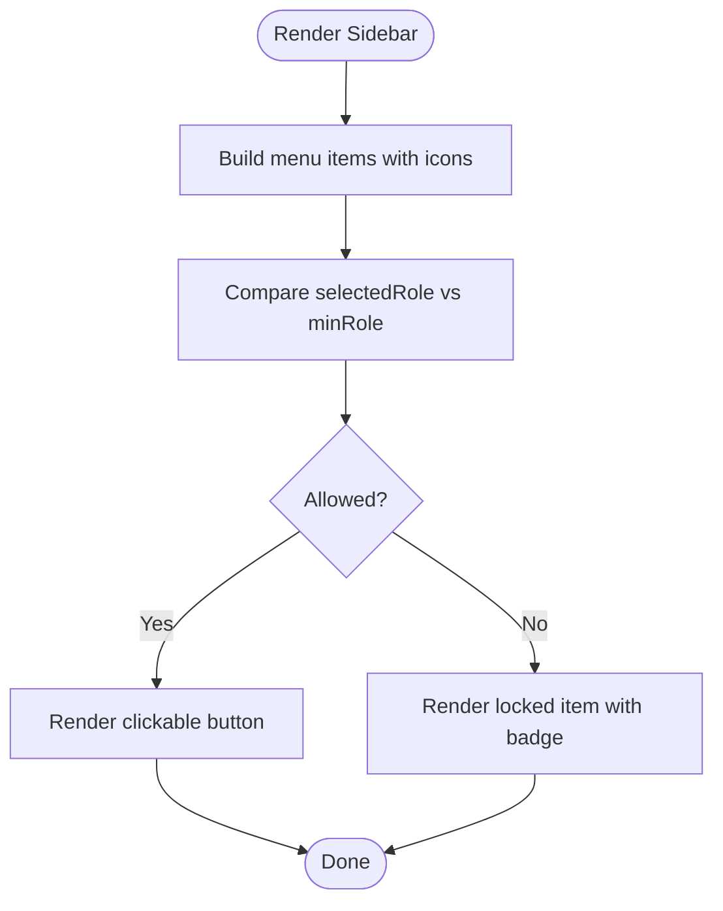
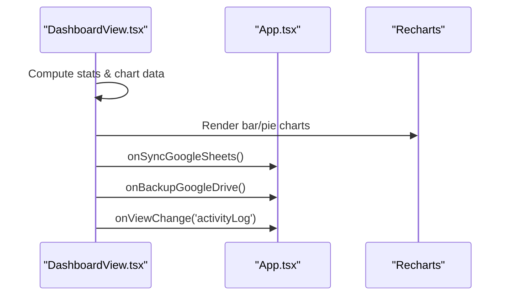
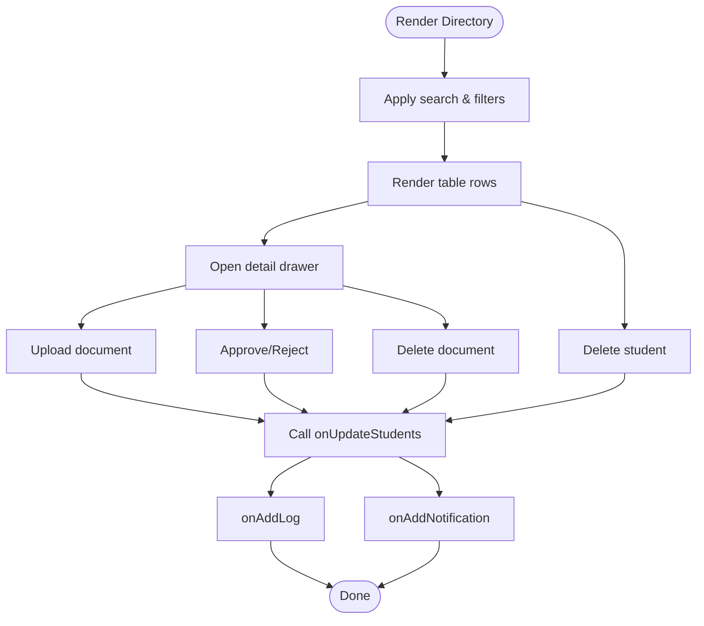
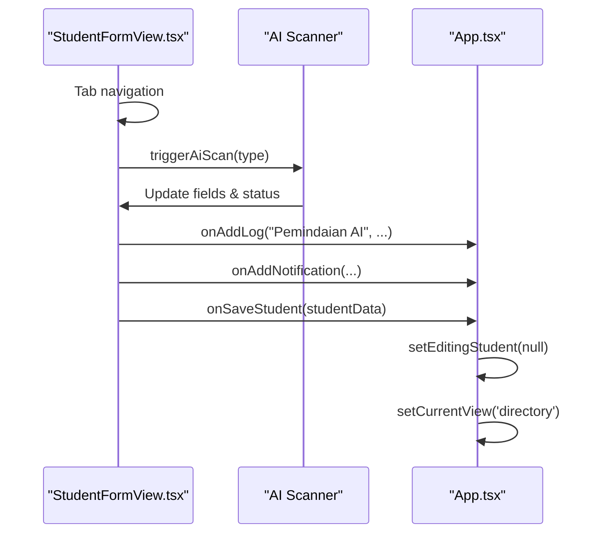
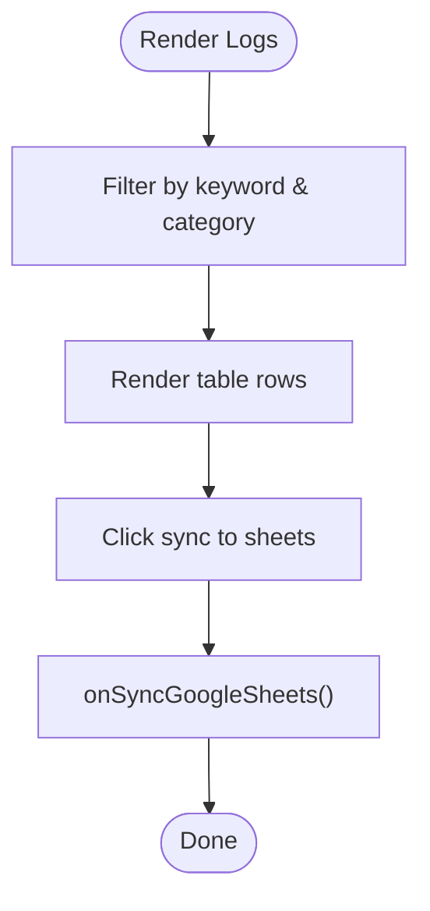
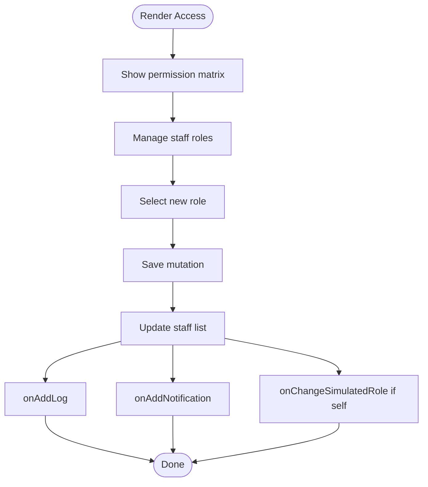
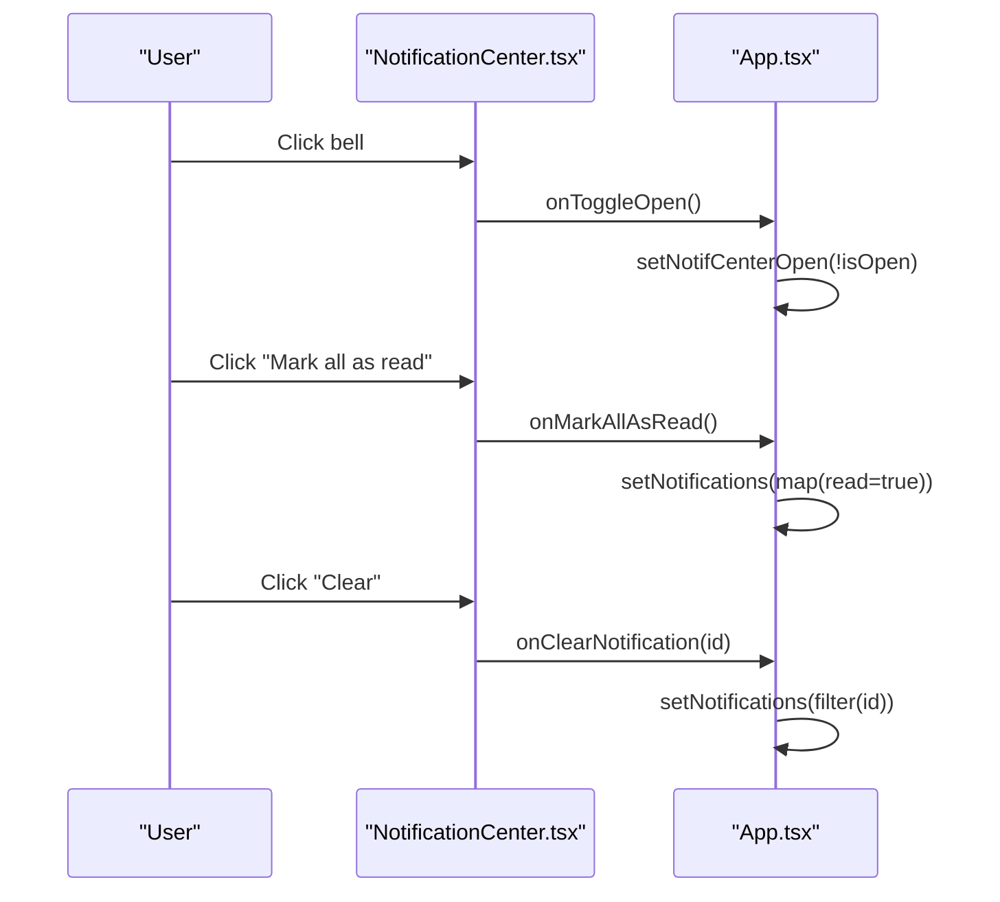
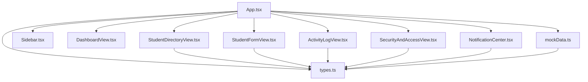

# Component System

<cite>
**Referenced Files in This Document**
- [App.tsx](file://src/App.tsx)
- [Sidebar.tsx](file://src/components/Sidebar.tsx)
- [DashboardView.tsx](file://src/components/DashboardView.tsx)
- [StudentDirectoryView.tsx](file://src/components/StudentDirectoryView.tsx)
- [StudentFormView.tsx](file://src/components/StudentFormView.tsx)
- [ActivityLogView.tsx](file://src/components/ActivityLogView.tsx)
- [SecurityAndAccessView.tsx](file://src/components/SecurityAndAccessView.tsx)
- [NotificationCenter.tsx](file://src/components/NotificationCenter.tsx)
- [types.ts](file://src/types.ts)
- [mockData.ts](file://src/mockData.ts)
</cite>

## Table of Contents
1. [Introduction](#introduction)
2. [Project Structure](#project-structure)
3. [Core Components](#core-components)
4. [Architecture Overview](#architecture-overview)
5. [Detailed Component Analysis](#detailed-component-analysis)
6. [Dependency Analysis](#dependency-analysis)
7. [Performance Considerations](#performance-considerations)
8. [Troubleshooting Guide](#troubleshooting-guide)
9. [Conclusion](#conclusion)
10. [Appendices](#appendices)

## Introduction
This document describes the ARBAL component system, a modular React-based application for managing student archives, digital document workflows, activity auditing, and permission management. The system is organized around a central App container that orchestrates routing, state, and cross-component communication, while specialized views encapsulate domain logic for dashboards, directory listings, enrollment forms, audit logs, access control, and notifications.

## Project Structure
The application follows a feature-based component architecture with a clear separation between:
- Root orchestration in App.tsx
- Feature components under src/components/
- Shared types and mock data under src/types.ts and src/mockData.ts
- Global styles and entry points under src/index.css, src/main.tsx, and index.html

**Diagram sources**
- [App.tsx:36-346](file://src/App.tsx#L36-L346)
- [Sidebar.tsx:28-181](file://src/components/Sidebar.tsx#L28-L181)
- [DashboardView.tsx:45-393](file://src/components/DashboardView.tsx#L45-L393)
- [StudentDirectoryView.tsx:42-755](file://src/components/StudentDirectoryView.tsx#L42-L755)
- [StudentFormView.tsx:37-1496](file://src/components/StudentFormView.tsx#L37-L1496)
- [ActivityLogView.tsx:25-171](file://src/components/ActivityLogView.tsx#L25-L171)
- [SecurityAndAccessView.tsx:40-315](file://src/components/SecurityAndAccessView.tsx#L40-L315)
- [NotificationCenter.tsx:25-130](file://src/components/NotificationCenter.tsx#L25-L130)

**Section sources**
- [App.tsx:36-346](file://src/App.tsx#L36-L346)

## Core Components
This section outlines the primary components and their responsibilities, props, state, and event handling patterns.

- Sidebar
  - Purpose: Navigation menu with role-aware visibility and cloud connection indicators.
  - Props: currentView, onViewChange, selectedRole, driveStatus, sheetsStatus
  - State: None (presentational)
  - Events: onClick triggers onViewChange with view id
  - Permissions: Uses role comparison to show/hide menu items
  - Styling: Tailwind classes for branding, active states, and status badges

- DashboardView
  - Purpose: Analytics dashboard with statistics, charts, recent logs, and quick actions.
  - Props: students, logs, selectedRole, onViewChange, onSyncGoogleSheets, onBackupGoogleDrive, isSyncingSheets, isSyncingDrive
  - State: None (presentational)
  - Events: Button clicks trigger external handlers for sync and navigation
  - Charts: Recharts-based bar/pie charts with responsive containers

- StudentDirectoryView
  - Purpose: Searchable, filterable directory of students with archive management.
  - Props: students, selectedRole, onUpdateStudents, onAddLog, onAddNotification, onEditStudent
  - State: Local search/filter, active student drawer, upload form state, drag-and-drop state
  - Events: Delete, upload, verify, approve/reject, open/close detail drawer
  - Permissions: Conditional rendering based on selectedRole

- StudentFormView
  - Purpose: Multi-tab enrollment form with parent details and document uploads.
  - Props: editingStudent, onSaveStudent, onCancel, selectedRole, onAddLog, onAddNotification
  - State: Tabs, form fields, document uploads, AI scanner simulation state
  - Events: Submit, remove doc, simulate upload, AI scan, cancel
  - AI Scanner: Simulated OCR pipeline with progress logs

- ActivityLogView
  - Purpose: Audit trail viewer with search and export capabilities.
  - Props: logs, onSyncGoogleSheets, isSyncing
  - State: Search term and category filter
  - Events: Sync to sheets, export, filter

- SecurityAndAccessView
  - Purpose: Role-based access control matrix and staff role management.
  - Props: selectedRole, onChangeSimulatedRole, onAddLog, onAddNotification
  - State: Editing staff role, temporary selection
  - Events: Role change for staff, self-simulation switch

- NotificationCenter
  - Purpose: Persistent bell-driven notification center with read/unread tracking.
  - Props: notifications, isOpen, onToggleOpen, onMarkAllAsRead, onClearNotification
  - State: None (presentational)
  - Events: Toggle open/close, mark all read, clear individual

**Section sources**
- [Sidebar.tsx:28-181](file://src/components/Sidebar.tsx#L28-L181)
- [DashboardView.tsx:45-393](file://src/components/DashboardView.tsx#L45-L393)
- [StudentDirectoryView.tsx:42-755](file://src/components/StudentDirectoryView.tsx#L42-L755)
- [StudentFormView.tsx:37-1496](file://src/components/StudentFormView.tsx#L37-L1496)
- [ActivityLogView.tsx:25-171](file://src/components/ActivityLogView.tsx#L25-L171)
- [SecurityAndAccessView.tsx:40-315](file://src/components/SecurityAndAccessView.tsx#L40-L315)
- [NotificationCenter.tsx:25-130](file://src/components/NotificationCenter.tsx#L25-L130)

## Architecture Overview
The App component acts as the central orchestrator, maintaining global state and passing down props to child components. It manages:
- Navigation state (currentView)
- Selected role (selectedRole)
- Core lists (students, logs, notifications)
- Editing context (editingStudent)
- Cloud sync states (isSyncingSheets, isSyncingDrive, driveStatus, sheetsStatus)
- Notification center visibility (notifCenterOpen)
- Event handlers for saving students, editing, syncing, logging, and notifications

**Diagram sources**
- [App.tsx:200-346](file://src/App.tsx#L200-L346)
- [Sidebar.tsx:98-111](file://src/components/Sidebar.tsx#L98-L111)
- [StudentDirectoryView.tsx:42-755](file://src/components/StudentDirectoryView.tsx#L42-L755)
- [StudentFormView.tsx:37-1496](file://src/components/StudentFormView.tsx#L37-L1496)
- [DashboardView.tsx:45-393](file://src/components/DashboardView.tsx#L45-L393)
- [ActivityLogView.tsx:25-171](file://src/components/ActivityLogView.tsx#L25-L171)
- [SecurityAndAccessView.tsx:40-315](file://src/components/SecurityAndAccessView.tsx#L40-L315)
- [NotificationCenter.tsx:25-130](file://src/components/NotificationCenter.tsx#L25-L130)

## Detailed Component Analysis

### Sidebar
- Responsibilities
  - Renders navigation menu with icons and labels
  - Enforces role-based visibility of menu items
  - Displays cloud connection statuses (Google Drive, Google Sheets)
- Props
  - currentView: string
  - onViewChange: (view: string) => void
  - selectedRole: RoleType
  - driveStatus: 'connected' | 'error' | 'syncing'
  - sheetsStatus: 'connected' | 'error' | 'syncing'
- State
  - None; uses props and helper functions
- Permissions
  - Menu items require minimum role level; otherwise renders locked state
- Styling
  - Tailwind utility classes for layout, colors, and active states

**Diagram sources**
- [Sidebar.tsx:36-112](file://src/components/Sidebar.tsx#L36-L112)

**Section sources**
- [Sidebar.tsx:28-181](file://src/components/Sidebar.tsx#L28-L181)

### DashboardView
- Responsibilities
  - Computes statistics from student data
  - Renders charts (bar/pie) using Recharts
  - Provides quick actions for syncing and backups
  - Shows recent activity logs with navigation to logs view
- Props
  - students: Student[]
  - logs: ActivityLog[]
  - selectedRole: RoleType
  - onViewChange: (view: string) => void
  - onSyncGoogleSheets: () => void
  - onBackupGoogleDrive: () => void
  - isSyncingSheets: boolean
  - isSyncingDrive: boolean
- State
  - None; derived from props
- Interactions
  - Buttons call external handlers for sync and navigation
  - Logs list links to ActivityLogView

**Diagram sources**
- [DashboardView.tsx:45-393](file://src/components/DashboardView.tsx#L45-L393)
- [App.tsx:104-161](file://src/App.tsx#L104-L161)

**Section sources**
- [DashboardView.tsx:45-393](file://src/components/DashboardView.tsx#L45-L393)

### StudentDirectoryView
- Responsibilities
  - Search and filter students
  - Manage document uploads (simulate upload, drag-and-drop)
  - Approve/reject documents
  - Delete documents and students (role-restricted)
  - Open detail drawer with profile and archive
- Props
  - students: Student[]
  - selectedRole: RoleType
  - onUpdateStudents: (updated: Student[]) => void
  - onAddLog: (action, category, details) => void
  - onAddNotification: (title, message, type) => void
  - onEditStudent: (student: Student) => void
- State
  - Search/filter: searchTerm, selectedClass, selectedStatus, selectedDocCompleteness
  - Detail drawer: activeStudentId
  - Upload form: uploadDocType, selectedFileName, isUploadingIdx
- Interactions
  - Handles delete/edit/verify actions
  - Updates students list via onUpdateStudents
  - Emits logs and notifications via callbacks

**Diagram sources**
- [StudentDirectoryView.tsx:42-755](file://src/components/StudentDirectoryView.tsx#L42-L755)

**Section sources**
- [StudentDirectoryView.tsx:42-755](file://src/components/StudentDirectoryView.tsx#L42-L755)

### StudentFormView
- Responsibilities
  - Multi-tab form for student enrollment
  - Parent/guardian details capture
  - Document upload simulation
  - AI-powered auto-fill (OCR-like simulation)
- Props
  - editingStudent: Student | null
  - onSaveStudent: (student: Student) => void
  - onCancel: () => void
  - selectedRole: RoleType
  - onAddLog: (action, category, details) => void
  - onAddNotification: (title, message, type) => void
- State
  - activeTab: 'siswa' | 'orangtua' | 'dokumen'
  - Form fields for student and parent details
  - docsUploaded: map of document uploads
  - AI scanner: showAiScanner, isScanning, scanProgressLogs, scannedDocType
- Interactions
  - Submit saves student data and emits logs/notifications
  - AI scanner updates form fields and switches tabs
  - Cancel returns to previous view

**Diagram sources**
- [StudentFormView.tsx:37-1496](file://src/components/StudentFormView.tsx#L37-L1496)
- [App.tsx:172-191](file://src/App.tsx#L172-L191)

**Section sources**
- [StudentFormView.tsx:37-1496](file://src/components/StudentFormView.tsx#L37-L1496)

### ActivityLogView
- Responsibilities
  - Search and filter audit logs
  - Export and sync logs to Google Sheets
- Props
  - logs: ActivityLog[]
  - onSyncGoogleSheets: () => void
  - isSyncing: boolean
- State
  - searchTerm, selectedCategory
- Interactions
  - Calls onSyncGoogleSheets when triggered

**Diagram sources**
- [ActivityLogView.tsx:25-171](file://src/components/ActivityLogView.tsx#L25-L171)

**Section sources**
- [ActivityLogView.tsx:25-171](file://src/components/ActivityLogView.tsx#L25-L171)

### SecurityAndAccessView
- Responsibilities
  - Role-based access control matrix
  - Staff role management (role mutation)
  - Self-simulation switch for selectedRole
- Props
  - selectedRole: RoleType
  - onChangeSimulatedRole: (role: RoleType) => void
  - onAddLog: (action, category, details) => void
  - onAddNotification: (title, message, type) => void
- State
  - editingStaffId, tempRoleSelect
- Interactions
  - Changes staff role and optionally updates current session role

**Diagram sources**
- [SecurityAndAccessView.tsx:40-315](file://src/components/SecurityAndAccessView.tsx#L40-L315)

**Section sources**
- [SecurityAndAccessView.tsx:40-315](file://src/components/SecurityAndAccessView.tsx#L40-L315)

### NotificationCenter
- Responsibilities
  - Bell-triggered dropdown with unread count
  - List of notifications with read/unread states
  - Mark all as read and clear individual notifications
- Props
  - notifications: SystemNotification[]
  - isOpen: boolean
  - onToggleOpen: () => void
  - onMarkAllAsRead: () => void
  - onClearNotification: (id: string) => void
- State
  - None; presentational
- Interactions
  - Toggles dropdown, marks all read, clears notifications

**Diagram sources**
- [NotificationCenter.tsx:25-130](file://src/components/NotificationCenter.tsx#L25-L130)
- [App.tsx:163-170](file://src/App.tsx#L163-L170)

**Section sources**
- [NotificationCenter.tsx:25-130](file://src/components/NotificationCenter.tsx#L25-L130)

## Dependency Analysis
- Component coupling
  - App.tsx is the central hub, tightly coupled to all child components via props and callbacks
  - Child components are mostly decoupled from each other except through shared types and mock data
- Data flow
  - Downward: App passes state and handlers to children
  - Upward: Children call handlers to update App state
- External dependencies
  - Recharts for visualization
  - lucide-react for icons
  - Tailwind CSS for styling

**Diagram sources**
- [App.tsx:17-34](file://src/App.tsx#L17-L34)
- [types.ts:6-82](file://src/types.ts#L6-L82)
- [mockData.ts:6-451](file://src/mockData.ts#L6-L451)

**Section sources**
- [App.tsx:17-34](file://src/App.tsx#L17-L34)
- [types.ts:6-82](file://src/types.ts#L6-L82)
- [mockData.ts:6-451](file://src/mockData.ts#L6-L451)

## Performance Considerations
- Rendering
  - DashboardView computes statistics and chart data from props; keep datasets minimal to avoid heavy computations
  - StudentDirectoryView filters and renders large tables; consider virtualization for very large datasets
- State updates
  - App maintains core lists in state; batch updates (e.g., handleSaveStudent) prevent unnecessary re-renders
- Network/UI
  - Simulated sync operations (Google Sheets/Drive) use timeouts; ensure UI reflects loading states to avoid perceived slowness
- Styling
  - Tailwind utility classes are efficient; avoid excessive nesting and redundant classes

## Troubleshooting Guide
- Role restrictions
  - If a menu item is locked, verify selectedRole meets minRole requirement
  - Use the role switcher in the header to test different permissions
- Sync failures
  - DriveStatus and SheetsStatus indicate connection states; check network and credentials
  - Retry sync operations; logs and notifications confirm outcomes
- Form validation
  - Required fields in StudentFormView trigger alerts; ensure all mandatory fields are filled
- Notification center
  - Unread count indicates pending notifications; use "Mark all as read" to reset
  - Clear individual notifications to declutter the list

**Section sources**
- [App.tsx:104-161](file://src/App.tsx#L104-L161)
- [StudentFormView.tsx:179-270](file://src/components/StudentFormView.tsx#L179-L270)
- [NotificationCenter.tsx:66-73](file://src/components/NotificationCenter.tsx#L66-L73)

## Conclusion
The ARBAL component system demonstrates a clean, modular architecture centered on a single orchestrator (App.tsx) that coordinates navigation, state, and cross-component communication. Each feature view encapsulates domain logic, adheres to role-based permissions, and integrates with a notification and audit trail system. The design supports scalability, reusability, and maintainability through shared types and mock data, while leveraging modern UI libraries for charts and icons.

## Appendices

### Component Lifecycle Management
- App.tsx
  - Manages global state and lifecycle hooks for sync operations and notifications
- Child components
  - Mostly functional with local state for UI interactions; lifecycle handled by React hooks

### Reusability Patterns
- Shared types and mock data enable consistent data structures across components
- Role-based rendering promotes reuse of permission checks across views
- Centralized handlers reduce duplication of event logic

### Styling Approaches
- Utility-first Tailwind classes for rapid prototyping and consistent design
- Responsive layouts using grid and flex utilities
- Theme tokens via color classes for branding and status indicators