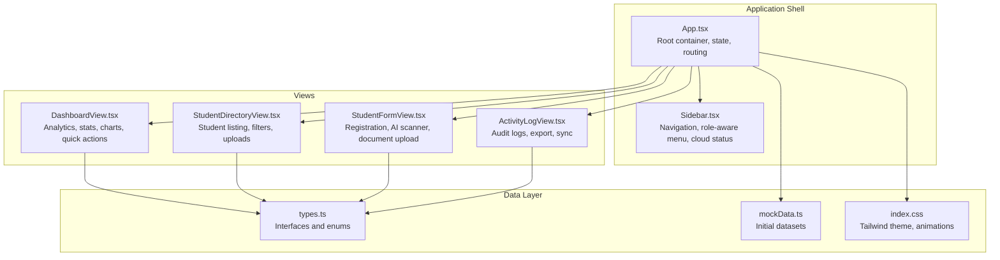
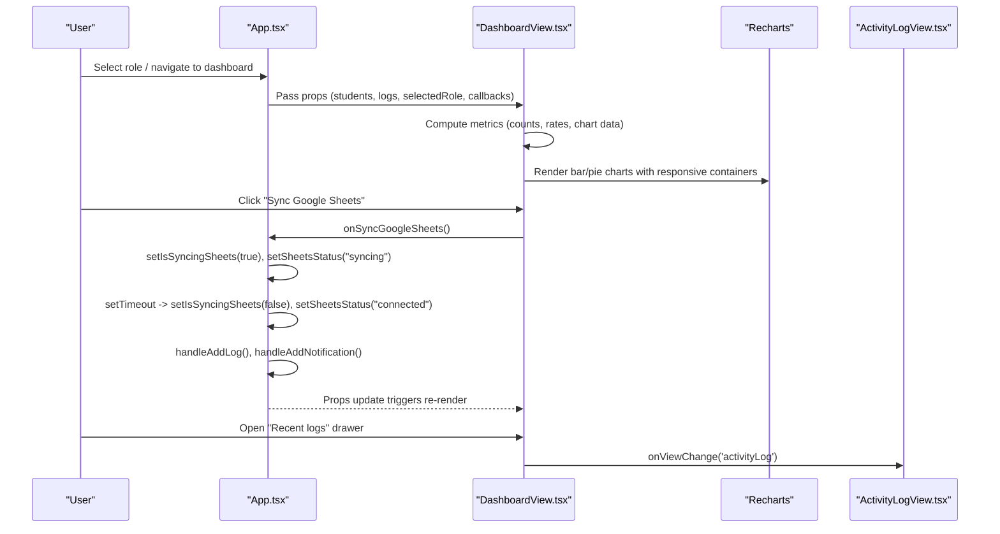
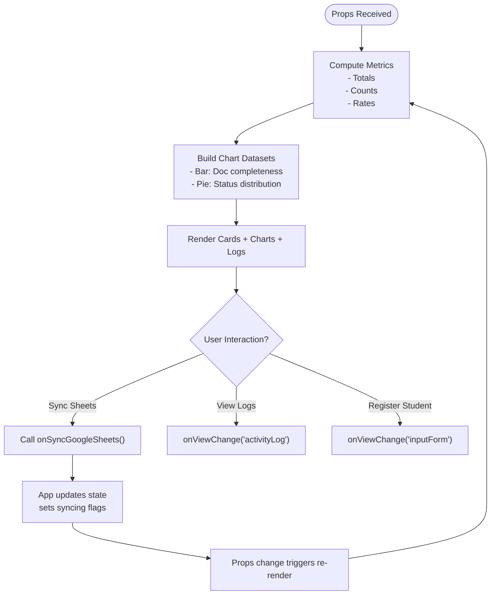
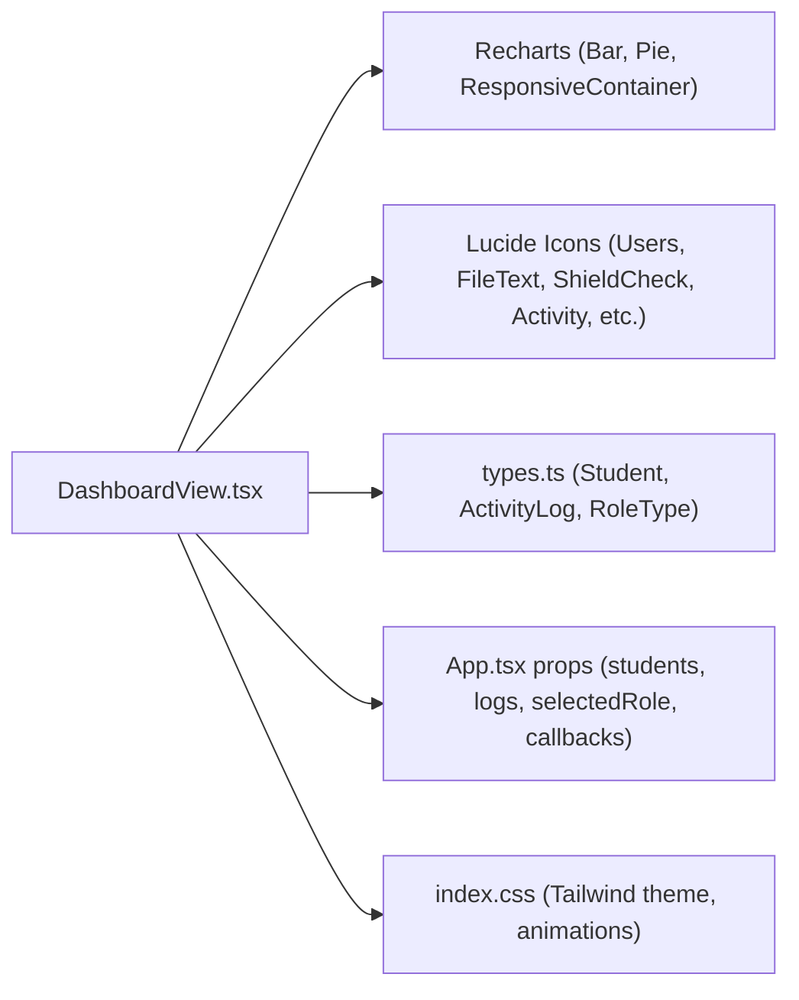

# Dashboard Analytics Component

<cite>
**Referenced Files in This Document**
- [DashboardView.tsx](file://src/components/DashboardView.tsx)
- [App.tsx](file://src/App.tsx)
- [types.ts](file://src/types.ts)
- [mockData.ts](file://src/mockData.ts)
- [index.css](file://src/index.css)
- [Sidebar.tsx](file://src/components/Sidebar.tsx)
- [StudentDirectoryView.tsx](file://src/components/StudentDirectoryView.tsx)
- [StudentFormView.tsx](file://src/components/StudentFormView.tsx)
- [ActivityLogView.tsx](file://src/components/ActivityLogView.tsx)
</cite>

## Table of Contents
1. [Introduction](#introduction)
2. [Project Structure](#project-structure)
3. [Core Components](#core-components)
4. [Architecture Overview](#architecture-overview)
5. [Detailed Component Analysis](#detailed-component-analysis)
6. [Dependency Analysis](#dependency-analysis)
7. [Performance Considerations](#performance-considerations)
8. [Troubleshooting Guide](#troubleshooting-guide)
9. [Conclusion](#conclusion)
10. [Appendices](#appendices)

## Introduction
This document provides comprehensive technical and practical documentation for the DashboardView component, focusing on the analytics and overview interface. It explains the dashboard’s data visualization capabilities, statistics display, real-time metrics presentation, layout structure, card-based information architecture, and interactive elements. It also details the data fetching patterns, state management for dashboard metrics, update mechanisms, configuration examples, metric calculations, performance monitoring, and responsive design strategies.

## Project Structure
The dashboard is part of a larger frontend application built with React and TypeScript, styled with Tailwind CSS and animated with Lucide icons and Recharts. The application simulates a centralized digital archive system integrating with Google Workspace (Sheets and Drive) and includes role-based access control and activity logging.

**Diagram sources**
- [App.tsx:36-348](file://src/App.tsx#L36-L348)
- [DashboardView.tsx:45-394](file://src/components/DashboardView.tsx#L45-L394)
- [Sidebar.tsx:28-182](file://src/components/Sidebar.tsx#L28-L182)
- [StudentDirectoryView.tsx:42-756](file://src/components/StudentDirectoryView.tsx#L42-L756)
- [StudentFormView.tsx:37-800](file://src/components/StudentFormView.tsx#L37-L800)
- [ActivityLogView.tsx:25-172](file://src/components/ActivityLogView.tsx#L25-L172)
- [types.ts:6-83](file://src/types.ts#L6-L83)
- [mockData.ts:6-452](file://src/mockData.ts#L6-L452)
- [index.css:1-31](file://src/index.css#L1-L31)

**Section sources**
- [App.tsx:36-348](file://src/App.tsx#L36-L348)
- [DashboardView.tsx:45-394](file://src/components/DashboardView.tsx#L45-L394)
- [types.ts:6-83](file://src/types.ts#L6-L83)
- [mockData.ts:6-452](file://src/mockData.ts#L6-L452)
- [index.css:1-31](file://src/index.css#L1-L31)

## Core Components
- DashboardView: Renders the analytics overview, statistics cards, charts, recent activity, and quick action links. It calculates metrics from props and renders Recharts visualizations.
- App: Manages global state (students, logs, notifications, roles, sync statuses), handles Google Workspace integrations, and routes views.
- Supporting Views: StudentDirectoryView, StudentFormView, ActivityLogView provide complementary data management and reporting.
- Types and Mock Data: Define data contracts and initial datasets for development and simulation.

Key responsibilities:
- DashboardView: Stateless rendering with derived computations; receives data and callbacks via props.
- App: Centralized state management, event handlers for sync operations, and navigation orchestration.

**Section sources**
- [DashboardView.tsx:45-394](file://src/components/DashboardView.tsx#L45-L394)
- [App.tsx:36-348](file://src/App.tsx#L36-L348)
- [types.ts:6-83](file://src/types.ts#L6-L83)
- [mockData.ts:6-452](file://src/mockData.ts#L6-L452)

## Architecture Overview
The dashboard integrates with Google Workspace through simulated sync operations and displays real-time-like activity logs. It uses a card-based layout with responsive grids and Recharts for visualizations. Role-based access controls restrict actions and visibility.

**Diagram sources**
- [App.tsx:104-161](file://src/App.tsx#L104-L161)
- [DashboardView.tsx:142-161](file://src/components/DashboardView.tsx#L142-L161)
- [ActivityLogView.tsx:25-172](file://src/components/ActivityLogView.tsx#L25-L172)

## Detailed Component Analysis

### DashboardView Component
DashboardView is a functional component that:
- Receives props: student records, activity logs, selected role, view change handler, and sync callbacks.
- Computes derived metrics: total students, active/alumni counts, document totals, completeness scores, and chart datasets.
- Renders:
  - A welcome banner with quick sync buttons for Google Sheets and Google Drive.
  - Four statistics cards (total students, total documents, completeness rate, role/security).
  - Two main chart areas: a bar chart for document completeness and a pie chart for student status.
  - A recent activity feed with role-restricted actions.
  - Quick links and tips for operational guidance.

Data visualization highlights:
- Bar chart: shows document type counts vs. total student targets.
- Pie chart: shows distribution of active/alumni/pending students.
- Responsive containers ensure charts adapt to screen sizes.

Interactive elements:
- Quick sync buttons trigger App-level handlers with role checks and loading states.
- Role-aware visibility of “View All Logs” and “New Registration” actions.
- Animated loading indicators during sync operations.

State management:
- Metrics are computed locally from props; no internal state is required.
- Sync states are managed in App and passed down as props.

Real-time metrics presentation:
- Activity logs are displayed from the latest to earliest.
- Role-dependent filtering ensures only authorized actions are exposed.

Configuration examples:
- Chart customization: axes, tooltips, legends, responsive sizing.
- Metric thresholds: completeness percentage calculation and display formatting.

Metric calculations:
- Completeness rate: ratio of students with full document sets (≥5 documents) to total students.
- Status distribution: counts per status category with color-coded segments.

Performance monitoring:
- Chart rendering uses responsive containers to prevent layout thrashing.
- Conditional rendering avoids unnecessary chart updates when data is empty.

Responsive design:
- Grid layouts adjust from single column on small screens to multi-column on larger screens.
- Typography scales appropriately across breakpoints.
- Icons and spacing remain consistent across devices.

**Section sources**
- [DashboardView.tsx:45-394](file://src/components/DashboardView.tsx#L45-L394)
- [App.tsx:104-161](file://src/App.tsx#L104-L161)
- [types.ts:6-83](file://src/types.ts#L6-L83)

### Data Fetching Patterns and State Management
- Initial data: Provided via props from App state initialized with mock datasets.
- Derived computations: Metrics and chart data are computed inside DashboardView from incoming props.
- Update mechanism: App manages state and re-renders DashboardView when props change (e.g., after sync operations or role switches).

**Diagram sources**
- [DashboardView.tsx:56-124](file://src/components/DashboardView.tsx#L56-L124)
- [App.tsx:104-161](file://src/App.tsx#L104-L161)

**Section sources**
- [App.tsx:43-102](file://src/App.tsx#L43-L102)
- [DashboardView.tsx:56-124](file://src/components/DashboardView.tsx#L56-L124)

### Layout Structure and Card-Based Information Architecture
- Welcome banner: Gradient background, role badge, quick sync buttons.
- Stats cards: Four horizontally aligned cards with icons and contextual labels.
- Charts grid: Two-column layout on large screens, stacked on smaller screens.
- Recent logs: Left-aligned with quick links and tips on the right.

Accessibility and UX:
- Clear typography hierarchy and consistent spacing.
- Role-aware actions and disabled states for restricted operations.
- Hover and focus states for interactive elements.

**Section sources**
- [DashboardView.tsx:125-394](file://src/components/DashboardView.tsx#L125-L394)

### Interactive Elements
- Quick sync buttons: Trigger App-level handlers with role checks and loading feedback.
- View change buttons: Navigate to other views (directory, input form, activity log).
- Disabled states: Respect role restrictions (e.g., teachers cannot trigger external sync).

**Section sources**
- [DashboardView.tsx:142-161](file://src/components/DashboardView.tsx#L142-L161)
- [DashboardView.tsx:314-322](file://src/components/DashboardView.tsx#L314-L322)
- [DashboardView.tsx:371-387](file://src/components/DashboardView.tsx#L371-L387)

### Data Visualization Capabilities
- Bar chart: Document type completeness vs. total student targets.
- Pie chart: Student status distribution with centered total label and legend.
- Tooltips and legends: Enhanced readability with Recharts.

Responsive containers:
- Charts resize dynamically while maintaining aspect ratios.

**Section sources**
- [DashboardView.tsx:226-302](file://src/components/DashboardView.tsx#L226-L302)
- [DashboardView.tsx:237-248](file://src/components/DashboardView.tsx#L237-L248)
- [DashboardView.tsx:262-280](file://src/components/DashboardView.tsx#L262-L280)

### Real-Time Metrics Presentation
- Activity logs: Latest entries shown first with timestamps and categorization.
- Role-dependent visibility: Super Admin and Staff TU see “View All Logs”.
- Notifications: Auto-open for warnings; App manages notification center.

**Section sources**
- [DashboardView.tsx:305-346](file://src/components/DashboardView.tsx#L305-L346)
- [App.tsx:60-102](file://src/App.tsx#L60-L102)

### Examples of Dashboard Configuration
- Chart customization: Axes, grid, tooltip, legend, and responsive sizing.
- Metric thresholds: Completeness percentage computed from document counts.
- Role-aware UI: Buttons and links adapt to selected role.

**Section sources**
- [DashboardView.tsx:237-248](file://src/components/DashboardView.tsx#L237-L248)
- [DashboardView.tsx:262-280](file://src/components/DashboardView.tsx#L262-L280)
- [DashboardView.tsx:198-203](file://src/components/DashboardView.tsx#L198-L203)

### Performance Monitoring
- Efficient computation: Metrics calculated once per render from props.
- Conditional rendering: Charts and lists only render when data is present.
- Responsive containers: Prevent layout shifts and improve perceived performance.

**Section sources**
- [DashboardView.tsx:234-236](file://src/components/DashboardView.tsx#L234-L236)
- [DashboardView.tsx:259-261](file://src/components/DashboardView.tsx#L259-L261)

## Dependency Analysis
DashboardView depends on:
- Recharts for visualization.
- Lucide icons for UI affordances.
- Tailwind CSS for styling and responsive utilities.
- App-provided props for data and callbacks.

**Diagram sources**
- [DashboardView.tsx:6-32](file://src/components/DashboardView.tsx#L6-L32)
- [types.ts:6-83](file://src/types.ts#L6-L83)
- [App.tsx:290-299](file://src/App.tsx#L290-L299)
- [index.css:1-31](file://src/index.css#L1-L31)

**Section sources**
- [DashboardView.tsx:6-32](file://src/components/DashboardView.tsx#L6-L32)
- [types.ts:6-83](file://src/types.ts#L6-L83)
- [App.tsx:290-299](file://src/App.tsx#L290-L299)
- [index.css:1-31](file://src/index.css#L1-L31)

## Performance Considerations
- Prefer derived computations in components to minimize prop drilling overhead.
- Use responsive containers to avoid expensive reflows.
- Keep chart datasets minimal and precomputed to reduce render time.
- Debounce or throttle frequent updates (e.g., logs) to avoid excessive re-renders.

## Troubleshooting Guide
Common issues and resolutions:
- Charts not rendering: Verify data arrays are non-empty; ensure responsive containers have explicit heights.
- Role restrictions: Confirm selectedRole prop reflects the intended role; buttons should be disabled accordingly.
- Sync operations: Check isSyncing flags and status indicators; confirm App-level handlers update state and emit logs/notifications.
- Empty states: Ensure fallback UIs are displayed when data is unavailable.

**Section sources**
- [DashboardView.tsx:234-236](file://src/components/DashboardView.tsx#L234-L236)
- [DashboardView.tsx:259-261](file://src/components/DashboardView.tsx#L259-L261)
- [App.tsx:104-161](file://src/App.tsx#L104-L161)

## Conclusion
DashboardView delivers a comprehensive analytics overview with clear statistics, intuitive visualizations, and role-aware interactions. Its modular design, responsive layout, and efficient data handling make it suitable for real-time monitoring and operational insights. The component’s reliance on props and derived computations keeps it lightweight and predictable, while App-level state management ensures seamless integration with Google Workspace simulations and activity logging.

## Appendices
- Data contracts and initial datasets are defined in types.ts and mockData.ts.
- Styling and animations leverage Tailwind and custom keyframes.

**Section sources**
- [types.ts:6-83](file://src/types.ts#L6-L83)
- [mockData.ts:6-452](file://src/mockData.ts#L6-L452)
- [index.css:1-31](file://src/index.css#L1-L31)