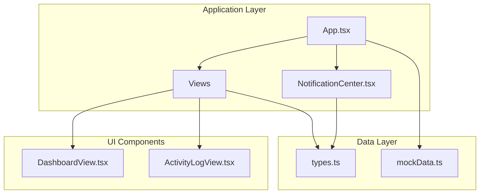
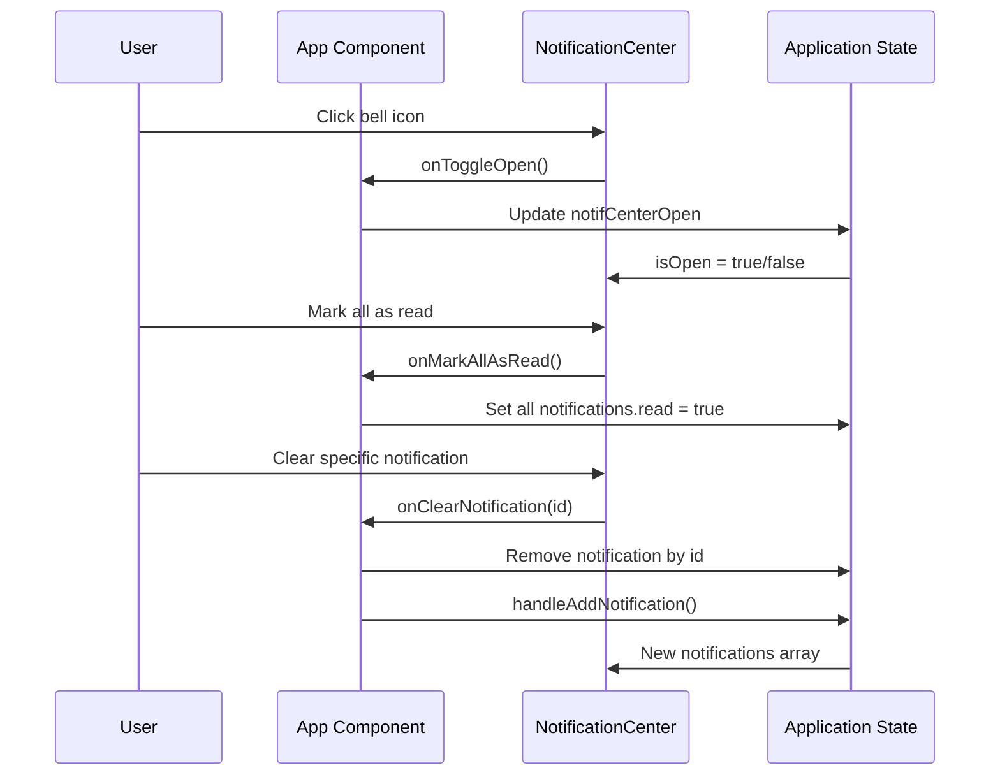
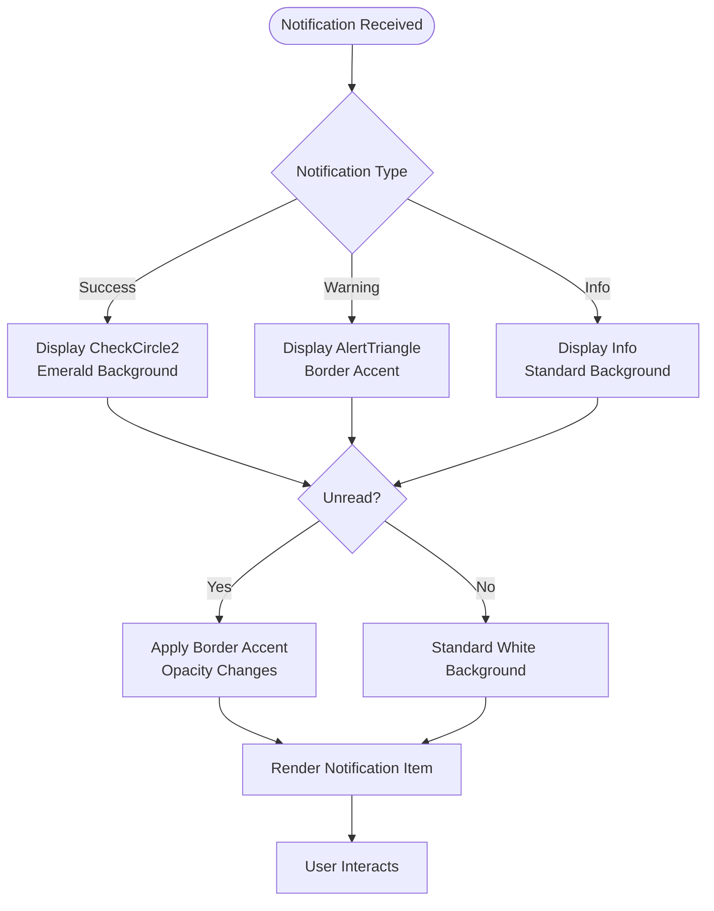
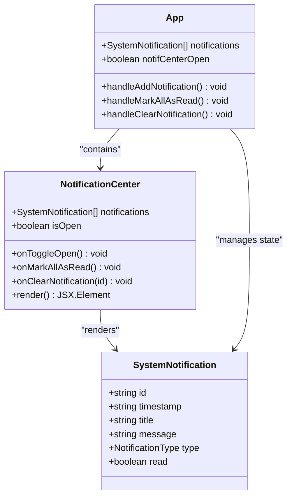

# Notification Center Component

<cite>
**Referenced Files in This Document**
- [NotificationCenter.tsx](file://src/components/NotificationCenter.tsx)
- [App.tsx](file://src/App.tsx)
- [types.ts](file://src/types.ts)
- [mockData.ts](file://src/mockData.ts)
- [DashboardView.tsx](file://src/components/DashboardView.tsx)
- [ActivityLogView.tsx](file://src/components/ActivityLogView.tsx)
</cite>

## Table of Contents
1. [Introduction](#introduction)
2. [Project Structure](#project-structure)
3. [Core Components](#core-components)
4. [Architecture Overview](#architecture-overview)
5. [Detailed Component Analysis](#detailed-component-analysis)
6. [Dependency Analysis](#dependency-analysis)
7. [Performance Considerations](#performance-considerations)
8. [Troubleshooting Guide](#troubleshooting-guide)
9. [Conclusion](#conclusion)

## Introduction
This document provides comprehensive documentation for the NotificationCenter component, focusing on the real-time alert and notification system. It explains notification display, alert types, priority handling, user interaction patterns, queue management, auto-dismiss functionality, user preferences, real-time updates, system alerts, user-specific messaging, configuration examples, custom alert types, integration patterns, persistence/history management, and accessibility features.

## Project Structure
The NotificationCenter component is part of a larger educational archive management application. It integrates with the main application state and various views to provide real-time notifications for system actions and user interactions.

**Diagram sources**
- [App.tsx:36-347](file://src/App.tsx#L36-L347)
- [NotificationCenter.tsx:25-130](file://src/components/NotificationCenter.tsx#L25-L130)

**Section sources**
- [App.tsx:36-347](file://src/App.tsx#L36-L347)
- [NotificationCenter.tsx:25-130](file://src/components/NotificationCenter.tsx#L25-L130)

## Core Components
The NotificationCenter component manages a dropdown notification panel with the following core functionalities:

### Notification Data Model
The system uses a structured notification model with the following properties:
- Unique identifier for each notification
- Timestamp for creation and display
- Title and message content
- Type classification (info, success, warning)
- Read/unread status tracking

### Component Interface
The component accepts props for managing notification state and user interactions:
- `notifications`: Array of SystemNotification objects
- `isOpen`: Boolean controlling dropdown visibility
- `onToggleOpen`: Function to toggle dropdown state
- `onMarkAllAsRead`: Function to mark all notifications as read
- `onClearNotification`: Function to remove individual notifications

### Visual Design Elements
The component implements a bell-shaped trigger with animated unread indicators and a comprehensive dropdown panel displaying notifications with appropriate icons and styling based on notification type.

**Section sources**
- [types.ts:75-82](file://src/types.ts#L75-L82)
- [NotificationCenter.tsx:17-23](file://src/components/NotificationCenter.tsx#L17-L23)
- [NotificationCenter.tsx:35-130](file://src/components/NotificationCenter.tsx#L35-L130)

## Architecture Overview
The notification system follows a unidirectional data flow pattern where the parent application manages state and passes down handlers to child components.

**Diagram sources**
- [App.tsx:58-170](file://src/App.tsx#L58-L170)
- [NotificationCenter.tsx:25-31](file://src/components/NotificationCenter.tsx#L25-L31)

## Detailed Component Analysis

### Notification Display System
The component renders notifications in a scrollable dropdown panel with the following display characteristics:

#### Priority-Based Visual Hierarchy
- **Success notifications**: Emerald green check-circle icons with light green backgrounds
- **Warning notifications**: Amber triangle icons with border-left accent styling  
- **Info notifications**: Blue info icons with standard white backgrounds
- **Unread state**: Distinct border-left accent and opacity changes

#### Interactive Elements
- Unread count badge with bounce animation for attention
- Individual clear buttons for selective removal
- Batch mark-as-read functionality
- Timestamp display with time-only formatting

**Diagram sources**
- [NotificationCenter.tsx:94-98](file://src/components/NotificationCenter.tsx#L94-L98)
- [NotificationCenter.tsx:89-91](file://src/components/NotificationCenter.tsx#L89-L91)

### Real-Time Update Mechanism
The system implements automatic real-time updates through React's state management:

#### Automatic Triggering
- Major warnings automatically open the notification panel
- New notifications appear immediately in the dropdown
- State updates propagate instantly to all connected components

#### Update Frequency
- Notifications update on every state change
- No manual refresh required
- Consistent real-time synchronization across the application

### User Interaction Patterns
The component supports multiple interaction modes:

#### Primary Actions
- **Toggle dropdown**: Click bell icon to show/hide notifications
- **Mark all read**: Batch operation to clear unread indicators
- **Individual clearing**: Remove specific notifications
- **Auto-dismiss**: System-managed removal after user action

#### Accessibility Features
- Proper ARIA labels and titles
- Keyboard navigable dropdown
- Color contrast compliant design
- Focus management for interactive elements

**Section sources**
- [App.tsx:83-102](file://src/App.tsx#L83-L102)
- [App.tsx:164-170](file://src/App.tsx#L164-L170)
- [NotificationCenter.tsx:38-50](file://src/components/NotificationCenter.tsx#L38-L50)

### Notification Queue Management
The system implements a first-in-first-out queue with the following characteristics:

#### Ordering and Priority
- Newest notifications appear at the top
- Automatic sorting by timestamp
- No manual reordering capability
- Priority-based visual emphasis (warnings first)

#### Capacity and Limits
- No explicit queue length limits
- Automatic cleanup through user actions
- Memory managed by React's component lifecycle

### Auto-Dismiss Functionality
The system provides several auto-dismiss mechanisms:

#### Automatic Opening
- Warning-type notifications automatically expand the panel
- Immediate user attention for critical issues
- No user intervention required for critical alerts

#### User-Initiated Dismissal
- Individual clear buttons remove specific notifications
- Mark-all-as-read clears entire queue
- Natural expiration through user interaction

### User Preference Settings
The component respects user preferences through state management:

#### Read/Unread Tracking
- Persistent read/unread state per notification
- Batch operations maintain consistency
- Visual indicators reflect current state

#### Visibility Control
- User-controlled dropdown visibility
- Session-based state persistence
- No permanent storage requirements

**Section sources**
- [App.tsx:164-170](file://src/App.tsx#L164-L170)
- [App.tsx:98-101](file://src/App.tsx#L98-L101)

### Real-Time Notification Updates
The system ensures notifications reflect current application state:

#### Event-Driven Updates
- All major system actions trigger notifications
- Immediate feedback for user operations
- Consistent timing across all notification types

#### Integration Points
- Student data modifications
- Document upload operations  
- System configuration changes
- Access control updates

### System Alerts and User-Specific Messaging
The component handles both system-generated and user-specific notifications:

#### System Alerts
- Configuration changes
- Permission updates
- System maintenance notices
- Integration status messages

#### User-Specific Messages
- Role-based access limitations
- Operation completion confirmations
- Error conditions and resolutions
- Progress notifications

### Notification Configuration Examples
The system supports flexible notification configuration:

#### Basic Configuration
- Title and message content
- Type specification (info/success/warning)
- Timestamp generation
- Read status initialization

#### Advanced Configuration
- Priority-based visual treatment
- Automatic user attention triggers
- Batch operation capabilities
- Integration with existing workflows

### Custom Alert Types
While the current implementation supports three standard types, the architecture allows for extension:

#### Extension Points
- Additional type enumeration in SystemNotification
- New icon mapping in render logic
- Custom styling and behavior
- Enhanced visual hierarchy

### Integration Patterns
The component integrates seamlessly with the broader application:

#### Parent-Child Communication
- Props-based data flow
- Callback handler propagation
- State management delegation
- Event-driven architecture

#### Cross-Component Coordination
- Shared state management
- Consistent notification formatting
- Unified user experience
- Centralized configuration

**Section sources**
- [App.tsx:274-281](file://src/App.tsx#L274-L281)
- [App.tsx:83-102](file://src/App.tsx#L83-L102)

## Dependency Analysis
The NotificationCenter component has minimal external dependencies and clear internal relationships:

**Diagram sources**
- [NotificationCenter.tsx:17-23](file://src/components/NotificationCenter.tsx#L17-L23)
- [types.ts:75-82](file://src/types.ts#L75-L82)
- [App.tsx:46-58](file://src/App.tsx#L46-L58)

**Section sources**
- [NotificationCenter.tsx:6-15](file://src/components/NotificationCenter.tsx#L6-L15)
- [types.ts:75-82](file://src/types.ts#L75-L82)

## Performance Considerations
The notification system is optimized for performance and user experience:

### Rendering Efficiency
- Virtual scrolling for large notification lists
- Efficient re-rendering through React.memo patterns
- Minimal DOM manipulation during updates
- Optimized state updates

### Memory Management
- Automatic cleanup through component unmounting
- No persistent storage overhead
- Efficient event handler binding
- Lightweight icon rendering

### Scalability Factors
- Linear performance scaling with notification count
- No database or network dependencies
- Client-side only processing
- Minimal computational overhead

## Troubleshooting Guide
Common issues and their solutions:

### Notification Not Appearing
- Verify notification state is being updated in parent component
- Check that notifications array is properly passed as props
- Ensure notification timestamps are formatted correctly

### Visual Display Issues
- Confirm CSS classes are loading properly
- Verify icon library dependencies are installed
- Check for conflicting style overrides

### Interaction Problems
- Validate callback handlers are properly bound
- Ensure event propagation is not being prevented
- Check for disabled state conflicts

### Performance Concerns
- Monitor notification list growth
- Consider implementing pagination for very large datasets
- Optimize rendering frequency if needed

**Section sources**
- [App.tsx:58-170](file://src/App.tsx#L58-L170)
- [NotificationCenter.tsx:35-130](file://src/components/NotificationCenter.tsx#L35-L130)

## Conclusion
The NotificationCenter component provides a robust, real-time notification system with comprehensive user interaction capabilities. Its clean architecture, efficient rendering, and seamless integration with the broader application make it an effective solution for delivering timely alerts and system feedback. The component's extensible design allows for future enhancements while maintaining excellent performance and user experience standards.