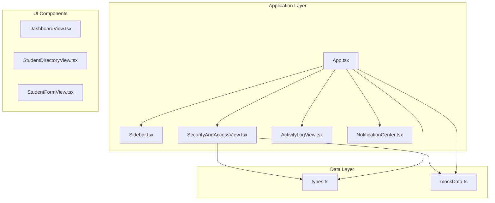
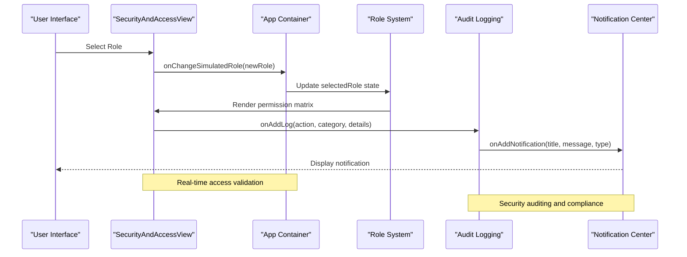
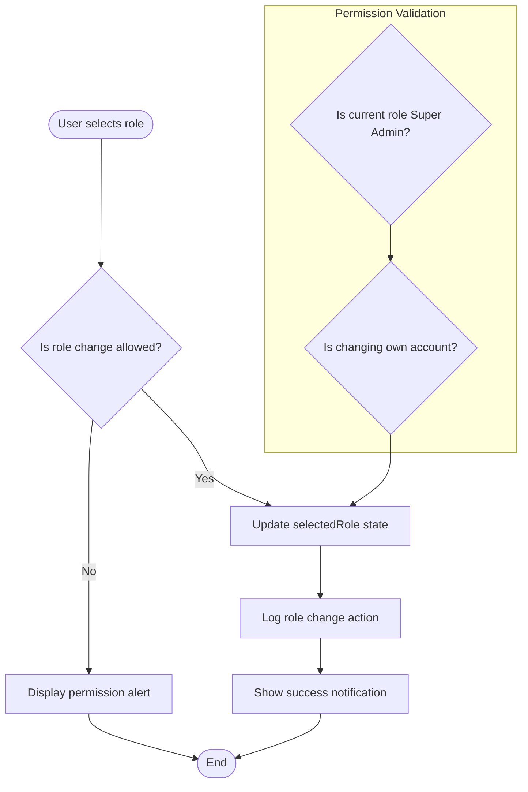
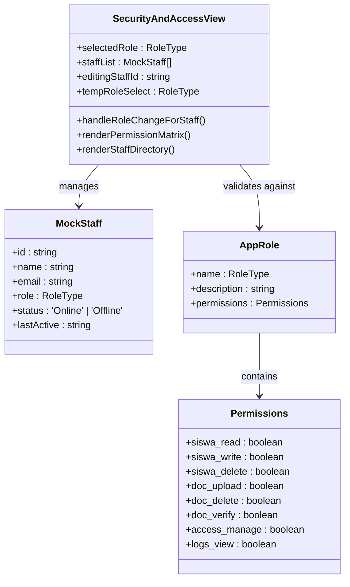
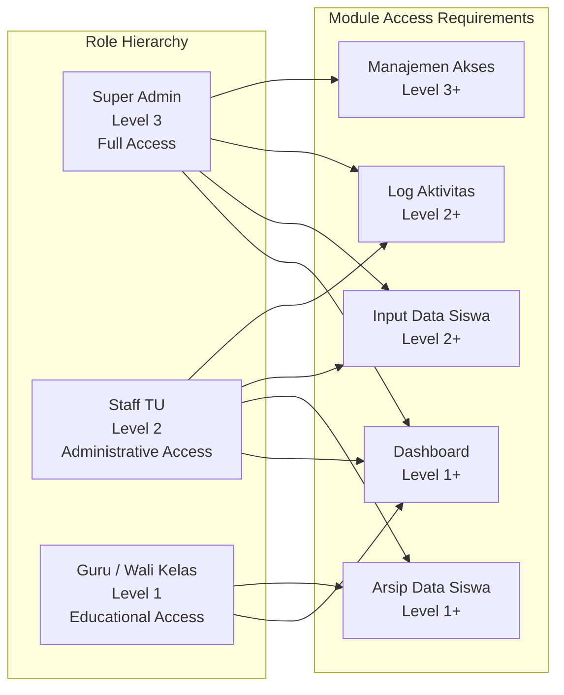
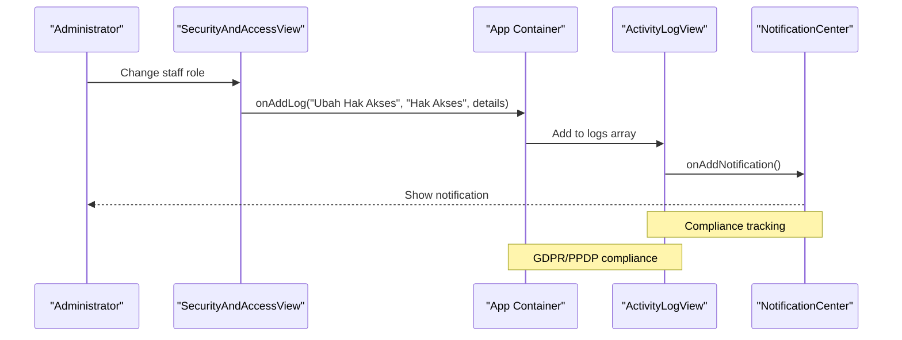
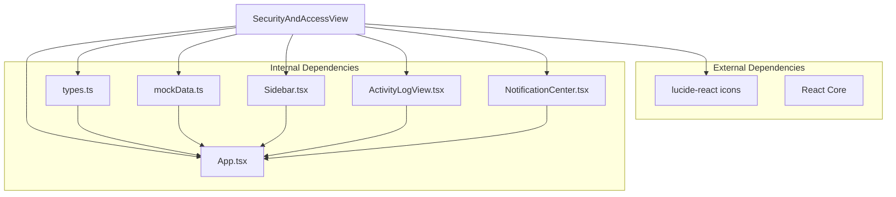

# Security and Access Control Component

<cite>
**Referenced Files in This Document**
- [SecurityAndAccessView.tsx](file://src/components/SecurityAndAccessView.tsx)
- [App.tsx](file://src/App.tsx)
- [types.ts](file://src/types.ts)
- [mockData.ts](file://src/mockData.ts)
- [Sidebar.tsx](file://src/components/Sidebar.tsx)
- [ActivityLogView.tsx](file://src/components/ActivityLogView.tsx)
- [NotificationCenter.tsx](file://src/components/NotificationCenter.tsx)
</cite>

## Table of Contents
1. [Introduction](#introduction)
2. [Project Structure](#project-structure)
3. [Core Components](#core-components)
4. [Architecture Overview](#architecture-overview)
5. [Detailed Component Analysis](#detailed-component-analysis)
6. [Dependency Analysis](#dependency-analysis)
7. [Performance Considerations](#performance-considerations)
8. [Troubleshooting Guide](#troubleshooting-guide)
9. [Conclusion](#conclusion)

## Introduction
This document provides comprehensive documentation for the SecurityAndAccessView component, focusing on the access control and permission management interface. The component implements a Role-Based Access Control (RBAC) system with role hierarchy, permission matrices, user access control, and security policies. It demonstrates role management, permission configuration, user access control, and security auditing through a practical interface that simulates different user roles and their capabilities.

The system follows strict security policies with encryption enforcement for sensitive student documents, ensuring compliance with privacy regulations. The component integrates seamlessly with the authentication system and session management, providing real-time role switching and access validation.

## Project Structure
The SecurityAndAccessView component is part of a larger educational administration system built with React and TypeScript. The project follows a modular architecture with clear separation of concerns:

**Diagram sources**
- [App.tsx:36-347](file://src/App.tsx#L36-L347)
- [SecurityAndAccessView.tsx:40-315](file://src/components/SecurityAndAccessView.tsx#L40-L315)

**Section sources**
- [App.tsx:36-347](file://src/App.tsx#L36-L347)
- [SecurityAndAccessView.tsx:40-315](file://src/components/SecurityAndAccessView.tsx#L40-L315)

## Core Components
The security and access control system consists of several interconnected components that work together to provide comprehensive access management:

### Role Management System
The system implements a hierarchical role-based access control model with three distinct roles:

- **Super Admin**: Full system access with administrative privileges
- **Staff TU**: Administrative support with document management capabilities  
- **Guru / Wali Kelas**: Educational access for student data viewing

### Permission Configuration
Each role has a defined set of permissions represented as boolean flags in the AppRole interface. The permissions include:
- Student data operations (read, write, delete)
- Document management (upload, delete, verification)
- Access control management
- Activity logging and auditing

### Security Policies
The system enforces strict security policies including:
- Encryption enforcement for sensitive documents
- Role-based access restrictions
- Comprehensive activity logging
- Compliance with privacy regulations (UU PDP No.27)

**Section sources**
- [types.ts:48-63](file://src/types.ts#L48-L63)
- [mockData.ts:315-358](file://src/mockData.ts#L315-L358)

## Architecture Overview
The SecurityAndAccessView component operates within a broader RBAC architecture that spans multiple application layers:

**Diagram sources**
- [SecurityAndAccessView.tsx:114-127](file://src/components/SecurityAndAccessView.tsx#L114-L127)
- [App.tsx:61-102](file://src/App.tsx#L61-L102)

The architecture ensures that role changes immediately propagate throughout the system, updating access controls, permission matrices, and user interface elements in real-time.

**Section sources**
- [SecurityAndAccessView.tsx:114-127](file://src/components/SecurityAndAccessView.tsx#L114-L127)
- [App.tsx:61-102](file://src/App.tsx#L61-L102)

## Detailed Component Analysis

### SecurityAndAccessView Component
The SecurityAndAccessView component serves as the central interface for managing security and access control within the system.

#### Role Simulation and Switching
The component provides a sophisticated role simulation mechanism that allows administrators to test different permission scenarios:

**Diagram sources**
- [SecurityAndAccessView.tsx:62-95](file://src/components/SecurityAndAccessView.tsx#L62-L95)

#### Permission Matrix Implementation
The component displays a comprehensive permission matrix that visually represents access rights for each role:

| Operation | Super Admin | Staff TU | Guru / Wali Kelas |
|-----------|-------------|----------|-------------------|
| Student Read | ✅ Full Access | ✅ Full Access | ✅ Full Access |
| Student Write | ✅ CRUD | ✅ CRUD | ❌ Restricted |
| Student Delete | ✅ CRUD | ❌ Restricted | ❌ Restricted |
| Document Upload | ✅ CRUD | ✅ CRUD | ❌ Restricted |
| Document Delete | ✅ CRUD | ❌ Restricted | ❌ Restricted |
| Document Verification | ✅ CRUD | ✅ CRUD | ❌ Restricted |
| Access Management | ✅ CRUD | ❌ Restricted | ❌ Restricted |
| Activity Log View | ✅ Full Access | ✅ Full Access | ❌ Restricted |

#### Staff Directory Management
The component includes an integrated staff directory management system with role mutation capabilities:

**Diagram sources**
- [SecurityAndAccessView.tsx:31-38](file://src/components/SecurityAndAccessView.tsx#L31-L38)
- [types.ts:50-63](file://src/types.ts#L50-L63)

**Section sources**
- [SecurityAndAccessView.tsx:40-315](file://src/components/SecurityAndAccessView.tsx#L40-L315)
- [types.ts:48-63](file://src/types.ts#L48-L63)

### Role Hierarchy and Access Control
The system implements a clear role hierarchy with explicit access control mechanisms:

#### Role Level System
The Sidebar component defines minimum role requirements for accessing different system modules:

**Diagram sources**
- [Sidebar.tsx:36-59](file://src/components/Sidebar.tsx#L36-L59)

#### Permission Inheritance and Restrictions
The system enforces strict permission inheritance where higher roles automatically inherit lower role permissions while maintaining their own elevated privileges.

**Section sources**
- [Sidebar.tsx:36-59](file://src/components/Sidebar.tsx#L36-L59)
- [mockData.ts:315-358](file://src/mockData.ts#L315-L358)

### Security Auditing and Compliance
The component integrates with comprehensive security auditing systems:

#### Activity Logging Integration
The SecurityAndAccessView component seamlessly integrates with the activity logging system to track all security-related actions:

**Diagram sources**
- [SecurityAndAccessView.tsx:75-85](file://src/components/SecurityAndAccessView.tsx#L75-L85)
- [App.tsx:61-102](file://src/App.tsx#L61-L102)

#### Privacy Protection Measures
The system implements robust privacy protection measures for sensitive student documents:

- **Encryption Enforcement**: Sensitive documents (Ijazah, Kartu Keluarga) are protected by encryption
- **Role-Based Access**: Only authorized personnel can access sensitive documents
- **Compliance Tracking**: All access attempts are logged for regulatory compliance
- **Privacy Impact Assessment**: Documents are restricted based on privacy impact levels

**Section sources**
- [SecurityAndAccessView.tsx:218-224](file://src/components/SecurityAndAccessView.tsx#L218-L224)
- [mockData.ts:315-358](file://src/mockData.ts#L315-L358)

## Dependency Analysis
The SecurityAndAccessView component has well-defined dependencies that contribute to its functionality and maintainability:

**Diagram sources**
- [SecurityAndAccessView.tsx:6-22](file://src/components/SecurityAndAccessView.tsx#L6-L22)
- [App.tsx:17-34](file://src/App.tsx#L17-L34)

### Component Coupling and Cohesion
The component maintains high cohesion around security and access control functionality while minimizing coupling to external systems. The design promotes:

- **Single Responsibility**: Focused on security and access management
- **Interface Stability**: Clean props interface for integration
- **State Management**: Centralized through parent component App
- **Event-Driven Architecture**: Uses callback functions for external communication

**Section sources**
- [SecurityAndAccessView.tsx:24-29](file://src/components/SecurityAndAccessView.tsx#L24-L29)
- [App.tsx:328-334](file://src/App.tsx#L328-L334)

## Performance Considerations
The SecurityAndAccessView component is designed with performance optimization in mind:

### Rendering Optimization
- **Conditional Rendering**: Role-specific UI elements render only when applicable
- **State Management**: Efficient state updates minimize re-renders
- **Memoization Opportunities**: Permission checks can be memoized for repeated use
- **Virtual Scrolling**: Large staff lists could benefit from virtualization

### Memory Management
- **Component Cleanup**: Proper cleanup of event listeners and timers
- **State Optimization**: Minimal state footprint with derived data
- **Image Loading**: Optimized icon rendering with lucide-react library

### Security Performance
- **Real-time Validation**: Immediate access validation prevents unnecessary API calls
- **Local State Management**: Reduces network latency for role switching
- **Efficient Logging**: Batched audit logging for performance

## Troubleshooting Guide

### Common Issues and Solutions

#### Role Change Permission Denied
**Problem**: Super Admin cannot change staff roles
**Solution**: Verify current user role is Super Admin before allowing mutations

#### Permission Matrix Display Issues
**Problem**: Permission matrix shows incorrect values
**Solution**: Check APP_ROLES configuration in mockData.ts for accurate permission assignments

#### Audit Log Not Recording
**Problem**: Role changes not appearing in activity logs
**Solution**: Verify onAddLog callback is properly passed and executed

#### Notification System Failure
**Problem**: Notifications not displaying after role changes
**Solution**: Ensure onAddNotification callback is correctly implemented and state managed

### Debugging Strategies
1. **Console Logging**: Add console.log statements in key functions
2. **State Inspection**: Monitor selectedRole and staffList state changes
3. **Permission Validation**: Verify role hierarchy calculations
4. **Event Flow**: Trace callback function execution paths

**Section sources**
- [SecurityAndAccessView.tsx:62-95](file://src/components/SecurityAndAccessView.tsx#L62-L95)
- [App.tsx:61-102](file://src/App.tsx#L61-L102)

## Conclusion
The SecurityAndAccessView component provides a comprehensive and secure access control interface that effectively manages role-based permissions within the educational administration system. The component successfully implements:

- **Hierarchical Role Management**: Clear role hierarchy with appropriate privilege escalation
- **Visual Permission Matrix**: Intuitive representation of access rights
- **Real-time Security Auditing**: Comprehensive logging of security-related actions
- **Integration Capabilities**: Seamless integration with authentication and session management
- **Privacy Compliance**: Strict adherence to privacy regulations and data protection standards

The component's design promotes maintainability, scalability, and security while providing an intuitive user experience for administrators managing system access. The implementation demonstrates best practices in RBAC system design with clear separation of concerns, comprehensive security policies, and robust audit capabilities.

Future enhancements could include advanced permission inheritance, dynamic role assignment, and enhanced security analytics for improved threat detection and compliance monitoring.