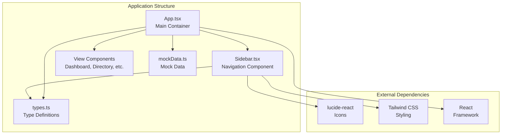
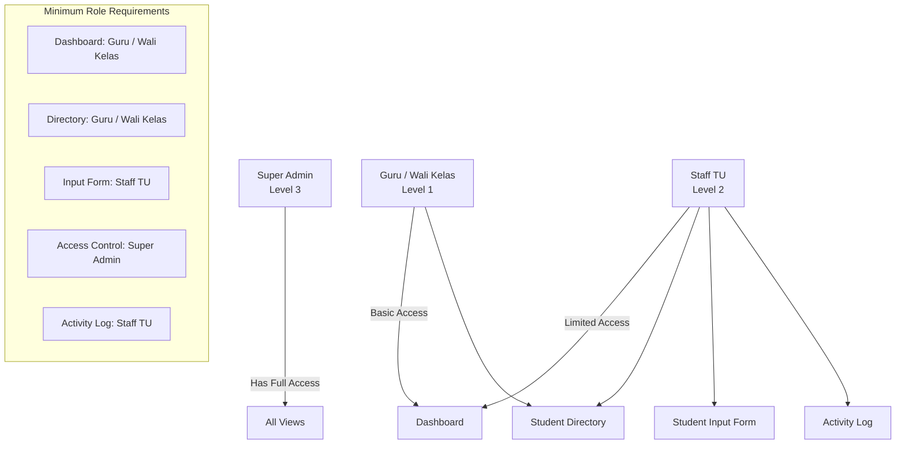
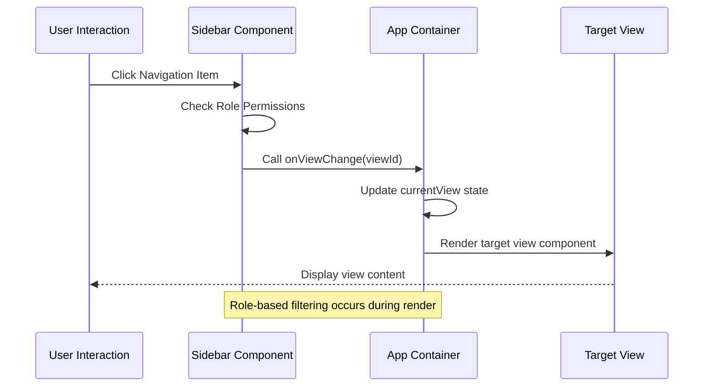
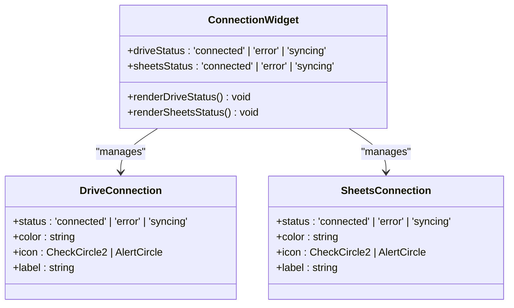
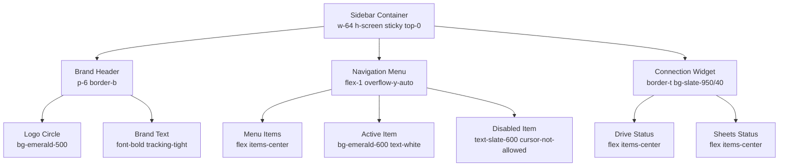
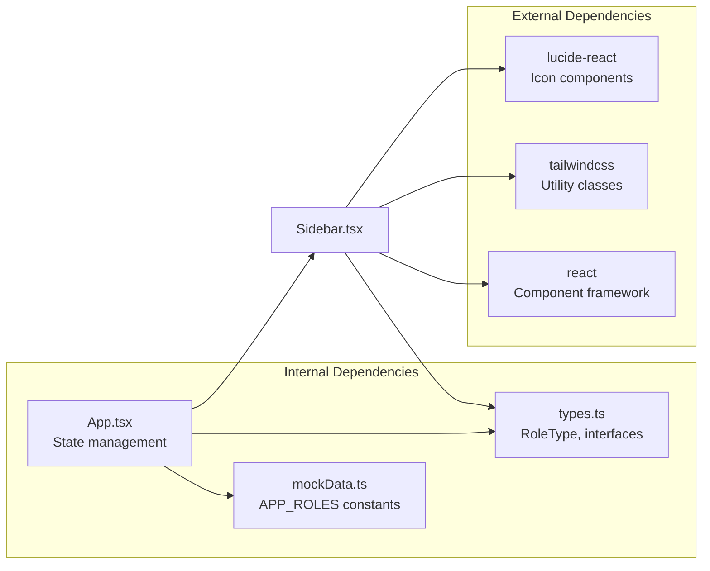

# Sidebar Navigation Component

<cite>
**Referenced Files in This Document**
- [Sidebar.tsx](file://src/components/Sidebar.tsx)
- [App.tsx](file://src/App.tsx)
- [types.ts](file://src/types.ts)
- [mockData.ts](file://src/mockData.ts)
- [package.json](file://package.json)
</cite>

## Table of Contents
1. [Introduction](#introduction)
2. [Project Structure](#project-structure)
3. [Core Components](#core-components)
4. [Architecture Overview](#architecture-overview)
5. [Detailed Component Analysis](#detailed-component-analysis)
6. [Dependency Analysis](#dependency-analysis)
7. [Performance Considerations](#performance-considerations)
8. [Troubleshooting Guide](#troubleshooting-guide)
9. [Conclusion](#conclusion)

## Introduction

The Sidebar navigation component serves as the primary navigation system for the ARBAL student archive management application. This component provides role-based access control, integrates with Google Drive and Google Sheets connections, and offers a responsive, sticky navigation interface using Tailwind CSS styling.

The component manages five distinct navigation views: Dashboard, Student Directory, Student Input Form, Access Control, and Activity Log. Each view requires specific minimum roles for access, ensuring proper security boundaries within the educational institution's data management system.

## Project Structure

The Sidebar component is part of a larger React application structured around a main App container that manages global state and view routing. The component follows a clean separation of concerns with dedicated files for types, mock data, and styling configuration.

**Diagram sources**
- [App.tsx:36-347](file://src/App.tsx#L36-L347)
- [Sidebar.tsx:1-182](file://src/components/Sidebar.tsx#L1-L182)
- [types.ts:1-83](file://src/types.ts#L1-L83)

**Section sources**
- [App.tsx:36-347](file://src/App.tsx#L36-L347)
- [Sidebar.tsx:1-182](file://src/components/Sidebar.tsx#L1-L182)
- [types.ts:1-83](file://src/types.ts#L1-L83)

## Core Components

### Sidebar Props Interface

The Sidebar component accepts four essential props that define its behavior and appearance:

| Prop | Type | Description | Required |
|------|------|-------------|----------|
| `currentView` | `string` | Currently active navigation view identifier | Yes |
| `onViewChange` | `(view: string) => void` | Callback function for navigation changes | Yes |
| `selectedRole` | `RoleType` | Current user's role for access control | Yes |
| `driveStatus` | `'connected' \| 'error' \| 'syncing'` | Google Drive connection status | Yes |
| `sheetsStatus` | `'connected' \| 'error' \| 'syncing'` | Google Sheets connection status | Yes |

### Role-Based Access Control System

The component implements a hierarchical role-based access control (RBAC) system with three distinct permission levels:

**Diagram sources**
- [Sidebar.tsx:36-42](file://src/components/Sidebar.tsx#L36-L42)
- [Sidebar.tsx:44-59](file://src/components/Sidebar.tsx#L44-L59)

The role hierarchy is implemented through numeric level comparisons:
- Super Admin: Level 3
- Staff TU: Level 2  
- Guru / Wali Kelas: Level 1

**Section sources**
- [Sidebar.tsx:20-26](file://src/components/Sidebar.tsx#L20-L26)
- [Sidebar.tsx:44-59](file://src/components/Sidebar.tsx#L44-L59)
- [types.ts:48](file://src/types.ts#L48)

## Architecture Overview

The Sidebar component operates within a larger application architecture that separates concerns between navigation, state management, and view rendering.

**Diagram sources**
- [Sidebar.tsx:78-112](file://src/components/Sidebar.tsx#L78-L112)
- [App.tsx:204-213](file://src/App.tsx#L204-L213)

The component maintains a fixed width of 16rem (64 units) and uses sticky positioning to remain visible during page scrolling. The navigation items are dynamically filtered based on the user's role level.

**Section sources**
- [Sidebar.tsx:61-113](file://src/components/Sidebar.tsx#L61-L113)
- [App.tsx:204-213](file://src/App.tsx#L204-L213)

## Detailed Component Analysis

### Navigation Menu Structure

The Sidebar component defines five primary navigation items, each with associated icons, labels, and minimum role requirements:

| View ID | Label | Icon Component | Minimum Role | Access Level |
|---------|-------|----------------|--------------|--------------|
| `dashboard` | Dasbor Utama | LayoutDashboard | Guru / Wali Kelas | Basic |
| `directory` | Arsip Data Siswa | Users | Guru / Wali Kelas | Basic |
| `inputForm` | Input Data Siswa | UserPlus | Staff TU | Limited |
| `accessControl` | Manajemen Akses | ShieldAlert | Super Admin | Full |
| `activityLog` | Log Aktivitas | History | Staff TU | Limited |

Each menu item renders differently based on the user's role:
- **Allowed items**: Render as interactive buttons with hover effects and active state highlighting
- **Denied items**: Render as disabled elements with locked indicators

### Connection Status Indicators

The component includes a dedicated connection status area for Google Drive and Google Sheets integration:

**Diagram sources**
- [Sidebar.tsx:115-178](file://src/components/Sidebar.tsx#L115-L178)

The connection indicators use color-coded status messages:
- **Connected**: Green checkmark with "Terhubung" (Connected)
- **Syncing**: Amber pulse animation with "Sinkron..." (Syncing)
- **Error**: Rose red alert with "Gagal" (Failed)

### Styling and Responsive Behavior

The component uses Tailwind CSS classes for comprehensive styling and responsive behavior:

**Diagram sources**
- [Sidebar.tsx:61-178](file://src/components/Sidebar.tsx#L61-L178)

The component maintains a fixed width of 256 pixels (w-64) while allowing the content area to expand responsively. The sticky positioning ensures the navigation remains visible during vertical scrolling.

**Section sources**
- [Sidebar.tsx:61-178](file://src/components/Sidebar.tsx#L61-L178)

### Implementation Details

The component implements several key features:

1. **Dynamic Menu Rendering**: Menu items are filtered based on role permissions using the `isAllowed()` function
2. **Active State Management**: Current view highlighting uses the `currentView` prop comparison
3. **Event Handling**: Navigation changes trigger the `onViewChange` callback with the selected view ID
4. **Status Monitoring**: Connection states are passed down as props and rendered conditionally

**Section sources**
- [Sidebar.tsx:78-112](file://src/components/Sidebar.tsx#L78-L112)
- [Sidebar.tsx:115-178](file://src/components/Sidebar.tsx#L115-L178)

## Dependency Analysis

The Sidebar component relies on several external dependencies and internal type definitions:

**Diagram sources**
- [Sidebar.tsx:6-18](file://src/components/Sidebar.tsx#L6-L18)
- [types.ts:48](file://src/types.ts#L48)
- [package.json:13-25](file://package.json#L13-L25)

The component imports Lucide React icons for visual representation and uses Tailwind CSS utility classes for styling. The RoleType definition from types.ts provides type safety for role-based operations.

**Section sources**
- [Sidebar.tsx:6-18](file://src/components/Sidebar.tsx#L6-L18)
- [types.ts:48](file://src/types.ts#L48)
- [package.json:13-25](file://package.json#L13-L25)

## Performance Considerations

The Sidebar component is designed for optimal performance through several mechanisms:

- **Minimal Re-renders**: Uses functional components with pure rendering logic
- **Efficient Role Checking**: Role level comparisons are O(1) operations
- **Conditional Rendering**: Disabled menu items are rendered as static elements rather than interactive components
- **Tailwind Utility Classes**: Pre-built utility classes minimize CSS overhead
- **Fixed Dimensions**: Consistent width and height prevent layout thrashing

The component's performance characteristics make it suitable for frequent re-rendering during navigation changes without impacting application responsiveness.

## Troubleshooting Guide

### Common Issues and Solutions

**Issue**: Menu items not appearing for certain roles
- **Cause**: Role level mismatch or incorrect role assignment
- **Solution**: Verify `selectedRole` prop matches expected values and check role level calculations

**Issue**: Connection status indicators not updating
- **Cause**: Incorrect status prop values or timing issues
- **Solution**: Ensure `driveStatus` and `sheetsStatus` props are updated correctly and match expected values

**Issue**: Navigation clicks not triggering view changes
- **Cause**: `onViewChange` callback not properly implemented
- **Solution**: Verify the callback receives the correct view ID and updates application state

**Issue**: Styling inconsistencies across browsers
- **Cause**: Tailwind CSS configuration or browser-specific rendering differences
- **Solution**: Check Tailwind configuration and ensure consistent utility class usage

**Section sources**
- [Sidebar.tsx:78-112](file://src/components/Sidebar.tsx#L78-L112)
- [Sidebar.tsx:115-178](file://src/components/Sidebar.tsx#L115-L178)

## Conclusion

The Sidebar navigation component provides a robust, role-based navigation system for the ARBAL application. Its clean architecture, comprehensive type safety, and thoughtful styling make it an excellent foundation for educational institution data management applications.

Key strengths include:
- **Secure Access Control**: Hierarchical role-based permissions prevent unauthorized access
- **Visual Clarity**: Clear status indicators for Google Drive and Google Sheets connections
- **Responsive Design**: Sticky positioning and flexible layout adapt to various screen sizes
- **Extensible Architecture**: Well-defined props interface allows for easy customization and extension

The component successfully balances functionality with maintainability, providing a solid foundation for the application's navigation needs while maintaining clear separation of concerns and type safety throughout the codebase.