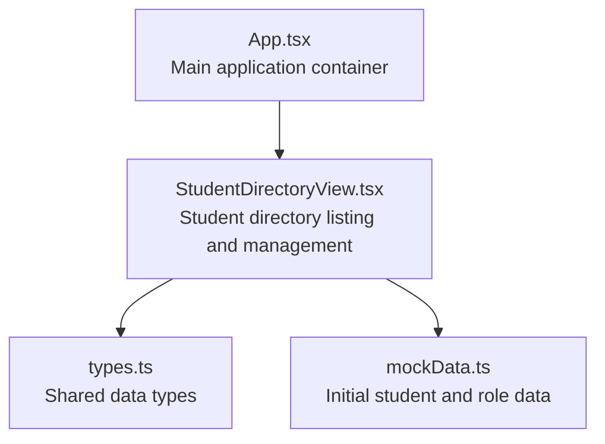
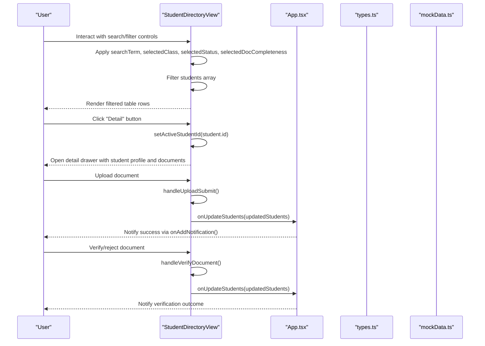
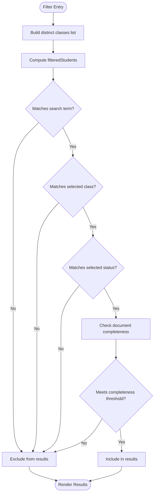
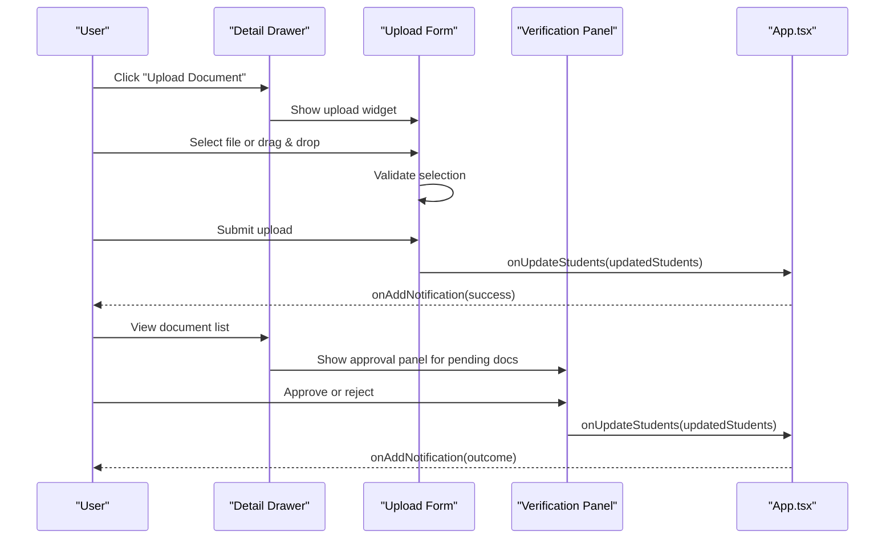
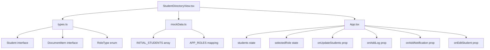

# Student Directory Component

<cite>
**Referenced Files in This Document**
- [StudentDirectoryView.tsx](file://src/components/StudentDirectoryView.tsx)
- [types.ts](file://src/types.ts)
- [mockData.ts](file://src/mockData.ts)
- [App.tsx](file://src/App.tsx)
</cite>

## Table of Contents
1. [Introduction](#introduction)
2. [Project Structure](#project-structure)
3. [Core Components](#core-components)
4. [Architecture Overview](#architecture-overview)
5. [Detailed Component Analysis](#detailed-component-analysis)
6. [Dependency Analysis](#dependency-analysis)
7. [Performance Considerations](#performance-considerations)
8. [Troubleshooting Guide](#troubleshooting-guide)
9. [Conclusion](#conclusion)

## Introduction
This document provides comprehensive documentation for the StudentDirectoryView component, focusing on the student listing and management interface. It explains the data grid functionality, student record display, search and filtering capabilities, table structure, column configurations, sorting mechanisms, pagination handling, bulk operations, selection mechanisms, batch processing, data binding, filter criteria, export functionality, responsive design, accessibility features, and keyboard navigation support.

## Project Structure
The StudentDirectoryView component resides in the components directory and integrates with the main application through App.tsx. It relies on shared types and mock data to render realistic student records and manage document archives.

**Diagram sources**
- [App.tsx:302-311](file://src/App.tsx#L302-L311)
- [StudentDirectoryView.tsx:33-49](file://src/components/StudentDirectoryView.tsx#L33-L49)
- [types.ts:6-48](file://src/types.ts#L6-L48)
- [mockData.ts:6-313](file://src/mockData.ts#L6-L313)

**Section sources**
- [App.tsx:302-311](file://src/App.tsx#L302-L311)
- [StudentDirectoryView.tsx:33-49](file://src/components/StudentDirectoryView.tsx#L33-L49)
- [types.ts:6-48](file://src/types.ts#L6-L48)
- [mockData.ts:6-313](file://src/mockData.ts#L6-L313)

## Core Components
The StudentDirectoryView component manages:
- Search and filter controls for students
- A responsive data grid displaying student records
- Document archive management with upload, verification, and deletion actions
- Role-based permission controls affecting available actions
- Real-time updates to student lists and notifications

Key props accepted by the component:
- students: Array of student records
- selectedRole: Current user role for permission checks
- onUpdateStudents: Callback to update the student list
- onAddLog: Callback to add activity logs
- onAddNotification: Callback to add system notifications
- onEditStudent: Callback to trigger student editing

**Section sources**
- [StudentDirectoryView.tsx:33-49](file://src/components/StudentDirectoryView.tsx#L33-L49)

## Architecture Overview
The component follows a functional React architecture with local state management for search, filters, and UI interactions. It renders a searchable and filterable table of students, supports document archive operations, and integrates with parent components via callbacks.

**Diagram sources**
- [StudentDirectoryView.tsx:80-97](file://src/components/StudentDirectoryView.tsx#L80-L97)
- [StudentDirectoryView.tsx:150-205](file://src/components/StudentDirectoryView.tsx#L150-L205)
- [StudentDirectoryView.tsx:208-246](file://src/components/StudentDirectoryView.tsx#L208-L246)
- [App.tsx:302-311](file://src/App.tsx#L302-L311)

## Detailed Component Analysis

### Data Grid and Table Structure
The component renders a responsive table with six columns:
- ID / NISN: Displays student ID and NISN with monospace formatting
- Nama Siswa: Shows student name and email in a compact format
- Kelas & Jurusan: Displays class and program field
- Kelengkapan Dokumen: Progress indicator showing document count and completion percentage
- Status: Displays student status with color-coded badges
- Aksi: Action buttons for detail, edit, and delete

The table adapts to different screen sizes using Tailwind CSS grid and responsive utilities. On small screens, the table becomes horizontally scrollable to preserve usability.

**Section sources**
- [StudentDirectoryView.tsx:374-472](file://src/components/StudentDirectoryView.tsx#L374-L472)

### Column Configurations and Sorting Mechanisms
Sorting is not implemented in the current component. The table displays filtered students in the order they appear in the filtered array. If sorting is required, it can be added by:
- Adding sort state for column keys
- Implementing click handlers on column headers
- Updating the filteredStudents computation to apply sort order

**Section sources**
- [StudentDirectoryView.tsx:80-97](file://src/components/StudentDirectoryView.tsx#L80-L97)

### Pagination Handling
Pagination is not implemented in the current component. The table displays all filtered results. For large datasets, consider:
- Implementing page size controls
- Adding previous/next navigation
- Using virtualized rendering for performance

**Section sources**
- [StudentDirectoryView.tsx:374-472](file://src/components/StudentDirectoryView.tsx#L374-L472)

### Search and Filtering Capabilities
The component provides four primary filters:
- Search bar: Searches by student name, NISN, ID, and major field
- Class filter: Selects students by class
- Status filter: Filters by student status (Aktif, Alumni, Pindahan, Non-Aktif)
- Document completeness filter: Filters by document count thresholds

Filter logic:
- Search term matching is case-insensitive and applies to multiple fields
- Class and status filters use exact matches
- Document completeness filter counts documents and compares against thresholds

**Diagram sources**
- [StudentDirectoryView.tsx:74](file://src/components/StudentDirectoryView.tsx#L74)
- [StudentDirectoryView.tsx:80-97](file://src/components/StudentDirectoryView.tsx#L80-L97)

**Section sources**
- [StudentDirectoryView.tsx:51-56](file://src/components/StudentDirectoryView.tsx#L51-L56)
- [StudentDirectoryView.tsx:80-97](file://src/components/StudentDirectoryView.tsx#L80-L97)

### Bulk Operations and Selection Mechanisms
Bulk operations are not implemented in the current component. Individual row actions are supported:
- Detail view opens a drawer with student profile and document archive
- Edit action triggers the form view for student modifications
- Delete action removes student records with confirmation

To implement bulk operations:
- Add checkbox selection per row
- Implement "Select All" and "Select None" controls
- Add batch action buttons (e.g., "Delete Selected", "Export Selected")

**Section sources**
- [StudentDirectoryView.tsx:432-464](file://src/components/StudentDirectoryView.tsx#L432-L464)

### Batch Processing Capabilities
Batch processing is not implemented. Document verification and deletion operate on individual documents within the detail drawer. Future enhancements could include:
- Batch verification with approve/reject all
- Batch deletion of selected documents
- Export selected students with their documents

**Section sources**
- [StudentDirectoryView.tsx:618-635](file://src/components/StudentDirectoryView.tsx#L618-L635)
- [StudentDirectoryView.tsx:648-657](file://src/components/StudentDirectoryView.tsx#L648-L657)

### Data Binding and Filter Criteria
Data binding occurs through controlled components:
- Search term state binds to the search input
- Filter selections bind to select dropdowns
- Active student state binds to the detail drawer

Filter criteria are derived from:
- Student properties: nama, nisn, id, kelas, jurusan
- Document count thresholds for completeness
- Status values from the StudentStatus type

**Section sources**
- [StudentDirectoryView.tsx:51-56](file://src/components/StudentDirectoryView.tsx#L51-L56)
- [StudentDirectoryView.tsx:80-97](file://src/components/StudentDirectoryView.tsx#L80-L97)
- [types.ts:18-48](file://src/types.ts#L18-L48)

### Export Functionality
Export functionality is not implemented. The component focuses on viewing and managing student records and documents. Potential export features:
- Export filtered student list to CSV/Excel
- Export document metadata for selected students
- Generate reports on document completeness

**Section sources**
- [StudentDirectoryView.tsx:374-472](file://src/components/StudentDirectoryView.tsx#L374-L472)

### Responsive Table Design
The table is responsive and adapts to various screen sizes:
- Uses grid layout for filter controls
- Enables horizontal scrolling on small screens
- Applies Tailwind utilities for spacing and typography
- Maintains readability with compact text styles

**Section sources**
- [StudentDirectoryView.tsx:300-362](file://src/components/StudentDirectoryView.tsx#L300-L362)
- [StudentDirectoryView.tsx:374-472](file://src/components/StudentDirectoryView.tsx#L374-L472)

### Accessibility Features
Accessibility considerations in the current implementation:
- Semantic HTML structure with table, thead, tbody
- Proper labeling for inputs and selects
- Focusable interactive elements
- Color contrast for status badges and progress indicators

Enhancement opportunities:
- Add aria-labels to buttons
- Implement keyboard navigation for table cells
- Provide skip links for screen readers
- Add ARIA attributes to the detail drawer

**Section sources**
- [StudentDirectoryView.tsx:374-472](file://src/components/StudentDirectoryView.tsx#L374-L472)

### Keyboard Navigation Support
Keyboard navigation is not explicitly implemented. Enhancements could include:
- Tab navigation through filter controls
- Enter/Space activation of buttons
- Arrow key navigation in the detail drawer
- Escape key to close drawers

**Section sources**
- [StudentDirectoryView.tsx:300-362](file://src/components/StudentDirectoryView.tsx#L300-L362)

### Document Archive Management
The detail drawer provides comprehensive document archive management:
- Document list with type, size, upload date, and status
- Upload form with file selection and drag-and-drop support
- Verification workflow for pending documents
- Deletion controls for authorized roles

**Diagram sources**
- [StudentDirectoryView.tsx:666-743](file://src/components/StudentDirectoryView.tsx#L666-L743)
- [StudentDirectoryView.tsx:150-205](file://src/components/StudentDirectoryView.tsx#L150-L205)
- [StudentDirectoryView.tsx:208-246](file://src/components/StudentDirectoryView.tsx#L208-L246)

**Section sources**
- [StudentDirectoryView.tsx:666-743](file://src/components/StudentDirectoryView.tsx#L666-L743)
- [StudentDirectoryView.tsx:150-205](file://src/components/StudentDirectoryView.tsx#L150-L205)
- [StudentDirectoryView.tsx:208-246](file://src/components/StudentDirectoryView.tsx#L208-L246)

### Role-Based Permissions
Permissions are enforced through role checks:
- Super Admin: Full CRUD operations and document verification
- Staff TU: Read/write access and document verification
- Guru / Wali Kelas: Read-only access

These permissions control:
- Visibility of action buttons (edit, delete)
- Availability of document upload and verification
- Access to sensitive operations

**Section sources**
- [StudentDirectoryView.tsx:68-71](file://src/components/StudentDirectoryView.tsx#L68-L71)
- [StudentDirectoryView.tsx:442-462](file://src/components/StudentDirectoryView.tsx#L442-L462)
- [StudentDirectoryView.tsx:618-635](file://src/components/StudentDirectoryView.tsx#L618-L635)

## Dependency Analysis
The component depends on shared types and mock data, and integrates with the parent application through callback props.

**Diagram sources**
- [StudentDirectoryView.tsx:31](file://src/components/StudentDirectoryView.tsx#L31)
- [types.ts:6-48](file://src/types.ts#L6-L48)
- [mockData.ts:6-313](file://src/mockData.ts#L6-L313)
- [App.tsx:44-49](file://src/App.tsx#L44-L49)

**Section sources**
- [StudentDirectoryView.tsx:31](file://src/components/StudentDirectoryView.tsx#L31)
- [types.ts:6-48](file://src/types.ts#L6-L48)
- [mockData.ts:6-313](file://src/mockData.ts#L6-L313)
- [App.tsx:44-49](file://src/App.tsx#L44-L49)

## Performance Considerations
Current performance characteristics:
- Filter computation runs on every render; consider memoization for large datasets
- Drag-and-drop handlers are lightweight; ensure they don't block UI
- Upload simulation uses setTimeout; consider real async operations with progress indicators

Optimization suggestions:
- Memoize filteredStudents using useMemo
- Implement virtualized rendering for large tables
- Debounce search input to reduce re-renders
- Lazy load detail drawer content

[No sources needed since this section provides general guidance]

## Troubleshooting Guide
Common issues and resolutions:
- Filter not updating: Ensure state updates propagate to filteredStudents computation
- Upload failing silently: Check file selection and submission logic
- Permission errors: Verify selectedRole matches expected values
- Detail drawer not closing: Confirm setActiveStudentId is called with null

Debugging tips:
- Log filteredStudents length to verify filter effectiveness
- Inspect activeStudent object for undefined states
- Monitor callback invocations (onUpdateStudents, onAddLog, onAddNotification)

**Section sources**
- [StudentDirectoryView.tsx:66](file://src/components/StudentDirectoryView.tsx#L66)
- [StudentDirectoryView.tsx:150-205](file://src/components/StudentDirectoryView.tsx#L150-L205)
- [StudentDirectoryView.tsx:100-122](file://src/components/StudentDirectoryView.tsx#L100-L122)

## Conclusion
The StudentDirectoryView component provides a robust foundation for student listing and management with comprehensive filtering, document archive operations, and role-based permissions. While it currently lacks sorting, pagination, bulk operations, and keyboard navigation, the modular structure supports incremental enhancements. The component demonstrates clean separation of concerns, effective use of controlled components, and integration with shared types and mock data.