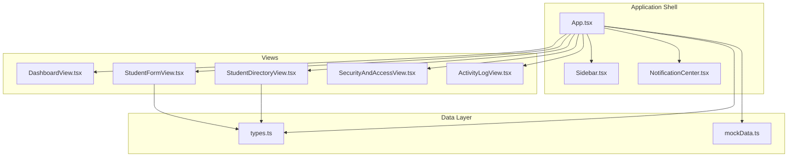
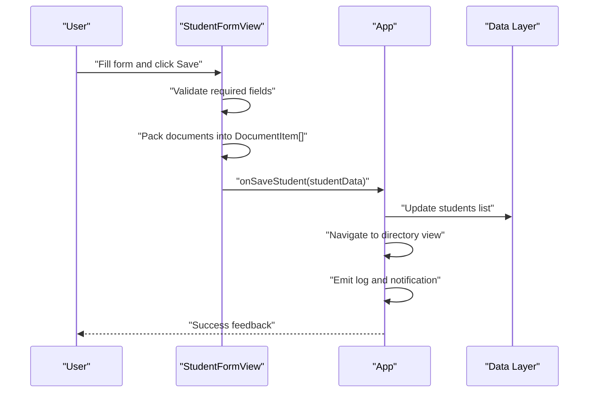
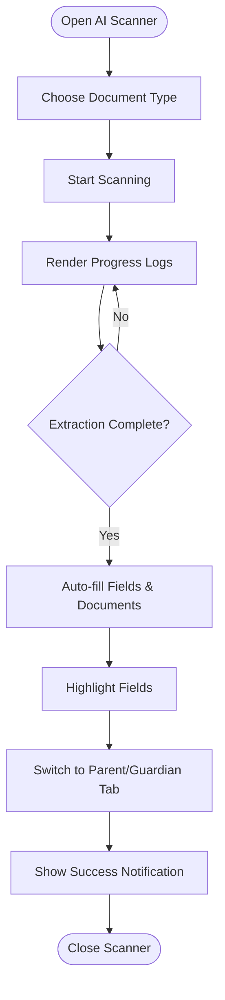
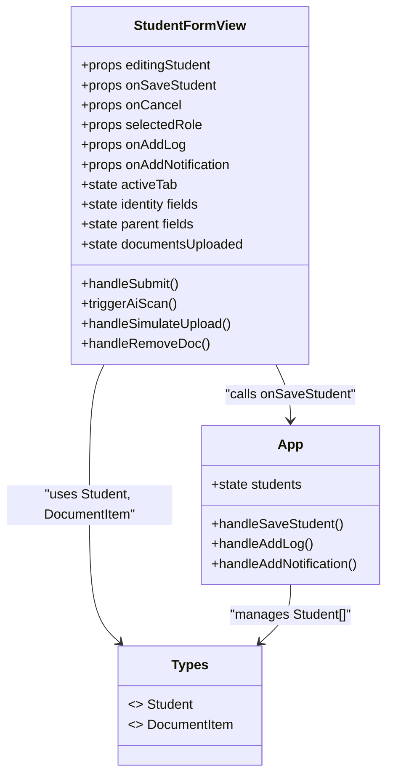

# Student Registration Form Component

<cite>
**Referenced Files in This Document**
- [StudentFormView.tsx](file://src/components/StudentFormView.tsx)
- [types.ts](file://src/types.ts)
- [App.tsx](file://src/App.tsx)
- [mockData.ts](file://src/mockData.ts)
- [StudentDirectoryView.tsx](file://src/components/StudentDirectoryView.tsx)
</cite>

## Table of Contents
1. [Introduction](#introduction)
2. [Project Structure](#project-structure)
3. [Core Components](#core-components)
4. [Architecture Overview](#architecture-overview)
5. [Detailed Component Analysis](#detailed-component-analysis)
6. [Dependency Analysis](#dependency-analysis)
7. [Performance Considerations](#performance-considerations)
8. [Troubleshooting Guide](#troubleshooting-guide)
9. [Conclusion](#conclusion)
10. [Appendices](#appendices)

## Introduction
This document provides comprehensive technical and practical documentation for the StudentFormView component, which implements the student enrollment and registration interface. It covers form structure, input validation, field configurations, submission handling, state management, error handling, success feedback, data model integration, dynamic behavior, and user experience enhancements. The component integrates with the broader application’s data layer and supports AI-assisted scanning for document extraction.

## Project Structure
The StudentFormView component resides under src/components and is integrated into the main application routing in App.tsx. It relies on shared types and mock data for demonstration and testing.

**Diagram sources**
- [App.tsx:313-325](file://src/App.tsx#L313-L325)
- [StudentFormView.tsx:26](file://src/components/StudentFormView.tsx#L26)
- [types.ts:1-83](file://src/types.ts#L1-L83)
- [mockData.ts:1-452](file://src/mockData.ts#L1-L452)

**Section sources**
- [App.tsx:300-343](file://src/App.tsx#L300-L343)
- [StudentFormView.tsx:26](file://src/components/StudentFormView.tsx#L26)

## Core Components
- StudentFormView: Multi-tab form for student registration/editing with three primary tabs: Identity, Parent/Guardian, and Document Upload. Supports AI-assisted scanning and simulated document uploads.
- Types: Defines the Student, DocumentItem, and related enums/interfaces used across the application.
- App: Orchestrates navigation, roles, notifications, logs, and data persistence for student records.
- StudentDirectoryView: Provides listing, filtering, and document upload actions for existing students.

Key responsibilities:
- Manage form state for student identity, parent/guardian details, and uploaded documents.
- Validate required fields and enforce numeric constraints.
- Pack and submit documents to the data layer.
- Emit activity logs and notifications upon successful saves.
- Provide AI scanner simulation for auto-filling form fields.

**Section sources**
- [StudentFormView.tsx:28-44](file://src/components/StudentFormView.tsx#L28-L44)
- [types.ts:20-46](file://src/types.ts#L20-L46)
- [App.tsx:172-186](file://src/App.tsx#L172-L186)

## Architecture Overview
The form participates in a role-based permission system. Submissions are routed to the App component, which updates the global student list and navigates to the directory view. Notifications and logs are emitted via callback props.

**Diagram sources**
- [StudentFormView.tsx:179-270](file://src/components/StudentFormView.tsx#L179-L270)
- [App.tsx:172-186](file://src/App.tsx#L172-L186)

## Detailed Component Analysis

### Form Structure and Tabs
The form is organized into three tabs:
- Tab 1: Identity (student personal and contact details)
- Tab 2: Parent/Guardian (father/mother/wali details)
- Tab 3: Documents (upload and manage required documents)

Each tab contains grouped inputs with labels, placeholders, and validation attributes. The third tab displays uploaded documents with status indicators and removal controls.

**Section sources**
- [StudentFormView.tsx:556-604](file://src/components/StudentFormView.tsx#L556-L604)
- [StudentFormView.tsx:609-789](file://src/components/StudentFormView.tsx#L609-L789)
- [StudentFormView.tsx:791-970](file://src/components/StudentFormView.tsx#L791-L970)
- [StudentFormView.tsx:972-1310](file://src/components/StudentFormView.tsx#L972-L1310)

### Form State Management
State is managed per tab:
- Tab 1: name, nisn, class, major, email, phone, address, date of birth, status, notes
- Tab 2: father/mother names, jobs, ID numbers, phones, guardian phone, address
- Tab 3: documentsUploaded map keyed by document type with name, size, status

Initialization logic:
- On mount or when editingStudent changes, the form hydrates from the provided student object.
- For new registrations, defaults are applied and the documents map is cleared.

**Section sources**
- [StudentFormView.tsx:49-96](file://src/components/StudentFormView.tsx#L49-L96)
- [StudentFormView.tsx:97-177](file://src/components/StudentFormView.tsx#L97-L177)

### Input Validation and Field Configurations
Validation rules:
- Required fields: Full name, NISN, and email trigger a tab switch to the identity tab with an alert if missing during submission.
- Numeric constraints:
  - NISN: restricted to 10 digits
  - KTP (parents): restricted to 16 digits
  - Phones: stripped of non-digit characters
- Status dropdown: controlled via select element with predefined options.
- Date of birth: date input with required attribute.

UI behavior:
- Flash animation highlights fields when AI auto-fill completes.
- Disabled save button for “Guru / Wali Kelas” role.

**Section sources**
- [StudentFormView.tsx:179-185](file://src/components/StudentFormView.tsx#L179-L185)
- [StudentFormView.tsx:637-648](file://src/components/StudentFormView.tsx#L637-L648)
- [StudentFormView.tsx:838-844](file://src/components/StudentFormView.tsx#L838-L844)
- [StudentFormView.tsx:898-904](file://src/components/StudentFormView.tsx#L898-L904)
- [StudentFormView.tsx:1325](file://src/components/StudentFormView.tsx#L1325)

### Submission Handling
Submission pipeline:
- Prevent default form submission.
- Validate required fields; if invalid, show alert and switch to the identity tab.
- Build documents list:
  - Merge existing documents with newly uploaded ones.
  - Remove entries when a document is deleted.
  - Assign IDs and timestamps for new documents.
- Construct Student object with all fields and documents.
- Invoke onSaveStudent callback to persist data.
- Emit activity log and notification for audit and user feedback.

**Section sources**
- [StudentFormView.tsx:179-270](file://src/components/StudentFormView.tsx#L179-L270)
- [App.tsx:172-186](file://src/App.tsx#L172-L186)

### Error Handling and Success Feedback
- Immediate client-side validation triggers alerts and focuses the problematic tab.
- Role-based restrictions disable saving for lower-privileged roles.
- Success notifications confirm save completion and system integration.
- Logs record actions for audit trails.

**Section sources**
- [StudentFormView.tsx:179-185](file://src/components/StudentFormView.tsx#L179-L185)
- [StudentFormView.tsx:259-269](file://src/components/StudentFormView.tsx#L259-L269)
- [App.tsx:60-102](file://src/App.tsx#L60-L102)

### Student Data Model and Field Dependencies
The Student interface defines:
- Core identity and contact fields
- Academic placement (class, major)
- Status and administrative notes
- Parent/guardian details
- Documents array of DocumentItem

DocumentItem fields:
- id, type, name, url, uploadedAt, status, size

Field dependencies:
- Documents depend on the documents array; adding/removing documents updates the UI and submission payload.
- Some fields are conditionally shown via the AI scanner simulation and tab navigation.

**Section sources**
- [types.ts:20-46](file://src/types.ts#L20-L46)
- [types.ts:8-16](file://src/types.ts#L8-L16)

### Conditional Visibility and Dynamic Behavior
- Tab switching allows stepwise progression through identity, parent/guardian, and documents.
- AI scanner modal enables simulated OCR-based auto-fill for multiple document types.
- Flash animation highlights fields after successful AI scans.
- Document counters in the tab header reflect the number of uploaded files.

**Section sources**
- [StudentFormView.tsx:47](file://src/components/StudentFormView.tsx#L47)
- [StudentFormView.tsx:598-603](file://src/components/StudentFormView.tsx#L598-L603)
- [StudentFormView.tsx:322-513](file://src/components/StudentFormView.tsx#L322-L513)

### AI-Assisted Scanning Simulation
The scanner simulates:
- Local OCR for KTP Ayah/Ibu using Tesseract.js
- Gemini AI scanning for KK, Akta, Ijazah with ThinkingLevel.HIGH
- Terminal-style progress logs
- Auto-fill of form fields and documents
- Transition to the parent/guardian tab for verification

**Diagram sources**
- [StudentFormView.tsx:322-513](file://src/components/StudentFormView.tsx#L322-L513)

**Section sources**
- [StudentFormView.tsx:322-513](file://src/components/StudentFormView.tsx#L322-L513)

### Document Upload and Removal
- Simulated upload sets document metadata (name, size, status) and attaches to the form state.
- Removal clears the document entry and updates the UI.
- The documents grid displays status badges and allows deletion.

**Section sources**
- [StudentFormView.tsx:273-311](file://src/components/StudentFormView.tsx#L273-L311)
- [StudentFormView.tsx:313-319](file://src/components/StudentFormView.tsx#L313-L319)
- [StudentFormView.tsx:980-1295](file://src/components/StudentFormView.tsx#L980-L1295)

### Integration with Data Layer
- onSaveStudent persists the constructed Student object to the application state.
- App handles updating the students list and navigating to the directory view.
- Notifications and logs are emitted for transparency and auditability.

**Section sources**
- [StudentFormView.tsx:257](file://src/components/StudentFormView.tsx#L257)
- [App.tsx:172-186](file://src/App.tsx#L172-L186)

## Dependency Analysis
The component depends on:
- Shared types for Student and DocumentItem
- Callback props for saving, canceling, logging, and notifications
- Role-based permissions affecting UI and submission availability

**Diagram sources**
- [StudentFormView.tsx:28-44](file://src/components/StudentFormView.tsx#L28-L44)
- [App.tsx:172-186](file://src/App.tsx#L172-L186)
- [types.ts:20-46](file://src/types.ts#L20-L46)

**Section sources**
- [StudentFormView.tsx:28-44](file://src/components/StudentFormView.tsx#L28-L44)
- [App.tsx:172-186](file://src/App.tsx#L172-L186)
- [types.ts:20-46](file://src/types.ts#L20-L46)

## Performance Considerations
- Minimize re-renders by consolidating state updates within the form handler.
- Debounce or batch UI updates when simulating AI scanning to reduce DOM churn.
- Use memoization for derived values (e.g., document counts) to avoid unnecessary recalculations.
- Virtualize long lists in related views (e.g., directory) if the dataset grows.

## Troubleshooting Guide
Common issues and resolutions:
- Missing required fields: Ensure name, NISN, and email are filled; the form will switch to the identity tab and show an alert.
- Role restrictions: Saving is disabled for “Guru / Wali Kelas”; switch roles via the header role switcher.
- Document upload problems: Verify file selection and simulate uploads; check document counters and status badges.
- AI scanner errors: The simulation runs continuously until completion; ensure the modal is closed before attempting another scan.

**Section sources**
- [StudentFormView.tsx:179-185](file://src/components/StudentFormView.tsx#L179-L185)
- [StudentFormView.tsx:1325](file://src/components/StudentFormView.tsx#L1325)
- [StudentFormView.tsx:322-513](file://src/components/StudentFormView.tsx#L322-L513)

## Conclusion
StudentFormView delivers a robust, role-aware, and user-friendly student enrollment interface. Its multi-tab design, AI-assisted scanning, and seamless integration with the application’s data layer provide a modern, efficient workflow for capturing and validating student information. The component’s modular structure and clear separation of concerns facilitate maintenance and future enhancements.

## Appendices

### Example Customizations
- Add new required fields: Extend the Student interface and add corresponding state and inputs; update validation and submission logic.
- Modify document types: Update DocumentType and the documentsUploaded map keys; adjust the upload grid and submission packing logic.
- Integrate real OCR: Replace simulation with external OCR APIs while preserving the same state and UI updates.
- Enhance validation: Add server-side validation hooks and richer error messaging.

### Validation Patterns
- Required fields: Use required attribute and pre-submission checks.
- Numeric constraints: Apply maxLength and replace non-digit characters.
- Status and dropdowns: Use controlled selects with predefined options.

### Integration Notes
- Ensure onSaveStudent receives a complete Student object with documents.
- Emit logs and notifications consistently for auditability.
- Respect role-based permissions to prevent unauthorized actions.