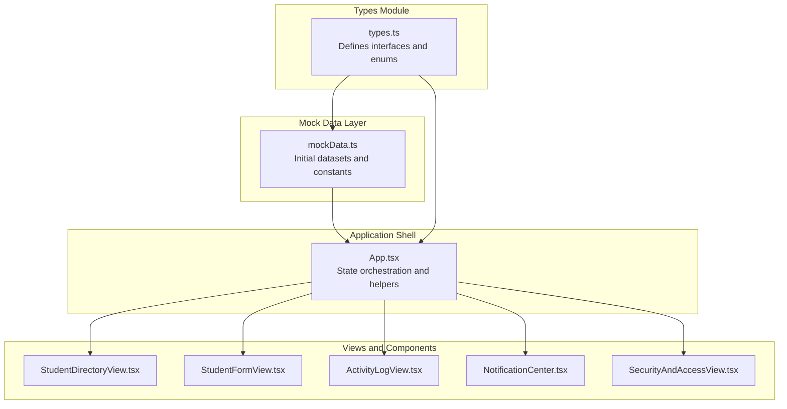
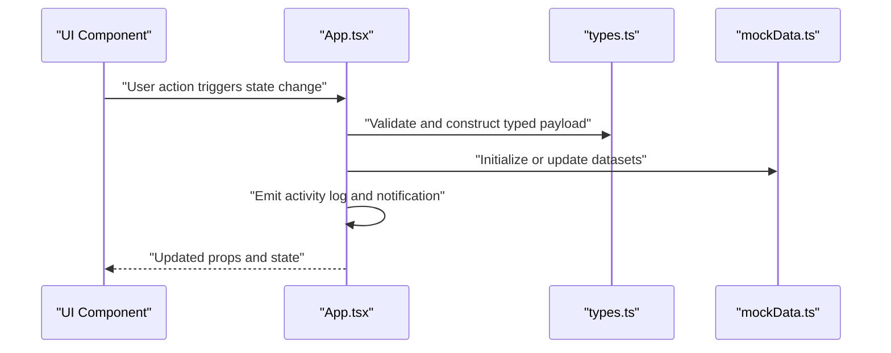
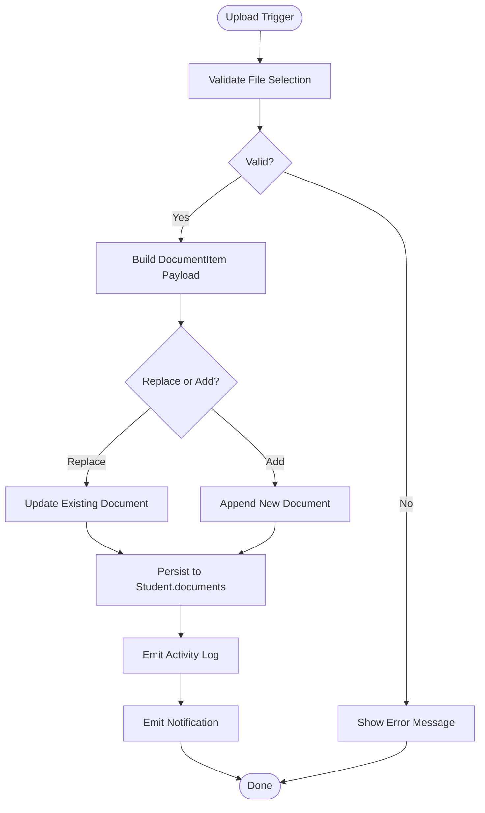
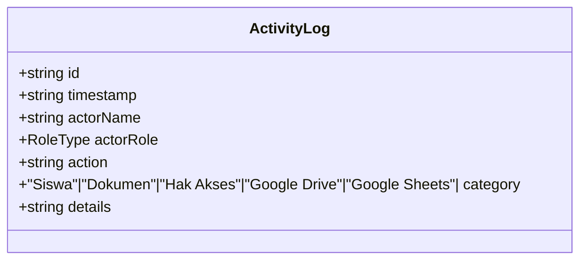
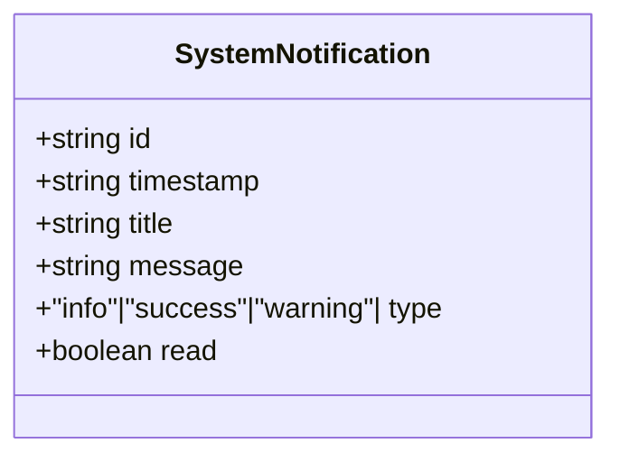
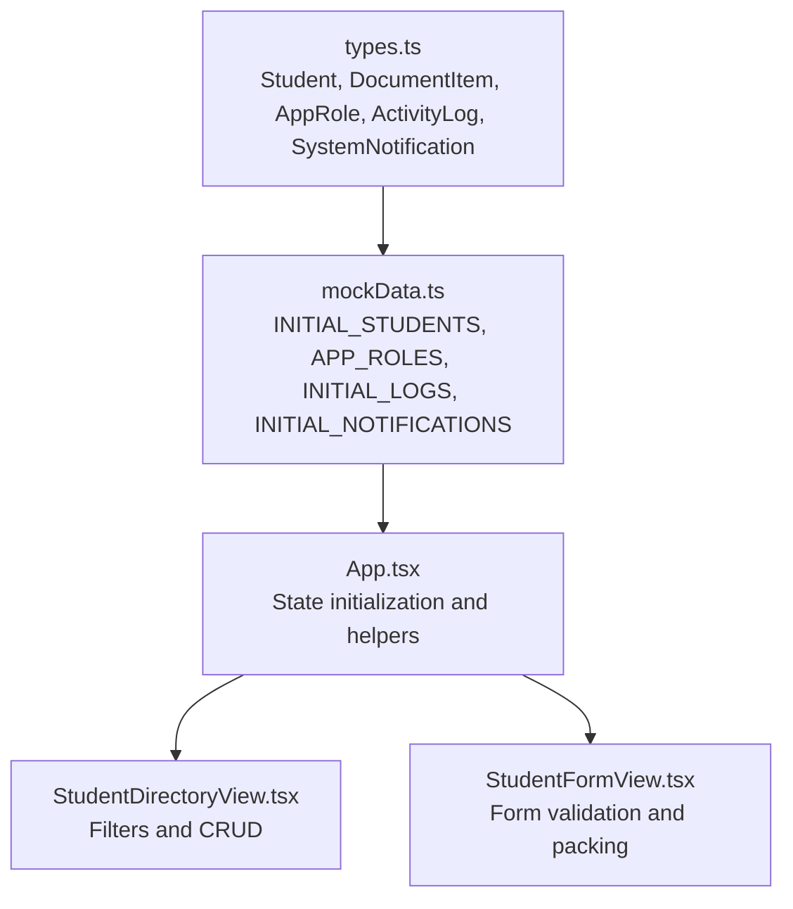
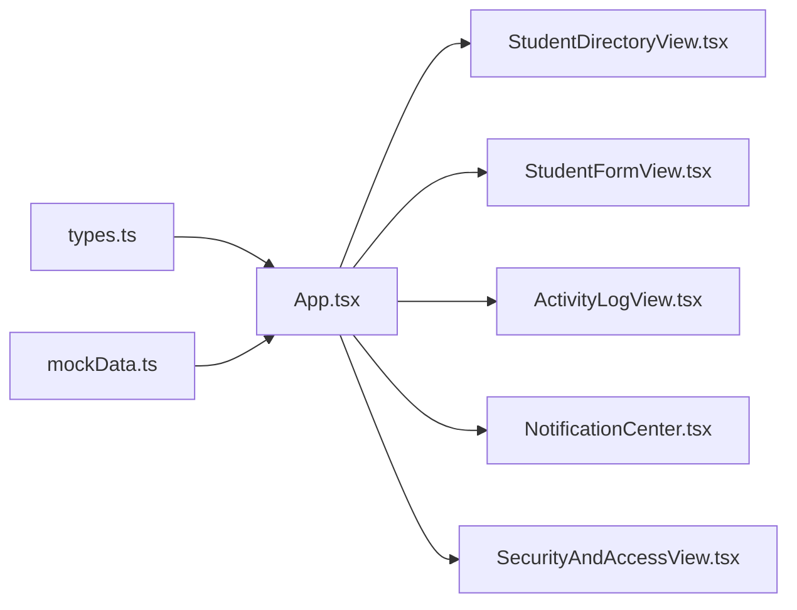

# Data Models and Types

<cite>
**Referenced Files in This Document**
- [types.ts](file://src/types.ts)
- [mockData.ts](file://src/mockData.ts)
- [App.tsx](file://src/App.tsx)
- [StudentDirectoryView.tsx](file://src/components/StudentDirectoryView.tsx)
- [StudentFormView.tsx](file://src/components/StudentFormView.tsx)
- [ActivityLogView.tsx](file://src/components/ActivityLogView.tsx)
- [NotificationCenter.tsx](file://src/components/NotificationCenter.tsx)
- [SecurityAndAccessView.tsx](file://src/components/SecurityAndAccessView.tsx)
</cite>

## Table of Contents
1. [Introduction](#introduction)
2. [Project Structure](#project-structure)
3. [Core Components](#core-components)
4. [Architecture Overview](#architecture-overview)
5. [Detailed Component Analysis](#detailed-component-analysis)
6. [Dependency Analysis](#dependency-analysis)
7. [Performance Considerations](#performance-considerations)
8. [Troubleshooting Guide](#troubleshooting-guide)
9. [Conclusion](#conclusion)

## Introduction
This document provides comprehensive data model documentation for the ARBAL application. It focuses on TypeScript interfaces and mock data structures that define student records, audit trails, notifications, and role-based access control (RBAC). The document explains field definitions, validation rules, type relationships, and how the mock data abstraction layer supports backend integration. It also covers data lifecycle, validation approaches, and type safety enforcement across the application.

## Project Structure
The ARBAL application is a React + TypeScript frontend that uses a centralized mock data layer to simulate backend behavior. The data models are defined in a shared types module and consumed by multiple views and components.



**Diagram sources**
- [types.ts:1-83](file://src/types.ts#L1-L83)
- [mockData.ts:1-452](file://src/mockData.ts#L1-L452)
- [App.tsx:1-348](file://src/App.tsx#L1-L348)
- [StudentDirectoryView.tsx:1-756](file://src/components/StudentDirectoryView.tsx#L1-L756)
- [StudentFormView.tsx:1-800](file://src/components/StudentFormView.tsx#L1-L800)
- [ActivityLogView.tsx:1-172](file://src/components/ActivityLogView.tsx#L1-L172)
- [NotificationCenter.tsx:1-131](file://src/components/NotificationCenter.tsx#L1-L131)
- [SecurityAndAccessView.tsx:1-316](file://src/components/SecurityAndAccessView.tsx#L1-L316)

**Section sources**
- [types.ts:1-83](file://src/types.ts#L1-L83)
- [mockData.ts:1-452](file://src/mockData.ts#L1-L452)
- [App.tsx:1-348](file://src/App.tsx#L1-L348)

## Core Components
This section documents the primary data models and their relationships.

- Student
  - Purpose: Represents a student record with personal, contact, academic, and parent/guardian information.
  - Key fields: identifiers, personal details, contact info, academic info, status, creation timestamp, optional notes, and a collection of documents.
  - Validation rules:
    - Required fields: name, NISN, email.
    - Academic fields: class and major are selectable from predefined lists.
    - Status constrained to a closed set of values.
    - Documents array is validated by the DocumentItem type.
  - Type relationships:
    - Documents: array of DocumentItem.
    - Parents/Guardians: optional fields for names, jobs, IDs, phones, and address.

- DocumentItem
  - Purpose: Represents a digital archive document associated with a student.
  - Validation rules:
    - Type constrained to a closed set of document categories.
    - Status constrained to a closed set of verification states.
    - Size stored as a human-readable string.
    - Uploaded timestamp formatted as a date-time string.
  - Type relationships:
    - Belongs to a Student via documents array.

- AppRole
  - Purpose: Defines role-based access control profiles with granular permission flags.
  - Validation rules:
    - Name constrained to a closed set of role types.
    - Permissions are booleans enabling/disabling specific operations.
  - Type relationships:
    - Used by RBAC simulation and UI controls.

- ActivityLog
  - Purpose: Captures system audit trail entries for actions performed by actors.
  - Validation rules:
    - Category constrained to a closed set of domains.
    - Timestamp formatted as a date-time string.
  - Type relationships:
    - Consumed by ActivityLogView for rendering and export.

- SystemNotification
  - Purpose: Manages system alerts and informational messages.
  - Validation rules:
    - Type constrained to a closed set of severity levels.
    - Read flag toggled by user actions.
  - Type relationships:
    - Managed by NotificationCenter for display and persistence.

**Section sources**
- [types.ts:6-83](file://src/types.ts#L6-L83)

## Architecture Overview
The application uses a centralized state managed in App.tsx, with mock data initialized from mockData.ts. Components consume these models and update state through helper functions, which also emit audit logs and notifications.



**Diagram sources**
- [App.tsx:60-102](file://src/App.tsx#L60-L102)
- [types.ts:20-46](file://src/types.ts#L20-L46)
- [mockData.ts:8-313](file://src/mockData.ts#L8-L313)

## Detailed Component Analysis

### Student Data Model
The Student interface encapsulates comprehensive student information and is central to the application’s data model.

```mermaid
classDiagram
class Student {
+string id
+string nama
+string nisn
+string kelas
+string jurusan
+string email
+string telepon
+string alamat
+string tanggalLahir
+StudentStatus status
+DocumentItem[] documents
+string createdAt
+string? catatan
+string? namaAyah
+string? pekerjaanAyah
+string? ktpAyah
+string? teleponAyah
+string? namaIbu
+string? pekerjaanIbu
+string? ktpIbu
+string? teleponIbu
+string? teleponOrangTua
+string? alamatOrangTua
}
class DocumentItem {
+string id
+DocumentType type
+string name
+string url
+string uploadedAt
+string status
+string size
}
class StudentStatus {
<<enumeration>>
"Aktif"
"Alumni"
"Pindahan"
"Non-Aktif"
}
class DocumentType {
<<enumeration>>
"Ijazah"
"Kartu Keluarga"
"Akta Kelahiran"
"Pas Foto"
"Rapor"
"KTP Ayah"
"KTP Ibu"
}
Student --> DocumentItem : "documents"
Student --> StudentStatus : "status"
DocumentItem --> DocumentType : "type"
```

**Diagram sources**
- [types.ts:18-46](file://src/types.ts#L18-L46)
- [types.ts:8-16](file://src/types.ts#L8-L16)

Validation and lifecycle highlights:
- Creation timestamp is set during initial registration and preserved on edits.
- Documents array is validated against DocumentType and status constraints.
- Optional guardian fields support partial data scenarios.

**Section sources**
- [types.ts:18-46](file://src/types.ts#L18-L46)

### DocumentItem Schema and Processing
DocumentItem defines the structure for uploaded archives and their verification lifecycle.



**Diagram sources**
- [StudentDirectoryView.tsx:150-205](file://src/components/StudentDirectoryView.tsx#L150-L205)

Processing patterns:
- Upload form supports manual selection and drag-and-drop.
- Status defaults to “Verifikasi” upon upload.
- Replacement logic updates existing documents by type.

**Section sources**
- [StudentDirectoryView.tsx:150-205](file://src/components/StudentDirectoryView.tsx#L150-L205)

### Role-Based Access Control (RBAC)
RBAC is modeled via AppRole and enforced through UI controls and permission checks.

```mermaid
classDiagram
class AppRole {
+RoleType name
+string description
+permissions
}
class RoleType {
<<enumeration>>
"Super Admin"
"Staff TU"
"Guru / Wali Kelas"
}
class Permissions {
+boolean siswa_read
+boolean siswa_write
+boolean siswa_delete
+boolean doc_upload
+boolean doc_delete
+boolean doc_verify
+boolean access_manage
+boolean logs_view
}
AppRole --> RoleType : "name"
AppRole --> Permissions : "permissions"
```

**Diagram sources**
- [types.ts:48-63](file://src/types.ts#L48-L63)

Enforcement patterns:
- Permission flags gate UI actions (delete, verify, manage access).
- Role switching simulates session changes and updates UI visibility.

**Section sources**
- [types.ts:48-63](file://src/types.ts#L48-L63)
- [SecurityAndAccessView.tsx:62-95](file://src/components/SecurityAndAccessView.tsx#L62-L95)

### ActivityLog Model and Audit Trail
ActivityLog captures system events with actor, action, category, and details.



**Diagram sources**
- [types.ts:65-73](file://src/types.ts#L65-L73)

Usage:
- Centralized helper in App.tsx creates new logs with actor mapping based on selected role.
- ActivityLogView renders and filters logs by category and keyword.

**Section sources**
- [types.ts:65-73](file://src/types.ts#L65-L73)
- [App.tsx:60-81](file://src/App.tsx#L60-L81)
- [ActivityLogView.tsx:36-43](file://src/components/ActivityLogView.tsx#L36-L43)

### SystemNotification Model and Alert System
SystemNotification manages alerts with severity and read state.



**Diagram sources**
- [types.ts:75-82](file://src/types.ts#L75-L82)

Usage:
- Centralized helper in App.tsx creates notifications and auto-opens the drawer for warning-level alerts.
- NotificationCenter displays and manages notifications.

**Section sources**
- [types.ts:75-82](file://src/types.ts#L75-L82)
- [App.tsx:83-102](file://src/App.tsx#L83-L102)
- [NotificationCenter.tsx:33-34](file://src/components/NotificationCenter.tsx#L33-L34)

### Mock Data Abstraction and Backend Integration
The mock data layer provides realistic initial datasets and constants for development and testing.



**Diagram sources**
- [mockData.ts:6-452](file://src/mockData.ts#L6-L452)
- [types.ts:6-83](file://src/types.ts#L6-L83)
- [App.tsx:44-46](file://src/App.tsx#L44-L46)
- [StudentDirectoryView.tsx:80-97](file://src/components/StudentDirectoryView.tsx#L80-L97)
- [StudentFormView.tsx:179-270](file://src/components/StudentFormView.tsx#L179-L270)

Integration patterns:
- INITIAL_STUDENTS initializes the student directory.
- APP_ROLES provides permission matrices for RBAC simulation.
- Helpers in App.tsx manage state updates and emit logs/notifications.

**Section sources**
- [mockData.ts:8-313](file://src/mockData.ts#L8-L313)
- [App.tsx:44-102](file://src/App.tsx#L44-L102)

## Dependency Analysis
The following diagram shows how components depend on the types and mock data modules.



**Diagram sources**
- [types.ts:1-83](file://src/types.ts#L1-L83)
- [mockData.ts:1-452](file://src/mockData.ts#L1-L452)
- [App.tsx:1-348](file://src/App.tsx#L1-L348)
- [StudentDirectoryView.tsx:1-756](file://src/components/StudentDirectoryView.tsx#L1-L756)
- [StudentFormView.tsx:1-800](file://src/components/StudentFormView.tsx#L1-L800)
- [ActivityLogView.tsx:1-172](file://src/components/ActivityLogView.tsx#L1-L172)
- [NotificationCenter.tsx:1-131](file://src/components/NotificationCenter.tsx#L1-L131)
- [SecurityAndAccessView.tsx:1-316](file://src/components/SecurityAndAccessView.tsx#L1-L316)

**Section sources**
- [App.tsx:1-348](file://src/App.tsx#L1-L348)

## Performance Considerations
- Filtering and sorting: StudentDirectoryView performs client-side filtering on large arrays. Consider virtualization for very large datasets.
- State updates: Batch updates (e.g., replacing documents) minimize re-renders; ensure immutability patterns are followed.
- Logs and notifications: Limit batch sizes for initial loads; defer heavy computations to background threads if needed.
- RBAC checks: Keep permission checks O(1) by caching role permissions derived from AppRole.

## Troubleshooting Guide
Common issues and resolutions:
- Validation errors on form submission:
  - Ensure required fields (name, NISN, email) are present before saving.
  - Verify document uploads include a filename and type.
- Permission denials:
  - Confirm selected role has sufficient permissions for the action (e.g., delete requires Super Admin).
- Audit log gaps:
  - Verify that helpers in App.tsx are invoked for each significant operation.
- Notification visibility:
  - Warning-level notifications automatically open the drawer; confirm state updates propagate to the UI.

**Section sources**
- [StudentFormView.tsx:179-185](file://src/components/StudentFormView.tsx#L179-L185)
- [StudentDirectoryView.tsx:100-122](file://src/components/StudentDirectoryView.tsx#L100-L122)
- [App.tsx:60-102](file://src/App.tsx#L60-L102)
- [NotificationCenter.tsx:98-117](file://src/components/NotificationCenter.tsx#L98-L117)

## Conclusion
The ARBAL application employs a robust TypeScript data model centered around Student, DocumentItem, AppRole, ActivityLog, and SystemNotification. The mock data abstraction layer enables seamless frontend development and testing while maintaining strong type safety. RBAC is enforced through granular permission flags, and audit trails and notifications provide operational transparency. The documented patterns and diagrams serve as a blueprint for extending the system and integrating with backend APIs.