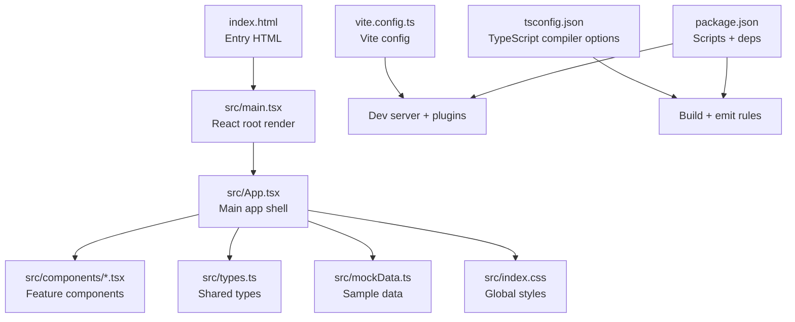
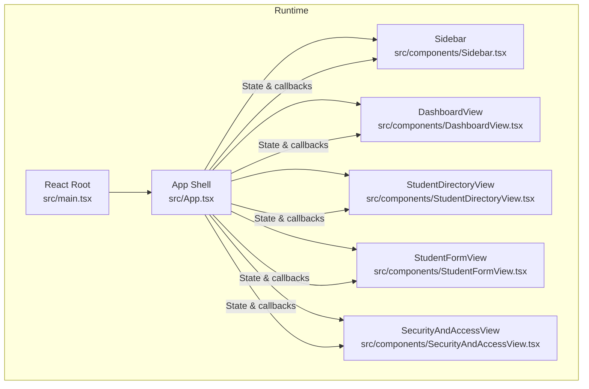
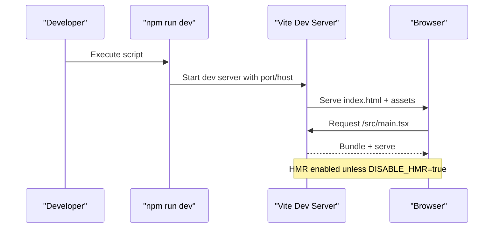
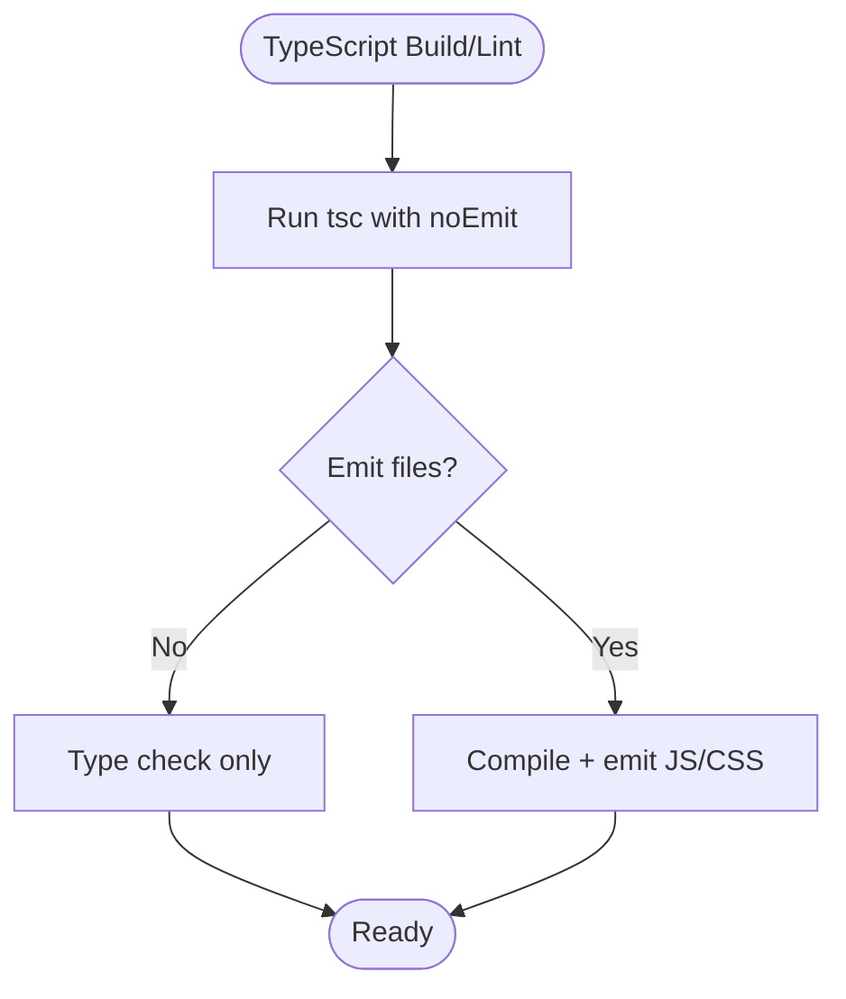
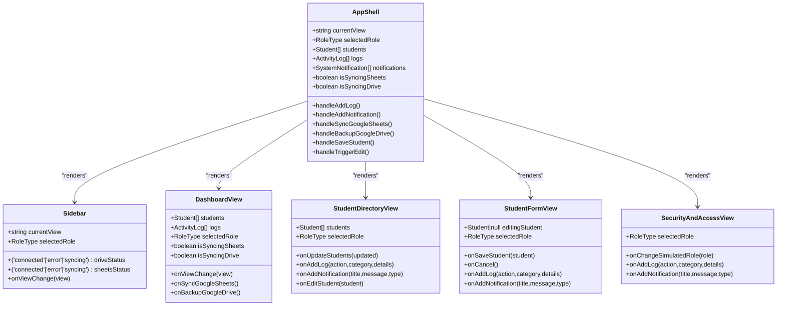
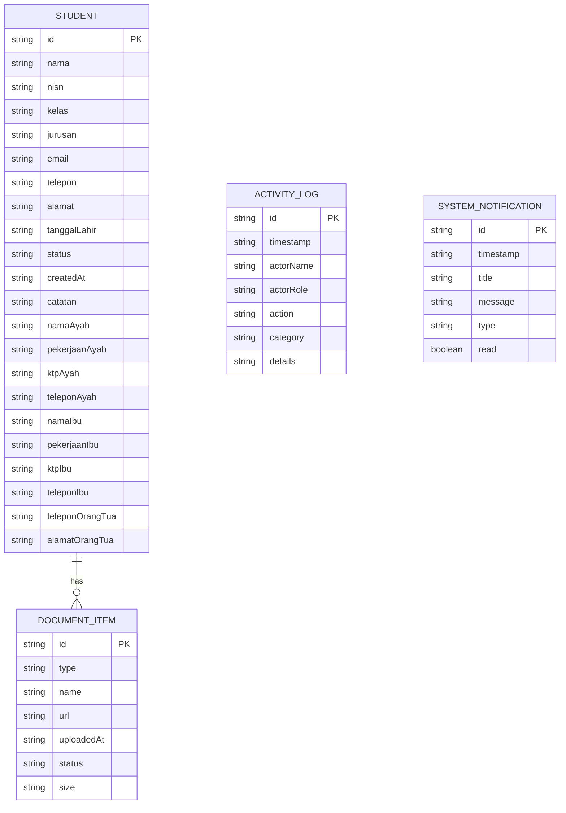
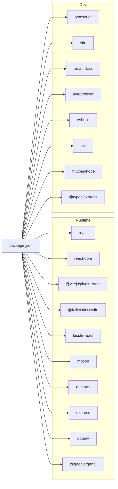

# Development Workflow

<cite>
**Referenced Files in This Document**
- [package.json](file://package.json)
- [vite.config.ts](file://vite.config.ts)
- [tsconfig.json](file://tsconfig.json)
- [README.md](file://README.md)
- [index.html](file://index.html)
- [src/main.tsx](file://src/main.tsx)
- [src/App.tsx](file://src/App.tsx)
- [src/index.css](file://src/index.css)
- [src/types.ts](file://src/types.ts)
- [src/mockData.ts](file://src/mockData.ts)
- [src/components/Sidebar.tsx](file://src/components/Sidebar.tsx)
- [src/components/DashboardView.tsx](file://src/components/DashboardView.tsx)
- [src/components/StudentDirectoryView.tsx](file://src/components/StudentDirectoryView.tsx)
- [src/components/StudentFormView.tsx](file://src/components/StudentFormView.tsx)
- [src/components/SecurityAndAccessView.tsx](file://src/components/SecurityAndAccessView.tsx)
</cite>

## Table of Contents
1. [Introduction](#introduction)
2. [Project Structure](#project-structure)
3. [Core Components](#core-components)
4. [Architecture Overview](#architecture-overview)
5. [Detailed Component Analysis](#detailed-component-analysis)
6. [Dependency Analysis](#dependency-analysis)
7. [Performance Considerations](#performance-considerations)
8. [Troubleshooting Guide](#troubleshooting-guide)
9. [Conclusion](#conclusion)
10. [Appendices](#appendices)

## Introduction
This document describes the ARBAL development workflow, focusing on environment setup, coding standards, development server configuration, hot reload behavior, debugging techniques, project structure, file naming conventions, formatting standards, contribution guidelines, testing approaches, quality assurance practices, TypeScript configuration, linting rules, and development tooling integration. It also covers common development scenarios, troubleshooting, and performance optimization during development.

## Project Structure
The project is a Vite-powered React application with TypeScript and Tailwind CSS. The entry point renders the root React element into the DOM, and the main application component orchestrates views and state. Components are organized under a dedicated components directory, with shared types and mock data supporting the UI.

**Diagram sources**
- [index.html](file://index.html)
- [src/main.tsx](file://src/main.tsx)
- [src/App.tsx](file://src/App.tsx)
- [src/index.css](file://src/index.css)
- [src/types.ts](file://src/types.ts)
- [src/mockData.ts](file://src/mockData.ts)
- [vite.config.ts](file://vite.config.ts)
- [tsconfig.json](file://tsconfig.json)
- [package.json](file://package.json)

**Section sources**
- [index.html](file://index.html)
- [src/main.tsx](file://src/main.tsx)
- [src/App.tsx](file://src/App.tsx)
- [src/index.css](file://src/index.css)
- [src/types.ts](file://src/types.ts)
- [src/mockData.ts](file://src/mockData.ts)
- [vite.config.ts](file://vite.config.ts)
- [tsconfig.json](file://tsconfig.json)
- [package.json](file://package.json)

## Core Components
- Development server and scripts are defined in the package manifest, enabling local development, building, and previewing.
- Vite configuration sets up React and Tailwind plugins, path aliases, and hot module replacement behavior controlled by an environment variable.
- TypeScript configuration defines strictness, JSX transform, bundler module resolution, and no-emit mode for type checking.
- The main application bootstraps the React root and applies global styles.
- The App component manages navigation state, role simulation, core lists, sync states, and notifications, delegating rendering to feature views.
- Shared types and mock data provide consistent data structures and realistic sample datasets for development and testing.

**Section sources**
- [package.json](file://package.json)
- [vite.config.ts](file://vite.config.ts)
- [tsconfig.json](file://tsconfig.json)
- [src/main.tsx](file://src/main.tsx)
- [src/App.tsx](file://src/App.tsx)
- [src/types.ts](file://src/types.ts)
- [src/mockData.ts](file://src/mockData.ts)

## Architecture Overview
The application follows a component-driven architecture with centralized state in the main App component. Views are single-file components that encapsulate UI logic and interactions. Data flows down via props, and actions/updaters are passed upward to App for state mutations.

**Diagram sources**
- [src/main.tsx](file://src/main.tsx)
- [src/App.tsx](file://src/App.tsx)
- [src/components/Sidebar.tsx](file://src/components/Sidebar.tsx)
- [src/components/DashboardView.tsx](file://src/components/DashboardView.tsx)
- [src/components/StudentDirectoryView.tsx](file://src/components/StudentDirectoryView.tsx)
- [src/components/StudentFormView.tsx](file://src/components/StudentFormView.tsx)
- [src/components/SecurityAndAccessView.tsx](file://src/components/SecurityAndAccessView.tsx)

## Detailed Component Analysis

### Development Server and Hot Reload
- The development server runs on port 3000 and binds to all network interfaces for external access.
- Hot Module Replacement (HMR) is enabled by default but can be conditionally disabled via an environment variable. When disabled, file watching is also disabled to reduce CPU usage during agent edits.
- The server resolves aliases configured in Vite to simplify imports.

**Diagram sources**
- [package.json](file://package.json)
- [vite.config.ts](file://vite.config.ts)

**Section sources**
- [package.json](file://package.json)
- [vite.config.ts](file://vite.config.ts)

### TypeScript Configuration and Linting
- Compiler options target modern JavaScript environments, enable experimental decorators, and use bundler module resolution.
- JSX is transformed via React JSX runtime.
- Path aliases are configured for clean imports.
- The project uses a lint script that runs TypeScript type-checking without emitting compiled files.

**Diagram sources**
- [tsconfig.json](file://tsconfig.json)
- [package.json](file://package.json)

**Section sources**
- [tsconfig.json](file://tsconfig.json)
- [package.json](file://package.json)

### Component Composition and State Management
- The App component centralizes navigation state, role simulation, core data lists, sync indicators, and notifications.
- Child components receive state and callbacks via props, ensuring predictable updates and testability.
- Feature components encapsulate UI logic, event handlers, and interactions while remaining reusable.

**Diagram sources**
- [src/App.tsx](file://src/App.tsx)
- [src/components/Sidebar.tsx](file://src/components/Sidebar.tsx)
- [src/components/DashboardView.tsx](file://src/components/DashboardView.tsx)
- [src/components/StudentDirectoryView.tsx](file://src/components/StudentDirectoryView.tsx)
- [src/components/StudentFormView.tsx](file://src/components/StudentFormView.tsx)
- [src/components/SecurityAndAccessView.tsx](file://src/components/SecurityAndAccessView.tsx)

**Section sources**
- [src/App.tsx](file://src/App.tsx)
- [src/components/Sidebar.tsx](file://src/components/Sidebar.tsx)
- [src/components/DashboardView.tsx](file://src/components/DashboardView.tsx)
- [src/components/StudentDirectoryView.tsx](file://src/components/StudentDirectoryView.tsx)
- [src/components/StudentFormView.tsx](file://src/components/StudentFormView.tsx)
- [src/components/SecurityAndAccessView.tsx](file://src/components/SecurityAndAccessView.tsx)

### Data Models and Mock Data
- Strongly typed models define student profiles, document types, roles, activity logs, and system notifications.
- Mock data provides realistic datasets for development and testing, including sample students, roles, logs, and notifications.

**Diagram sources**
- [src/types.ts](file://src/types.ts)
- [src/mockData.ts](file://src/mockData.ts)

**Section sources**
- [src/types.ts](file://src/types.ts)
- [src/mockData.ts](file://src/mockData.ts)

### UI and Styling
- Global styles import fonts and configure Tailwind theme tokens.
- Utility animations and transitions enhance user experience.
- Components leverage Tailwind classes for responsive layouts and consistent design.

**Section sources**
- [src/index.css](file://src/index.css)

## Dependency Analysis
- Runtime dependencies include React, React DOM, Tailwind CSS plugin, Lucide icons, motion, recharts, Express, dotenv, and Google GenAI SDK.
- Development dependencies include TypeScript, Vite, Tailwind CSS, esbuild, autoprefixer, tsx, and related type definitions.
- Scripts orchestrate development, building, previewing, cleaning, and type-checking.

**Diagram sources**
- [package.json](file://package.json)

**Section sources**
- [package.json](file://package.json)

## Performance Considerations
- Keep HMR enabled for rapid iteration; disable it only when agent edits cause excessive file watching overhead.
- Prefer memoization and stable callbacks to minimize unnecessary re-renders in frequently updated components.
- Lazy-load heavy assets and defer non-critical computations to background threads or worker APIs when applicable.
- Monitor bundle size and remove unused dependencies to reduce initial load time.
- Use Tailwind utilities efficiently to avoid bloated CSS; purge unused styles in production builds.

## Troubleshooting Guide
- Environment prerequisites: Ensure Node.js is installed and available in PATH.
- API keys: Set the required API key in the appropriate environment file before running the development server.
- Port conflicts: If port 3000 is busy, adjust the port in the development script or stop the conflicting service.
- HMR issues: If hot reload behaves unexpectedly, toggle the DISABLE_HMR environment variable to disable HMR and file watching temporarily.
- Type errors: Run the type-checking script to catch and fix TypeScript errors before committing changes.
- Preview mode: Use the preview script to validate production builds locally.

**Section sources**
- [README.md](file://README.md)
- [package.json](file://package.json)
- [vite.config.ts](file://vite.config.ts)

## Conclusion
ARBAL’s development workflow leverages Vite for fast builds and HMR, TypeScript for type safety, and Tailwind for efficient styling. The component-driven architecture promotes maintainability and testability. By following the outlined setup, configuration, and best practices, contributors can develop features quickly, debug effectively, and deliver high-quality enhancements aligned with the project’s standards.

## Appendices

### Development Environment Setup
- Install dependencies using the project’s package manager.
- Configure environment variables as described in the project’s documentation.
- Start the development server with the provided script.

**Section sources**
- [README.md](file://README.md)
- [package.json](file://package.json)

### Coding Standards and Formatting
- Use TypeScript with strict compiler options for type safety.
- Apply Tailwind utility classes for styling and keep components modular.
- Maintain consistent naming conventions for files and components.
- Keep imports organized and use path aliases for readability.

**Section sources**
- [tsconfig.json](file://tsconfig.json)
- [vite.config.ts](file://vite.config.ts)
- [src/index.css](file://src/index.css)

### Testing and Quality Assurance
- Use the type-checking script to validate code correctness.
- Manually test UI interactions across different roles and views.
- Verify hot reload behavior and responsiveness during development.
- Confirm that build artifacts are generated correctly for preview.

**Section sources**
- [package.json](file://package.json)
- [vite.config.ts](file://vite.config.ts)