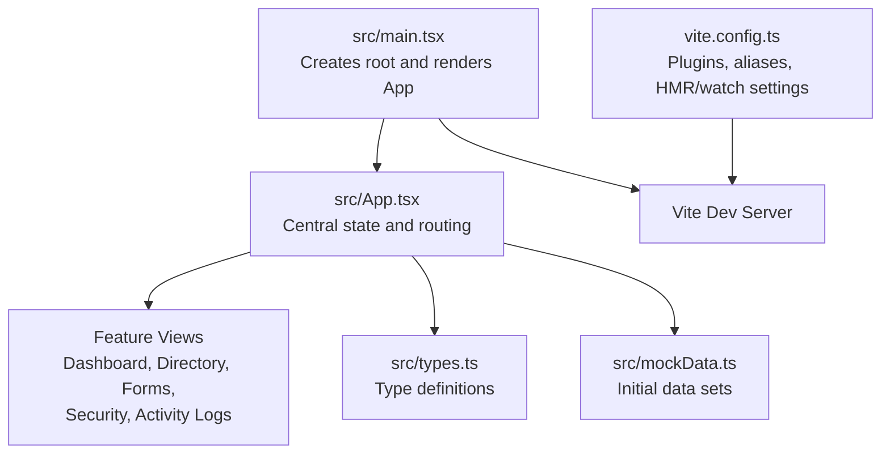
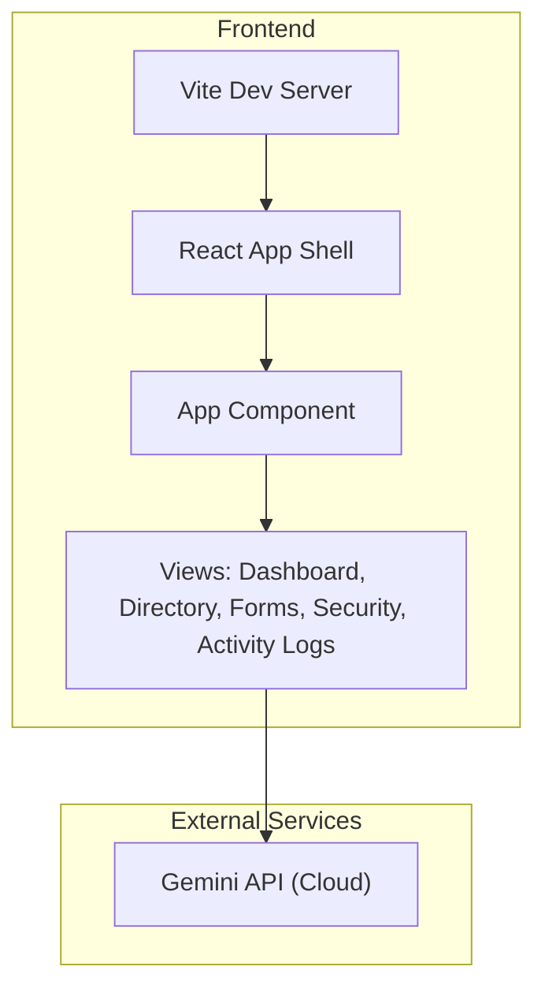
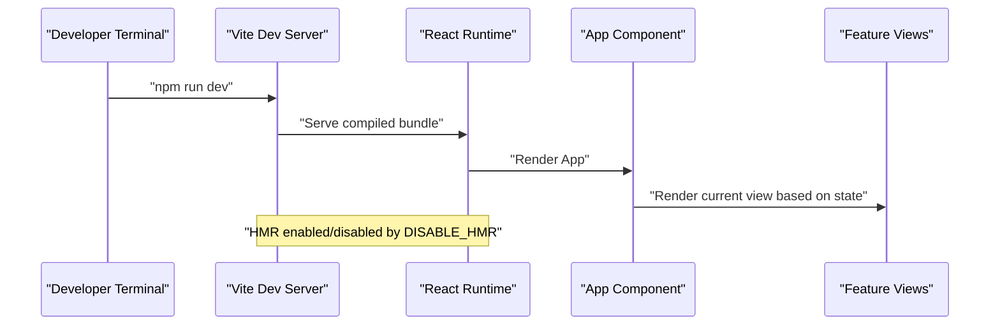
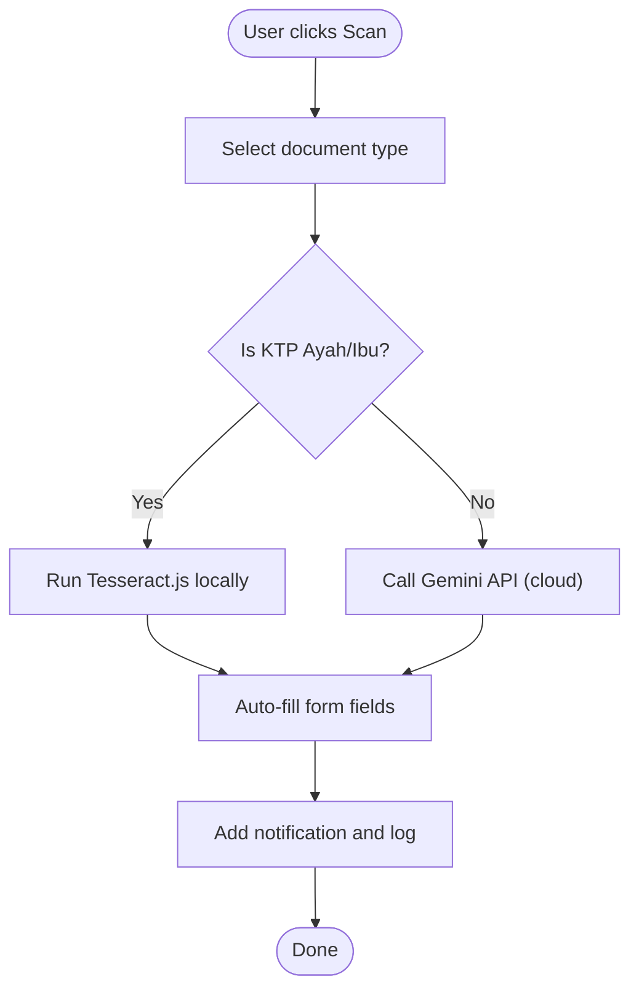
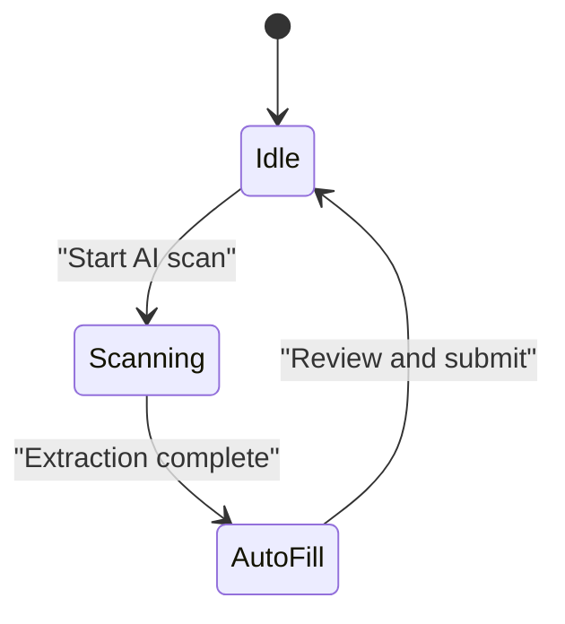
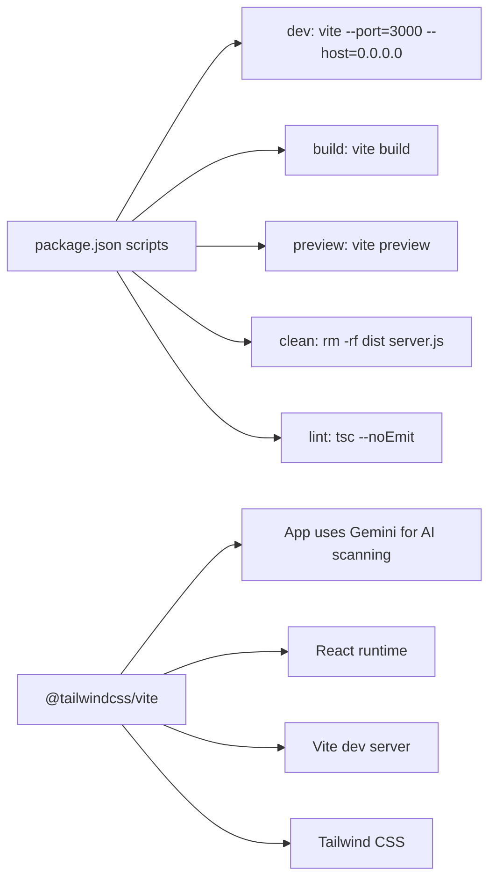

# Getting Started

<cite>
**Referenced Files in This Document**
- [README.md](file://README.md)
- [package.json](file://package.json)
- [vite.config.ts](file://vite.config.ts)
- [src/main.tsx](file://src/main.tsx)
- [src/App.tsx](file://src/App.tsx)
- [src/components/StudentFormView.tsx](file://src/components/StudentFormView.tsx)
- [src/types.ts](file://src/types.ts)
- [src/mockData.ts](file://src/mockData.ts)
- [PRD.md](file://PRD.md)
- [DEPLOYMENT_PLAN.md](file://DEPLOYMENT_PLAN.md)
</cite>

## Table of Contents
1. [Introduction](#introduction)
2. [Project Structure](#project-structure)
3. [Core Components](#core-components)
4. [Architecture Overview](#architecture-overview)
5. [Detailed Component Analysis](#detailed-component-analysis)
6. [Dependency Analysis](#dependency-analysis)
7. [Performance Considerations](#performance-considerations)
8. [Troubleshooting Guide](#troubleshooting-guide)
9. [Conclusion](#conclusion)
10. [Appendices](#appendices)

## Introduction
This guide helps you set up and run the ARBAL application locally. It covers prerequisites, environment configuration for Gemini integration, step-by-step installation, local development server startup, and practical tips for hot reload, debugging, and troubleshooting. The content is designed to be beginner-friendly while providing sufficient technical depth for experienced developers.

## Project Structure
ARBAL is a React + Vite application with TypeScript. It includes:
- A React root rendering the main application shell
- A central App component orchestrating views and state
- Feature views for dashboard, directory, forms, security, and activity logs
- Mock data and typed models for students, documents, roles, logs, and notifications
- Vite configuration with React and Tailwind CSS plugins, plus HMR controls

**Diagram sources**
- [src/main.tsx:1-11](file://src/main.tsx#L1-L11)
- [src/App.tsx:1-348](file://src/App.tsx#L1-L348)
- [vite.config.ts:1-23](file://vite.config.ts#L1-L23)

**Section sources**
- [src/main.tsx:1-11](file://src/main.tsx#L1-L11)
- [src/App.tsx:1-348](file://src/App.tsx#L1-L348)
- [vite.config.ts:1-23](file://vite.config.ts#L1-L23)

## Core Components
- Application entrypoint initializes the React root and mounts the App component.
- Central App component manages navigation state, selected role, lists of students/logs/notifications, editing context, and connection sync states.
- Feature components are rendered conditionally based on the current view.
- Types define the shape of students, documents, roles, activity logs, and system notifications.
- Mock data provides initial datasets for quick local development.

Key responsibilities:
- State orchestration and event helpers for adding logs and notifications
- Triggers for syncing with Google Sheets and backing up to Google Drive
- Role-based permission simulation and UI updates

**Section sources**
- [src/main.tsx:1-11](file://src/main.tsx#L1-L11)
- [src/App.tsx:36-198](file://src/App.tsx#L36-L198)
- [src/types.ts:1-83](file://src/types.ts#L1-L83)
- [src/mockData.ts:1-452](file://src/mockData.ts#L1-L452)

## Architecture Overview
ARBAL’s frontend is a single-page React application built with Vite. The App component coordinates views and state, while feature components encapsulate UI logic. The project integrates with Gemini for AI-powered OCR scanning in the student form view.

**Diagram sources**
- [src/App.tsx:200-347](file://src/App.tsx#L200-L347)
- [src/components/StudentFormView.tsx:320-509](file://src/components/StudentFormView.tsx#L320-L509)

**Section sources**
- [src/App.tsx:200-347](file://src/App.tsx#L200-L347)
- [src/components/StudentFormView.tsx:320-509](file://src/components/StudentFormView.tsx#L320-L509)

## Detailed Component Analysis

### Application Entry and Dev Server
- The entrypoint creates the React root and renders the App component.
- Vite runs the dev server with React and Tailwind plugins, resolves aliases, and toggles HMR/watch based on environment variables.

**Diagram sources**
- [vite.config.ts:14-21](file://vite.config.ts#L14-L21)
- [src/main.tsx:6-10](file://src/main.tsx#L6-L10)
- [src/App.tsx:200-347](file://src/App.tsx#L200-L347)

**Section sources**
- [src/main.tsx:1-11](file://src/main.tsx#L1-L11)
- [vite.config.ts:1-23](file://vite.config.ts#L1-L23)

### AI Scanning Integration (Gemini)
- The student form view simulates AI scanning with Gemini for complex documents (e.g., Kartu Keluarga, Akta, Ijazah).
- For KTP Ayah/Ibu, the flow uses a local OCR engine (Tesseract.js) to extract identity fields.
- The scanner logs progress, auto-fills form fields, and triggers notifications and activity logs.

**Diagram sources**
- [src/components/StudentFormView.tsx:320-509](file://src/components/StudentFormView.tsx#L320-L509)

**Section sources**
- [src/components/StudentFormView.tsx:320-509](file://src/components/StudentFormView.tsx#L320-L509)

### Conceptual Overview
- The application simulates Google Workspace integrations (Drive and Sheets) with UI indicators and notifications.
- Role-based access controls restrict actions and visibility across views.

[No sources needed since this diagram shows conceptual workflow, not actual code structure]

## Dependency Analysis
- Scripts define dev/build/preview/clean/lint commands.
- Dependencies include React, React DOM, Vite, Tailwind CSS plugin, Lucide icons, motion animations, Recharts, and @google/genai.
- Dev dependencies include TypeScript, Tailwind CSS, esbuild, and Vite.

**Diagram sources**
- [package.json:6-11](file://package.json#L6-L11)
- [package.json:13-24](file://package.json#L13-L24)
- [package.json:26-34](file://package.json#L26-L34)

**Section sources**
- [package.json:1-37](file://package.json#L1-L37)

## Performance Considerations
- Hot Module Replacement (HMR) is controlled by an environment variable to optimize CPU usage during agent edits.
- Local development uses a lightweight dev server; production builds leverage Vite’s bundling.
- Keep the number of watchers minimal by disabling file watching when HMR is disabled.

[No sources needed since this section provides general guidance]

## Troubleshooting Guide
Common setup issues and resolutions:

- Missing Node.js
  - Ensure Node.js is installed and available in PATH. The project requires Node.js for local development.
  - Verify with your terminal: node --version

- Missing GEMINI_API_KEY
  - The application expects a Gemini API key configured in the environment.
  - Create a .env.local file at the project root and set GEMINI_API_KEY to your key.
  - After setting the key, restart the dev server.

- Vite HMR/watch behavior
  - HMR and file watching can be toggled via an environment variable. If you experience flickering or high CPU usage during agent edits, set the variable accordingly and restart the dev server.

- Port conflicts
  - The dev server binds to port 3000. If another process is using this port, change the port in the dev script or stop the conflicting service.

- TypeScript lint errors
  - Use the lint script to check for type errors without emitting JavaScript.

- Running the app locally
  - Install dependencies, configure the Gemini API key, then start the dev server.

**Section sources**
- [README.md:11-21](file://README.md#L11-L21)
- [vite.config.ts:14-21](file://vite.config.ts#L14-L21)
- [package.json:6-11](file://package.json#L6-L11)

## Conclusion
You now have the essentials to run ARBAL locally: Node.js, a Gemini API key, and the Vite dev server. Use the provided scripts, configure environment variables, and explore the UI. For advanced scenarios involving Google Workspace integrations, refer to the deployment and PRD documents.

[No sources needed since this section summarizes without analyzing specific files]

## Appendices

### Step-by-Step Setup
1. Prerequisites
   - Node.js installed

2. Install dependencies
   - Run the install script to fetch all dependencies

3. Configure environment
   - Create a .env.local file at the project root
   - Set GEMINI_API_KEY to your Gemini API key

4. Start the development server
   - Run the dev script to launch the Vite dev server

5. Access the app
   - Open the URL shown by the dev server (default port 3000)

6. Explore the UI
   - Navigate between views and simulate role-based actions

7. Optional: Build and preview
   - Build the project and preview the production bundle

**Section sources**
- [README.md:11-21](file://README.md#L11-L21)
- [package.json:6-11](file://package.json#L6-L11)

### Development Workflow and Debugging
- Hot reload
  - HMR is enabled by default; adjust behavior via the environment variable if needed

- Debugging
  - Use your browser’s developer tools to inspect React components and state
  - Check console logs for AI scanning progress and notifications

- State management
  - Centralized state in the App component drives UI updates across views

- Role simulation
  - Use the role switcher in the header to test different permission sets

**Section sources**
- [vite.config.ts:14-21](file://vite.config.ts#L14-L21)
- [src/App.tsx:244-272](file://src/App.tsx#L244-L272)

### Advanced: Self-Hosted Deployment Notes
- The PRD and deployment plan describe a self-hosted stack using Coolify, PostgreSQL with TimescaleDB, pgAdmin, and Grafana.
- These documents outline database schemas, API integrations, and monitoring dashboards for production environments.

**Section sources**
- [PRD.md:171-250](file://PRD.md#L171-L250)
- [DEPLOYMENT_PLAN.md:130-250](file://DEPLOYMENT_PLAN.md#L130-L250)