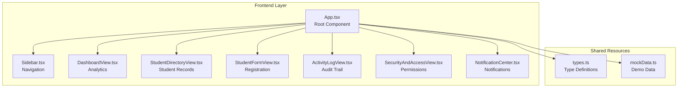
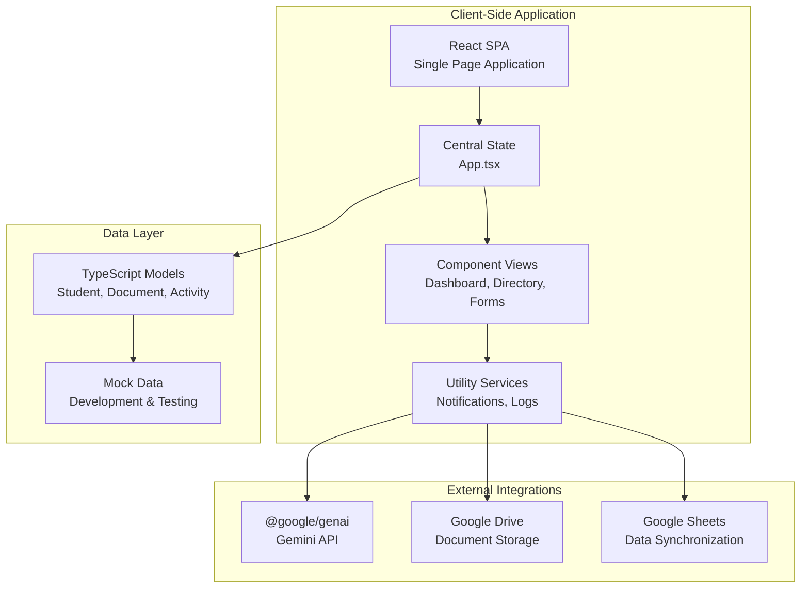
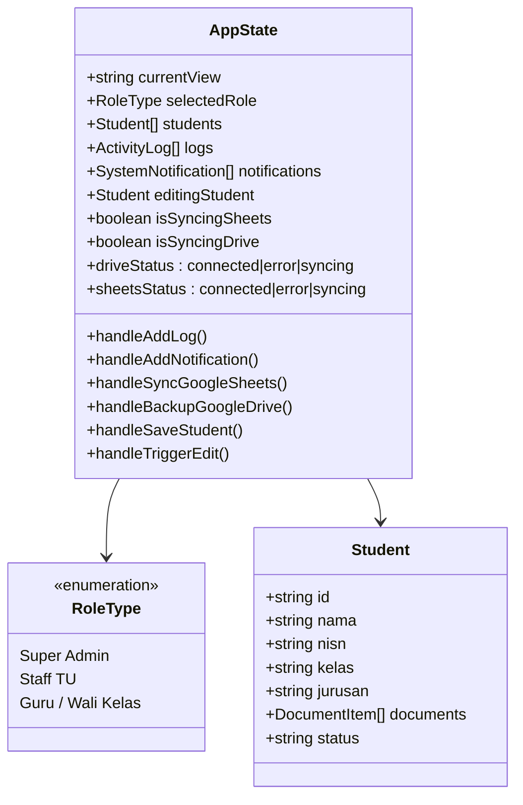
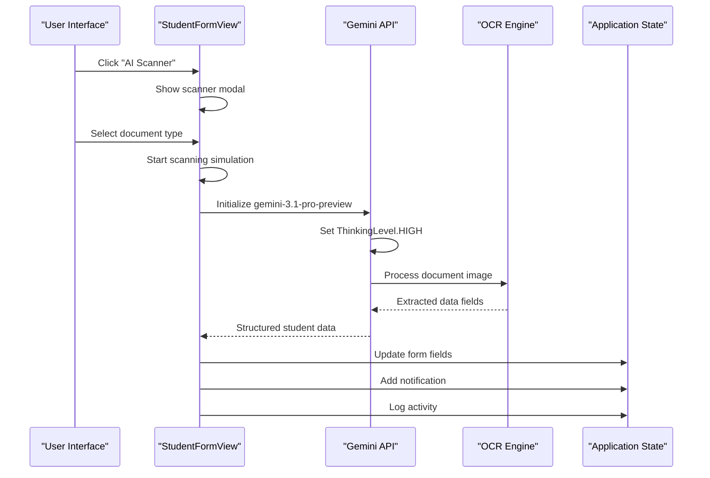
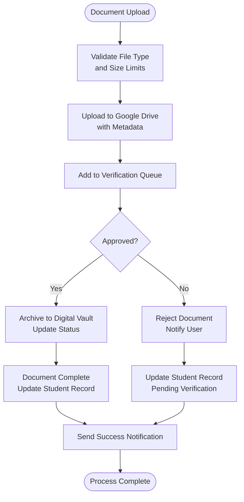
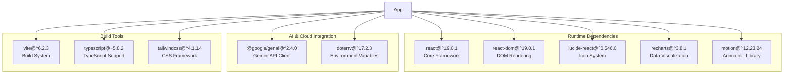

# Project Overview

<cite>
**Referenced Files in This Document**
- [README.md](file://README.md)
- [PRD.md](file://PRD.md)
- [App.tsx](file://src/App.tsx)
- [DashboardView.tsx](file://src/components/DashboardView.tsx)
- [StudentDirectoryView.tsx](file://src/components/StudentDirectoryView.tsx)
- [StudentFormView.tsx](file://src/components/StudentFormView.tsx)
- [ActivityLogView.tsx](file://src/components/ActivityLogView.tsx)
- [SecurityAndAccessView.tsx](file://src/components/SecurityAndAccessView.tsx)
- [Sidebar.tsx](file://src/components/Sidebar.tsx)
- [NotificationCenter.tsx](file://src/components/NotificationCenter.tsx)
- [types.ts](file://src/types.ts)
- [mockData.ts](file://src/mockData.ts)
- [main.tsx](file://src/main.tsx)
- [package.json](file://package.json)
</cite>

## Table of Contents
1. [Introduction](#introduction)
2. [Project Structure](#project-structure)
3. [Core Components](#core-components)
4. [Architecture Overview](#architecture-overview)
5. [Detailed Component Analysis](#detailed-component-analysis)
6. [Dependency Analysis](#dependency-analysis)
7. [Performance Considerations](#performance-considerations)
8. [Troubleshooting Guide](#troubleshooting-guide)
9. [Conclusion](#conclusion)

## Introduction
ARBAL (Arsip Mustaqbal) is an educational student administration dashboard built with React and TypeScript. It serves as a centralized digital archive and management platform for PKBM (Community Learning Center) institutions, focusing on streamlined student data capture, document archiving, activity auditing, and secure access control. The application integrates with Google Workspace (Drive and Sheets) and demonstrates AI-powered document extraction capabilities using the Gemini API, while maintaining self-hosted deployment flexibility for data sovereignty.

Target audience:
- Educational administrators (Super Admin)
- School staff (TU/Registrar)
- Classroom teachers and homeroom advisors

Positioning within the educational technology ecosystem:
- Student Information System (SIS) front-end with integrated document management
- Audit-ready platform emphasizing transparency and compliance
- AI-assisted data entry and verification workflows
- Self-hosted deployment option for privacy and control

## Project Structure
The application follows a modular React architecture with clear separation of concerns:
- Single-page application routing with sidebar navigation
- Component-based UI with reusable views for dashboard, directory, forms, logs, and security
- Centralized state management in the root App component
- Type-safe data models for students, documents, activities, and roles
- Mock data for demonstration and development

**Diagram sources**
- [App.tsx:1-348](file://src/App.tsx#L1-L348)
- [Sidebar.tsx:1-182](file://src/components/Sidebar.tsx#L1-L182)
- [DashboardView.tsx:1-394](file://src/components/DashboardView.tsx#L1-L394)
- [StudentDirectoryView.tsx:1-756](file://src/components/StudentDirectoryView.tsx#L1-L756)
- [StudentFormView.tsx:1-1497](file://src/components/StudentFormView.tsx#L1-L1497)
- [ActivityLogView.tsx:1-172](file://src/components/ActivityLogView.tsx#L1-L172)
- [SecurityAndAccessView.tsx:1-316](file://src/components/SecurityAndAccessView.tsx#L1-L316)
- [NotificationCenter.tsx:1-131](file://src/components/NotificationCenter.tsx#L1-L131)
- [types.ts:1-83](file://src/types.ts#L1-L83)
- [mockData.ts:1-452](file://src/mockData.ts#L1-L452)

**Section sources**
- [main.tsx:1-11](file://src/main.tsx#L1-L11)
- [package.json:1-37](file://package.json#L1-L37)

## Core Components
The application comprises five primary functional areas:

### Dashboard Analytics
Provides institutional overview with:
- Student enrollment statistics and completeness metrics
- Document upload and verification status
- Real-time activity feed
- Quick actions for synchronization with Google Workspace

### Student Directory
Central repository with:
- Advanced filtering by class, status, and document completeness
- Detailed student profiles with parent/guardian information
- Document management with upload, verification, and deletion capabilities
- Bulk operations and status tracking

### Registration Form
Multi-tab workflow for student enrollment:
- Personal identification and contact details
- Parent/guardian information capture
- Document upload with OCR integration
- AI-powered auto-fill using Gemini API

### Activity Logging
Comprehensive audit trail:
- Detailed action tracking with timestamps and actors
- Categorized logging (student, document, access, external sync)
- Export capabilities for compliance reporting
- Real-time monitoring of system activities

### Security & Access Control
Role-based permissions system:
- Three-tier access model (Super Admin, TU Staff, Teacher)
- Granular permission matrix for each operation
- Session switching for testing access restrictions
- Compliance-focused data encryption and enclave protection

**Section sources**
- [DashboardView.tsx:1-394](file://src/components/DashboardView.tsx#L1-L394)
- [StudentDirectoryView.tsx:1-756](file://src/components/StudentDirectoryView.tsx#L1-L756)
- [StudentFormView.tsx:1-1497](file://src/components/StudentFormView.tsx#L1-L1497)
- [ActivityLogView.tsx:1-172](file://src/components/ActivityLogView.tsx#L1-L172)
- [SecurityAndAccessView.tsx:1-316](file://src/components/SecurityAndAccessView.tsx#L1-L316)

## Architecture Overview
The system implements a client-side React architecture with backend integration:

**Diagram sources**
- [App.tsx:1-348](file://src/App.tsx#L1-L348)
- [StudentFormView.tsx:321-513](file://src/components/StudentFormView.tsx#L321-L513)
- [DashboardView.tsx:140-161](file://src/components/DashboardView.tsx#L140-L161)
- [StudentDirectoryView.tsx:150-205](file://src/components/StudentDirectoryView.tsx#L150-L205)
- [types.ts:1-83](file://src/types.ts#L1-L83)
- [mockData.ts:1-452](file://src/mockData.ts#L1-L452)

## Detailed Component Analysis

### Application State Management
The root App component orchestrates the entire application state:

**Diagram sources**
- [App.tsx:36-347](file://src/App.tsx#L36-L347)
- [types.ts:48-46](file://src/types.ts#L48-L46)

### AI Document Extraction Workflow
The system demonstrates advanced AI integration for document processing:

**Diagram sources**
- [StudentFormView.tsx:321-513](file://src/components/StudentFormView.tsx#L321-L513)
- [StudentFormView.tsx:1336-1494](file://src/components/StudentFormView.tsx#L1336-L1494)

### Document Management Lifecycle
The document workflow ensures proper archival and verification:

**Diagram sources**
- [StudentDirectoryView.tsx:150-205](file://src/components/StudentDirectoryView.tsx#L150-L205)
- [StudentDirectoryView.tsx:207-246](file://src/components/StudentDirectoryView.tsx#L207-L246)

**Section sources**
- [App.tsx:60-191](file://src/App.tsx#L60-L191)
- [StudentFormView.tsx:321-513](file://src/components/StudentFormView.tsx#L321-L513)
- [StudentDirectoryView.tsx:150-246](file://src/components/StudentDirectoryView.tsx#L150-L246)

## Dependency Analysis
The application leverages several key technologies and libraries:

**Diagram sources**
- [package.json:13-34](file://package.json#L13-L34)

**Section sources**
- [package.json:1-37](file://package.json#L1-L37)

## Performance Considerations
- State management optimized through centralized App component
- Component-level rendering with React.memo patterns
- Debounced search and filter operations
- Lazy loading for heavy components
- Efficient chart rendering with responsive containers
- Minimal re-renders through proper state partitioning

## Troubleshooting Guide
Common operational issues and resolutions:

### Authentication & API Issues
- Verify GEMINI_API_KEY environment variable is set
- Check network connectivity to Google APIs
- Review console errors for CORS or quota limitations

### Document Upload Problems
- Ensure file size limits are not exceeded
- Verify supported file formats (PDF, JPG, PNG)
- Check Google Drive storage quotas

### Permission Denied Errors
- Confirm user role assignment in sidebar
- Verify role-based access controls
- Test session switching for permission validation

### Performance Optimization
- Monitor bundle size with Vite analyzer
- Optimize chart rendering for large datasets
- Implement virtual scrolling for extensive lists

**Section sources**
- [README.md:16-20](file://README.md#L16-L20)
- [App.tsx:104-161](file://src/App.tsx#L104-L161)

## Conclusion
ARBAL represents a comprehensive educational administration solution that combines modern React development practices with robust educational workflows. Its AI-integrated document processing, comprehensive audit capabilities, and flexible deployment options position it as a valuable asset for PKBM institutions seeking efficient, secure, and compliant student management. The application's modular architecture ensures maintainability while its role-based security model supports institutional governance requirements.