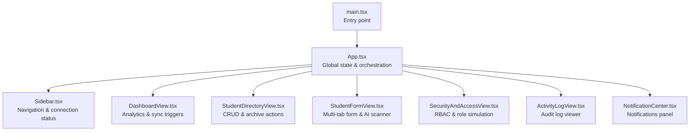
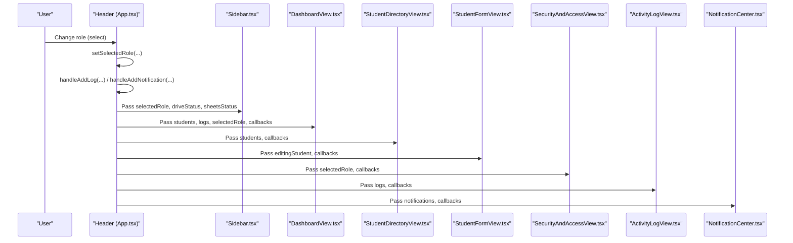
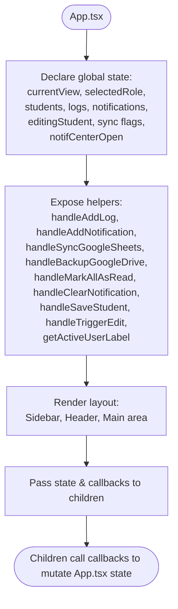
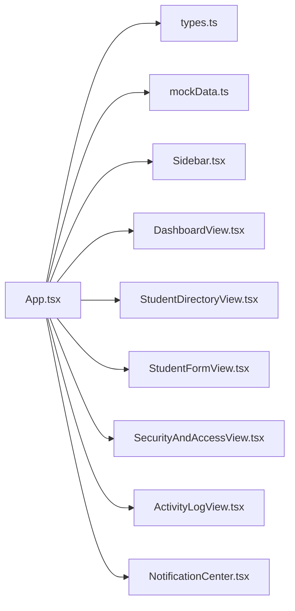

# State Management

<cite>
**Referenced Files in This Document**
- [App.tsx](file://src/App.tsx)
- [main.tsx](file://src/main.tsx)
- [types.ts](file://src/types.ts)
- [mockData.ts](file://src/mockData.ts)
- [Sidebar.tsx](file://src/components/Sidebar.tsx)
- [DashboardView.tsx](file://src/components/DashboardView.tsx)
- [StudentDirectoryView.tsx](file://src/components/StudentDirectoryView.tsx)
- [StudentFormView.tsx](file://src/components/StudentFormView.tsx)
- [SecurityAndAccessView.tsx](file://src/components/SecurityAndAccessView.tsx)
- [ActivityLogView.tsx](file://src/components/ActivityLogView.tsx)
- [NotificationCenter.tsx](file://src/components/NotificationCenter.tsx)
</cite>

## Table of Contents
1. [Introduction](#introduction)
2. [Project Structure](#project-structure)
3. [Core Components](#core-components)
4. [Architecture Overview](#architecture-overview)
5. [Detailed Component Analysis](#detailed-component-analysis)
6. [Dependency Analysis](#dependency-analysis)
7. [Performance Considerations](#performance-considerations)
8. [Troubleshooting Guide](#troubleshooting-guide)
9. [Conclusion](#conclusion)

## Introduction
This document explains the ARBAL state management system with a focus on React hooks and state synchronization strategies. It details how App.tsx orchestrates global application state, coordinates user interactions, and synchronizes data across components. It also covers state update patterns, event handling, data flow between parent and child components, best practices, performance considerations, and memory management strategies.

## Project Structure
The application follows a component-driven architecture with a single-page layout. App.tsx serves as the global state container and orchestrator, passing state and callbacks down to child components. Child components manage their own local state for UI concerns while delegating persistent updates to App.tsx.

**Diagram sources**
- [main.tsx:1-11](file://src/main.tsx#L1-L11)
- [App.tsx:36-348](file://src/App.tsx#L36-L348)
- [Sidebar.tsx:28-182](file://src/components/Sidebar.tsx#L28-L182)
- [DashboardView.tsx:45-394](file://src/components/DashboardView.tsx#L45-L394)
- [StudentDirectoryView.tsx:42-756](file://src/components/StudentDirectoryView.tsx#L42-L756)
- [StudentFormView.tsx:37-1497](file://src/components/StudentFormView.tsx#L37-L1497)
- [SecurityAndAccessView.tsx:40-316](file://src/components/SecurityAndAccessView.tsx#L40-L316)
- [ActivityLogView.tsx:25-172](file://src/components/ActivityLogView.tsx#L25-L172)
- [NotificationCenter.tsx:25-131](file://src/components/NotificationCenter.tsx#L25-L131)

**Section sources**
- [main.tsx:1-11](file://src/main.tsx#L1-L11)
- [App.tsx:36-348](file://src/App.tsx#L36-L348)

## Core Components
- App.tsx: Declares and manages all application-wide state, including navigation, role, lists, editing context, and cloud sync statuses. It exposes helper functions for logging, notifications, and CRUD operations to children.
- Sidebar.tsx: Receives current view, role, and connection statuses; renders navigation and cloud connection indicators.
- DashboardView.tsx: Consumes lists and statuses to render analytics and provides sync triggers.
- StudentDirectoryView.tsx: Manages local UI state for filtering and detail drawers; delegates persistence via callbacks to App.tsx.
- StudentFormView.tsx: Manages multi-tab form state and AI scanner simulation; persists changes via callback to App.tsx.
- SecurityAndAccessView.tsx: Manages role simulation and RBAC matrix; updates App.tsx role state.
- ActivityLogView.tsx: Renders and filters activity logs; triggers sync to Google Sheets.
- NotificationCenter.tsx: Manages notification panel visibility and actions; receives notifications from App.tsx.

**Section sources**
- [App.tsx:36-348](file://src/App.tsx#L36-L348)
- [Sidebar.tsx:28-182](file://src/components/Sidebar.tsx#L28-L182)
- [DashboardView.tsx:45-394](file://src/components/DashboardView.tsx#L45-L394)
- [StudentDirectoryView.tsx:42-756](file://src/components/StudentDirectoryView.tsx#L42-L756)
- [StudentFormView.tsx:37-1497](file://src/components/StudentFormView.tsx#L37-L1497)
- [SecurityAndAccessView.tsx:40-316](file://src/components/SecurityAndAccessView.tsx#L40-L316)
- [ActivityLogView.tsx:25-172](file://src/components/ActivityLogView.tsx#L25-L172)
- [NotificationCenter.tsx:25-131](file://src/components/NotificationCenter.tsx#L25-L131)

## Architecture Overview
The state architecture centers around a single source of truth in App.tsx with unidirectional data flow:
- Global state: currentView, selectedRole, lists (students, logs, notifications), editingStudent, sync statuses.
- Event handlers: centralized in App.tsx; invoked by children via props.
- Local state: managed inside child components for UI concerns (filters, drawer visibility, form tabs).
- Data propagation: App.tsx passes state and callbacks to children; children call callbacks to mutate global state.

**Diagram sources**
- [App.tsx:244-282](file://src/App.tsx#L244-L282)
- [Sidebar.tsx:28-182](file://src/components/Sidebar.tsx#L28-L182)
- [DashboardView.tsx:45-394](file://src/components/DashboardView.tsx#L45-L394)
- [StudentDirectoryView.tsx:42-756](file://src/components/StudentDirectoryView.tsx#L42-L756)
- [StudentFormView.tsx:37-1497](file://src/components/StudentFormView.tsx#L37-L1497)
- [SecurityAndAccessView.tsx:40-316](file://src/components/SecurityAndAccessView.tsx#L40-L316)
- [ActivityLogView.tsx:25-172](file://src/components/ActivityLogView.tsx#L25-L172)
- [NotificationCenter.tsx:25-131](file://src/components/NotificationCenter.tsx#L25-L131)

## Detailed Component Analysis

### App.tsx: Global State Container
- State declarations:
  - Navigation and role: currentView, selectedRole
  - Core lists: students, logs, notifications
  - Editing context: editingStudent
  - Cloud sync: isSyncingSheets, isSyncingDrive, driveStatus, sheetsStatus
  - Notification panel: notifCenterOpen
- Helpers:
  - handleAddLog: creates and prepends a new activity log
  - handleAddNotification: creates and prepends a new system notification; auto-opens panel for warnings
  - handleSyncGoogleSheets: permission-gated sync with UI feedback and log/notification updates
  - handleBackupGoogleDrive: permission-gated backup with UI feedback and log/notification updates
  - handleMarkAllAsRead, handleClearNotification: notification list mutations
  - handleSaveStudent: adds or updates a student; resets editingStudent and navigates to directory
  - handleTriggerEdit: sets editingStudent and navigates to input form
  - getActiveUserLabel: resolves display label for active role
- Data flow:
  - Passes state and callbacks to children via props
  - Children invoke callbacks to mutate App.tsx state

**Diagram sources**
- [App.tsx:36-348](file://src/App.tsx#L36-L348)

**Section sources**
- [App.tsx:36-348](file://src/App.tsx#L36-L348)

### Sidebar.tsx: Navigation and Cloud Status
- Props: currentView, onViewChange, selectedRole, driveStatus, sheetsStatus
- Behavior:
  - Renders navigation items gated by role
  - Displays cloud connection status indicators
  - Invokes onViewChange to update App.tsx currentView

**Section sources**
- [Sidebar.tsx:28-182](file://src/components/Sidebar.tsx#L28-L182)

### DashboardView.tsx: Analytics and Sync Triggers
- Props: students, logs, selectedRole, onViewChange, onSyncGoogleSheets, onBackupGoogleDrive, isSyncingSheets, isSyncingDrive
- Behavior:
  - Computes statistics and chart data from students
  - Provides quick sync buttons bound to App.tsx callbacks
  - Allows navigation to logs and directory

**Section sources**
- [DashboardView.tsx:45-394](file://src/components/DashboardView.tsx#L45-L394)

### StudentDirectoryView.tsx: CRUD and Archive Actions
- Local state: search/filter inputs, active student drawer, upload form state
- Props: students, selectedRole, onUpdateStudents, onAddLog, onAddNotification, onEditStudent
- Behavior:
  - Filters students based on search and filters
  - Handles delete, upload, verify, and remove document actions
  - Updates App.tsx students list via onUpdateStudents
  - Emits logs and notifications via callbacks

**Section sources**
- [StudentDirectoryView.tsx:42-756](file://src/components/StudentDirectoryView.tsx#L42-L756)

### StudentFormView.tsx: Multi-Tab Form and AI Scanner
- Local state: activeTab, form fields per tab, document uploads, AI scanner state
- Props: editingStudent, onSaveStudent, onCancel, selectedRole, onAddLog, onAddNotification
- Behavior:
  - Initializes form from editingStudent or clears for new registrations
  - Submits form to App.tsx via onSaveStudent
  - Simulates AI scanning and auto-fills fields
  - Emits logs and notifications via callbacks

**Section sources**
- [StudentFormView.tsx:37-1497](file://src/components/StudentFormView.tsx#L37-L1497)

### SecurityAndAccessView.tsx: RBAC and Role Simulation
- Local state: staff list, editing staff state
- Props: selectedRole, onChangeSimulatedRole, onAddLog, onAddNotification
- Behavior:
  - Displays permission matrix
  - Allows changing staff roles (Admin-only)
  - Updates App.tsx selectedRole via onChangeSimulatedRole

**Section sources**
- [SecurityAndAccessView.tsx:40-316](file://src/components/SecurityAndAccessView.tsx#L40-L316)

### ActivityLogView.tsx: Audit Log Viewer
- Local state: search and category filters
- Props: logs, onSyncGoogleSheets, isSyncing
- Behavior:
  - Filters logs by keyword and category
  - Triggers Google Sheets sync via callback

**Section sources**
- [ActivityLogView.tsx:25-172](file://src/components/ActivityLogView.tsx#L25-L172)

### NotificationCenter.tsx: Notification Panel
- Local state: open/closed visibility
- Props: notifications, isOpen, onToggleOpen, onMarkAllAsRead, onClearNotification
- Behavior:
  - Displays unread count badge
  - Shows notification list with actions to mark as read and clear

**Section sources**
- [NotificationCenter.tsx:25-131](file://src/components/NotificationCenter.tsx#L25-L131)

## Dependency Analysis
- App.tsx depends on:
  - types.ts for type definitions
  - mockData.ts for initial datasets and role definitions
  - Child components for UI rendering and user interactions
- Child components depend on:
  - App.tsx for state and callbacks
  - types.ts for prop typing
- No circular dependencies observed among components.

**Diagram sources**
- [App.tsx:17-35](file://src/App.tsx#L17-L35)
- [types.ts:1-83](file://src/types.ts#L1-L83)
- [mockData.ts:6-452](file://src/mockData.ts#L6-L452)
- [Sidebar.tsx:6-18](file://src/components/Sidebar.tsx#L6-L18)
- [DashboardView.tsx:32-43](file://src/components/DashboardView.tsx#L32-L43)
- [StudentDirectoryView.tsx:31-49](file://src/components/StudentDirectoryView.tsx#L31-L49)
- [StudentFormView.tsx:26-44](file://src/components/StudentFormView.tsx#L26-L44)
- [SecurityAndAccessView.tsx:21-28](file://src/components/SecurityAndAccessView.tsx#L21-L28)
- [ActivityLogView.tsx:17-29](file://src/components/ActivityLogView.tsx#L17-L29)
- [NotificationCenter.tsx:15-31](file://src/components/NotificationCenter.tsx#L15-L31)

**Section sources**
- [App.tsx:17-35](file://src/App.tsx#L17-L35)
- [types.ts:1-83](file://src/types.ts#L1-L83)
- [mockData.ts:6-452](file://src/mockData.ts#L6-L452)

## Performance Considerations
- Prefer immutable updates: App.tsx uses functional setState patterns (e.g., mapping arrays) to ensure predictable re-renders.
- Minimize re-renders:
  - Keep heavy computations in child components (e.g., DashboardView’s chart data) memoized via local state and derived from props.
  - Avoid unnecessary prop drilling by grouping related callbacks and state into cohesive props where feasible.
- Virtualization: For large lists (e.g., logs or directory), consider virtualizing long tables to reduce DOM nodes.
- Debouncing: Apply debounced search inputs in filters to limit frequent re-renders during typing.
- Lazy loading: Defer non-critical UI initialization until after mount if needed.
- Avoid deep equality checks: Keep state structures flat and shallow to simplify change detection.

## Troubleshooting Guide
Common issues and resolutions:
- Role-based UI not updating:
  - Ensure selectedRole is updated in App.tsx and passed down to children. Verify Sidebar role gating logic.
- Sync buttons disabled unexpectedly:
  - Check selectedRole gating in sync handlers and UI states (isSyncingSheets/isSyncingDrive).
- Notifications not appearing:
  - Confirm handleAddNotification is invoked and notifCenterOpen is toggled for warning types.
- Form not saving:
  - Verify onSaveStudent callback is called with a valid Student object and that handleSaveStudent resets editingStudent and navigates to directory.
- Cloud status not reflecting:
  - Ensure driveStatus and sheetsStatus are updated in App.tsx during sync operations.

**Section sources**
- [App.tsx:104-161](file://src/App.tsx#L104-L161)
- [App.tsx:172-191](file://src/App.tsx#L172-L191)
- [StudentDirectoryView.tsx:99-122](file://src/components/StudentDirectoryView.tsx#L99-L122)
- [StudentDirectoryView.tsx:150-205](file://src/components/StudentDirectoryView.tsx#L150-L205)
- [StudentDirectoryView.tsx:207-246](file://src/components/StudentDirectoryView.tsx#L207-L246)
- [StudentDirectoryView.tsx:248-281](file://src/components/StudentDirectoryView.tsx#L248-L281)

## Conclusion
The ARBAL application employs a clean, centralized state management pattern with App.tsx as the single source of truth. Child components manage local UI state while delegating persistent updates to App.tsx via callbacks. This design yields predictable data flow, simplified debugging, and maintainable component boundaries. By following the best practices outlined—immutable updates, minimal re-renders, and clear separation of concerns—the system remains scalable and robust.