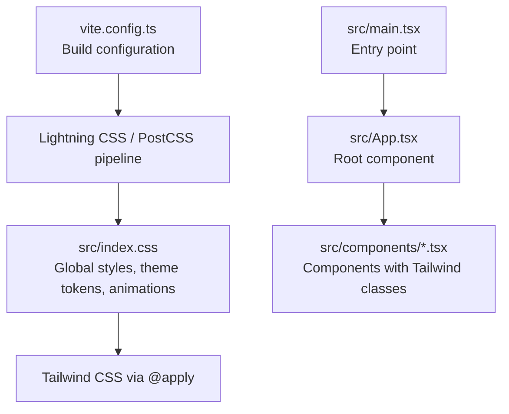
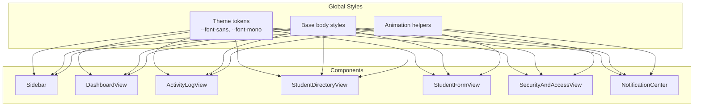
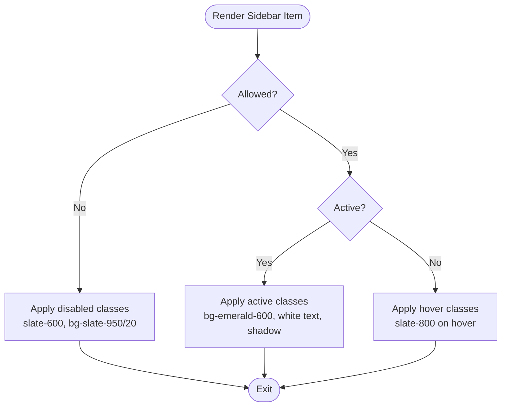
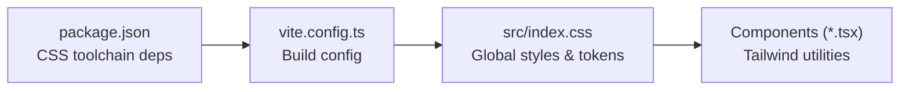

# Styling and Theming

<cite>
**Referenced Files in This Document**
- [index.css](file://src/index.css)
- [App.tsx](file://src/App.tsx)
- [Sidebar.tsx](file://src/components/Sidebar.tsx)
- [DashboardView.tsx](file://src/components/DashboardView.tsx)
- [ActivityLogView.tsx](file://src/components/ActivityLogView.tsx)
- [StudentDirectoryView.tsx](file://src/components/StudentDirectoryView.tsx)
- [StudentFormView.tsx](file://src/components/StudentFormView.tsx)
- [SecurityAndAccessView.tsx](file://src/components/SecurityAndAccessView.tsx)
- [NotificationCenter.tsx](file://src/components/NotificationCenter.tsx)
- [main.tsx](file://src/main.tsx)
- [vite.config.ts](file://vite.config.ts)
- [package.json](file://package.json)
</cite>

## Table of Contents
1. [Introduction](#introduction)
2. [Project Structure](#project-structure)
3. [Core Components](#core-components)
4. [Architecture Overview](#architecture-overview)
5. [Detailed Component Analysis](#detailed-component-analysis)
6. [Dependency Analysis](#dependency-analysis)
7. [Performance Considerations](#performance-considerations)
8. [Troubleshooting Guide](#troubleshooting-guide)
9. [Conclusion](#conclusion)

## Introduction
This document describes the ARBAL styling and theming system with a focus on CSS architecture and design system implementation. It explains the global styling approach, component styling patterns, and responsive design principles. It also documents the design tokens, color schemes, typography systems, and spacing conventions used across the application, along with guidelines for maintaining consistency, custom CSS properties, and theme customization. The relationship between global styles and component-specific styling is addressed, alongside accessibility, cross-browser compatibility, and performance optimization considerations.

## Project Structure
The styling system centers around a small set of global styles and Tailwind-based component styling. Global fonts and theme tokens are defined in the global stylesheet, while individual components apply utility classes for layout, color, and interaction states.

**Diagram sources**
- [index.css:1-30](file://src/index.css#L1-L30)
- [main.tsx:1-20](file://src/main.tsx#L1-L20)
- [App.tsx:1-50](file://src/App.tsx#L1-L50)
- [vite.config.ts:1-50](file://vite.config.ts#L1-L50)

**Section sources**
- [index.css:1-30](file://src/index.css#L1-L30)
- [main.tsx:1-20](file://src/main.tsx#L1-L20)
- [vite.config.ts:1-50](file://vite.config.ts#L1-L50)

## Core Components
- Global stylesheet defines:
  - Font families via CSS variables and Tailwind theme tokens.
  - Base body styles and anti-aliasing.
  - Reusable animation helpers for UI transitions.
- Root application component composes views and relies on global styles.
- Components apply Tailwind utility classes for layout, color, spacing, and stateful interactions.

Key implementation references:
- Global theme tokens and base styles: [index.css:4-14](file://src/index.css#L4-L14)
- Animation helpers: [index.css:16-30](file://src/index.css#L16-L30)
- Root app composition: [App.tsx:1-50](file://src/App.tsx#L1-L50)

**Section sources**
- [index.css:4-30](file://src/index.css#L4-L30)
- [App.tsx:1-50](file://src/App.tsx#L1-L50)

## Architecture Overview
The styling architecture follows a minimal global baseline with Tailwind utility classes for component styling. Global tokens define fonts and theme variables; components consume Tailwind utilities and state classes to achieve responsive, accessible, and performant UI.

**Diagram sources**
- [index.css:4-30](file://src/index.css#L4-L30)
- [Sidebar.tsx:77-107](file://src/components/Sidebar.tsx#L77-L107)
- [DashboardView.tsx:1-50](file://src/components/DashboardView.tsx#L1-L50)
- [ActivityLogView.tsx:1-50](file://src/components/ActivityLogView.tsx#L1-L50)
- [StudentDirectoryView.tsx:1-50](file://src/components/StudentDirectoryView.tsx#L1-L50)
- [StudentFormView.tsx:1-50](file://src/components/StudentFormView.tsx#L1-L50)
- [SecurityAndAccessView.tsx:1-50](file://src/components/SecurityAndAccessView.tsx#L1-L50)
- [NotificationCenter.tsx:1-50](file://src/components/NotificationCenter.tsx#L1-L50)

## Detailed Component Analysis

### Global Styles and Theme Tokens
- Typography tokens:
  - Sans-serif and monospace families are exposed as CSS variables and integrated into Tailwind’s theme.
- Color and background:
  - Body background and text color are set globally with light background and dark text.
- Animations:
  - A reusable slide-in animation is defined and applied via a helper class for smooth UI entries.

Implementation references:
- Font tokens and theme injection: [index.css:4-7](file://src/index.css#L4-L7)
- Body defaults: [index.css:9-14](file://src/index.css#L9-L14)
- Animation definition and helper: [index.css:16-30](file://src/index.css#L16-L30)

**Section sources**
- [index.css:4-30](file://src/index.css#L4-L30)

### Sidebar Component Styling Patterns
The sidebar demonstrates consistent use of utility classes for:
- Layout alignment and spacing.
- Active and hover states with color and shadow utilities.
- Text sizing, weight, and casing.
- Conditional disabled styling.

**Diagram sources**
- [Sidebar.tsx:77-107](file://src/components/Sidebar.tsx#L77-L107)

**Section sources**
- [Sidebar.tsx:77-107](file://src/components/Sidebar.tsx#L77-L107)

### Component Styling Consistency Guidelines
- Prefer Tailwind utility classes for layout, spacing, and color to maintain consistency.
- Use semantic state classes (active/hover/focus) to reflect interactivity.
- Centralize typography and spacing via theme tokens and global variables.
- Keep component classes scoped to the component’s DOM to avoid global leakage.

References:
- Global font and color baseline: [index.css:4-14](file://src/index.css#L4-L14)
- Component stateful classes (example from sidebar): [Sidebar.tsx:102-106](file://src/components/Sidebar.tsx#L102-L106)

**Section sources**
- [index.css:4-14](file://src/index.css#L4-L14)
- [Sidebar.tsx:102-106](file://src/components/Sidebar.tsx#L102-L106)

### Responsive Design Principles
- Components rely on Tailwind’s responsive prefixes to adapt layouts across breakpoints.
- Typography scales are controlled via theme tokens and utility classes.
- Interactive states (hover, focus) are applied consistently across breakpoints.

References:
- Tailwind usage in components: [Sidebar.tsx:77-107](file://src/components/Sidebar.tsx#L77-L107)

**Section sources**
- [Sidebar.tsx:77-107](file://src/components/Sidebar.tsx#L77-L107)

### Accessibility Considerations
- Sufficient color contrast is maintained using the chosen palette (background and text colors).
- Focus states are implied through hover utilities; explicit focus rings can be added via utilities if needed.
- Semantic HTML and role attributes are recommended at the component level to complement styles.

References:
- Body text and background colors: [index.css:9-14](file://src/index.css#L9-L14)

**Section sources**
- [index.css:9-14](file://src/index.css#L9-L14)

### Cross-Browser Compatibility
- Fonts are loaded via Google Fonts and exposed as CSS variables for broad browser support.
- CSS variables and Tailwind utilities are widely supported; ensure legacy browsers receive a reduced feature set gracefully.

References:
- Font import and variable: [index.css:1](file://src/index.css#L1), [index.css:4-7](file://src/index.css#L4-L7)

**Section sources**
- [index.css:1](file://src/index.css#L1)
- [index.css:4-7](file://src/index.css#L4-L7)

### Performance Optimization for Styling
- Tailwind utilities are scoped to actual usage; unused styles are purged during build.
- CSS minification and modern tooling (Lightning CSS and PostCSS) improve load performance.
- Utility-first classes reduce CSS bloat compared to bespoke selectors.

References:
- Build tooling configuration: [vite.config.ts:1-50](file://vite.config.ts#L1-L50)
- Package dependencies indicating CSS toolchain: [package.json:1-50](file://package.json#L1-L50)

**Section sources**
- [vite.config.ts:1-50](file://vite.config.ts#L1-L50)
- [package.json:1-50](file://package.json#L1-L50)

## Dependency Analysis
The styling stack integrates global CSS, Tailwind utilities, and Vite’s CSS pipeline. Components depend on Tailwind classes and global tokens; the build pipeline processes and optimizes CSS.

**Diagram sources**
- [package.json:1-50](file://package.json#L1-L50)
- [vite.config.ts:1-50](file://vite.config.ts#L1-L50)
- [index.css:1-30](file://src/index.css#L1-L30)

**Section sources**
- [package.json:1-50](file://package.json#L1-L50)
- [vite.config.ts:1-50](file://vite.config.ts#L1-L50)
- [index.css:1-30](file://src/index.css#L1-L30)

## Performance Considerations
- Keep the number of unique color and spacing utilities consistent to minimize CSS output.
- Avoid deeply nested custom CSS; prefer utility-first patterns for maintainability and smaller bundles.
- Use CSS variables for theme tokens to enable runtime adjustments without rebuilding styles.

[No sources needed since this section provides general guidance]

## Troubleshooting Guide
- If fonts appear incorrect, verify the imported font family variables and fallbacks.
- If animations do not play, confirm the presence of the animation keyframes and helper class.
- If colors look incorrect, check the global background/text color variables and component overrides.

References:
- Font and theme variables: [index.css:4-7](file://src/index.css#L4-L7)
- Body defaults: [index.css:9-14](file://src/index.css#L9-L14)
- Animation helpers: [index.css:16-30](file://src/index.css#L16-L30)

**Section sources**
- [index.css:4-30](file://src/index.css#L4-L30)

## Conclusion
ARBAL’s styling system combines a concise global stylesheet with Tailwind utility classes to deliver a consistent, responsive, and accessible design. Theme tokens centralize typography and fonts, while component classes manage stateful interactions. The build pipeline ensures optimized CSS delivery. Following the outlined guidelines will help maintain design consistency, accessibility, and performance across the application.